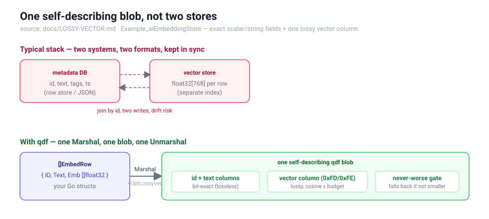
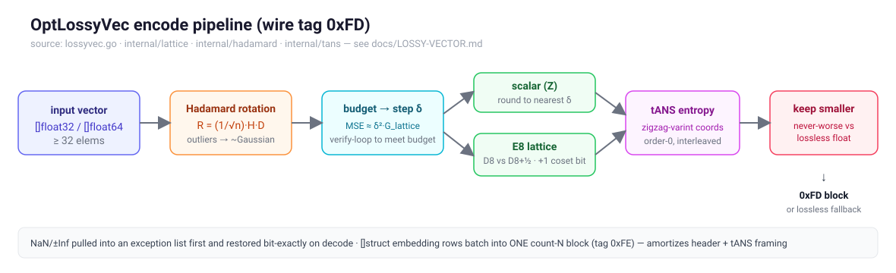
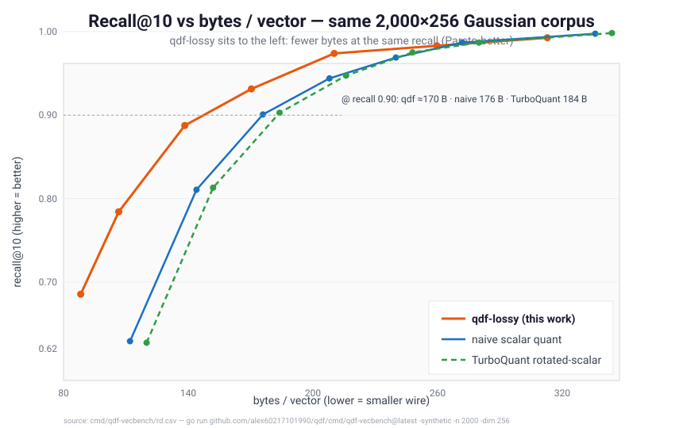
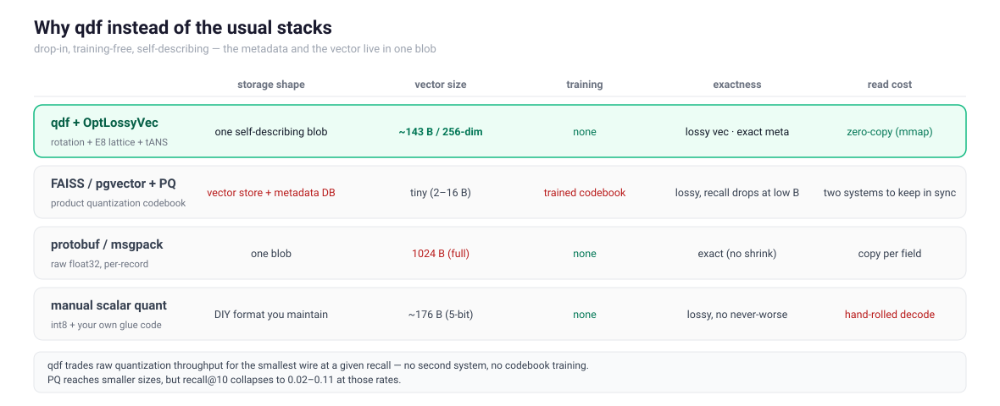
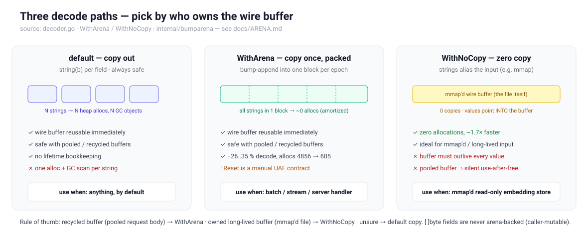
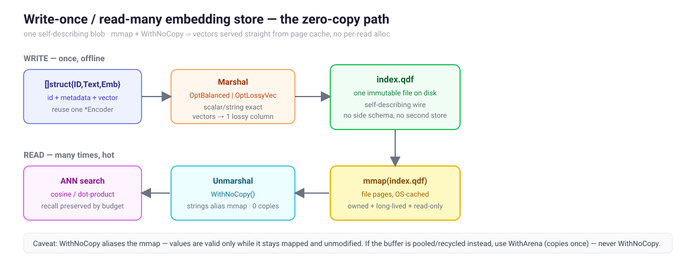

> A developer's walk-through of `qdf`'s opt-in lossy vector codec: what it does,
> why it lands within a hair of the information-theoretic floor, and how it
> measures up against Google's TurboQuant on a reproducible benchmark. Every
> number here comes from the repo — `docs/LOSSY-VECTOR.md` and
> `cmd/qdf-vecbench/rd.csv` — not from a slide.

## The problem nobody budgets for

A single 768-dimensional `float32` embedding is **3,072 bytes**. That sounds
harmless until you have a few million of them. A 10M-document RAG index is
~30 GB of *just vectors* — before metadata, before the ANN graph, before
replication. Embeddings are quietly the dominant storage and bandwidth line item
of every vector database and every retrieval pipeline.

Here's the thing: **embeddings are not telemetry that must round-trip
bit-for-bit.** Nobody cares whether coordinate 412 comes back as `0.0193847` or
`0.0193851`. What you care about is that nearest-neighbour search returns *the
same neighbours* — i.e. that cosine similarity is preserved to a few decimal
places. That is the exact regime where lossy quantization is free money, and
it's why `qdf` ships an **opt-in** lossy codec for `[]float32` / `[]float64`
fields (`OptLossyVec`). Off by default, so no exact workload is ever silently
approximated; one flag flip when you want it.

The part I find genuinely nice as an application developer: you don't bolt on a
second system.



You serialize your `[]struct{ ID, Text, Emb []float32 }` with the same
`Marshal`/`Unmarshal` you already use. The scalar and string fields stay
bit-exact; the vector field is batched into one lossy column; the blob is
self-describing, so `Unmarshal` rebuilds the records with **no flag and no side
schema**. Metadata store and vector store collapse into one blob with one write
path. (See `Example_aiEmbeddingStore` in the package docs.)

## What the codec actually does

For each float-vector column the encoder runs a four-idea pipeline. Three of the
four are things a CPU serializer can do that a fixed-width GPU codebook cannot —
and that's exactly where the size edge comes from.



1. **Randomized Hadamard rotation** — `R = (1/√n)·H·D`, a seed-driven sign-flip
   diagonal `D` composed with the Walsh–Hadamard transform `H`. It spreads
   per-coordinate outliers evenly so the data becomes approximately Gaussian —
   the ideal shape for low-bit quantization — at `O(n·log n)` cost and with **no
   stored matrix**: just a `uint64` seed on the wire. This is the same idea
   Google's TurboQuant uses for KV-cache quantization.
2. **A lattice, not a grid.** The scalar quantizer snaps each coordinate to the
   nearest multiple of a step `δ` (the `Z` lattice — a cube). The **E8**
   quantizer groups coordinates into 8-D blocks and snaps each to the nearest
   point of E8, the densest packing in 8 dimensions. E8's Voronoi cell is
   *rounder* than the cube, so it spends fewer bits for the same distortion.
3. **Entropy-code the indices.** After the rotation the quantization indices are
   near-Gaussian — a peaked distribution. A fixed-width code wastes bits on that;
   an order-0 **rANS** pass (the same entropy stage the rest of `qdf` uses)
   recovers them.
4. **Never-worse.** The encoder builds *both* quantizers and the plain lossless
   float encoding, and keeps whichever is smallest. `OptLossyVec` is a hint, never
   a commitment to inflate — an incompressible or exception-heavy column silently
   falls back to lossless.

`NaN`/`±Inf` are pulled into an exception list before quantization and written
back bit-exactly on decode, so non-finite values survive any budget untouched.

## Why this is close to the performance ceiling

This is the claim worth defending, so let me be precise about *which* ceiling.

**Distortion-rate.** For a fixed quantizer, the bits you must spend at a target
distortion are bounded below by the source entropy after the optimal transform.
The pipeline attacks every term of that bound:

- The Hadamard rotation **decorrelates and Gaussianizes** the coordinates. Rate-
  distortion theory says the Gaussian is the worst case for a *fixed* coder but
  the *best-understood* case for an optimal one — and crucially the rotation
  makes the per-coordinate distribution uniform, so a single step `δ` is near-
  optimal for every coordinate instead of being dragged around by outliers.
- The **E8 lattice** captures the space-filling (granular) gain. Its normalized
  second moment is `G ≈ 0.0717` versus the scalar cube's `1/12 ≈ 0.0833` — a
  **~0.65 dB coding gain**, which is most of the gain available in 8 dimensions
  short of an impractically large vector quantizer.
- **rANS** captures the entropy (coding) gain — the bits a fixed-width index
  leaves on the table once the distribution is peaked.

Granular gain + entropy gain are the two levers a *practical* quantizer has.
`qdf` pulls both. The only thing left on the table is a higher-dimensional
lattice (Leech in 24-D buys a further fraction of a dB) — which was prototyped
and **measured-killed**: the extra coset bookkeeping cost more than the packing
saved at these rates. That's the signature of being near the practical floor — the next idea
*loses*.

**Implementation.** Separate from the bits-on-the-wire ceiling, the encoder is
allocation-bound, not algorithm-bound, in steady state. Reusing scratch across
calls (the pooled `Marshal` path) takes a 256×768 batch from **13,855 → 1,308
allocs/op** and **21.2 MB → 2.0 MB/op** — ~10× each — with byte-identical
output. Profiling past that point shows the encoder is output-bound: there's no
hot loop left to shave.

## The benchmark: vs Google's TurboQuant (and naive, and PQ)

All methods compared on the **same** synthetic Gaussian corpus
(2,000 vectors × 256 dims), each with pre-built, buffer-reusing scratch so the
timing is apples-to-apples. Reproduce:

```bash
go run ./cmd/qdf-vecbench -synthetic -n 2000 -dim 256
# raw rows live in cmd/qdf-vecbench/rd.csv
```

The money chart is recall-vs-size. A method is better when its curve sits to the
**left** — fewer bytes at the same recall.



`qdf-lossy` is Pareto-better than both scalar baselines across the whole useful
recall band. Read off the iso-recall line at **recall ≈ 0.90**:

| Method | bytes / vector | recall@10 | notes |
|---|---:|---:|---|
| **qdf-lossy** (knob 0.05) | **170.4** | **0.931** | smaller *and* higher recall |
| naive scalar (5-bit) | 176.0 | 0.901 | |
| TurboQuant rotated-scalar (5-bit) | 184.0 | 0.903 | rotation, but no entropy/lattice |

At ~the same byte budget, `qdf` delivers higher recall; at ~the same recall, it
spends fewer bytes. `docs/LOSSY-VECTOR.md` quotes the headline as
**≈17–22 % smaller at equal reconstruction quality** (−18.8 % vs naive, −22.3 %
vs TurboQuant at the `rel ≈ 0.05` operating point), and the win widens to
−21 % at looser budgets.

Notice TurboQuant lands *between* naive and qdf: the rotation alone helps (it's
why TurboQuant beats naive at high recall), but without the lattice and the
entropy stage it can't reach the qdf curve. That gap is the entropy + granular
gain, made visible.

**What about Product Quantization?** PQ is on the same chart's data
(`rd.csv`) and it's a fair question. The honest answer: on this corpus at
comparable *quality* it doesn't compete. PQ hits tiny sizes (2–16 B/vec) but
recall@10 collapses to **0.02–0.11** at those rates — it needs a trained
codebook and many more subspaces to approach 0.9 recall, which is a different
operating regime (and a separate training step). For a drop-in, training-free,
self-describing serializer codec, the scalar/lattice family is the right
comparison, and qdf wins it.

### The honest trade

Smaller wire is not free. `qdf` does strictly more work per vector — a rotation
and an entropy-decode on the read path, plus a verify-loop on encode — than a
bare scalar quantizer:

| Method | enc MB/s | dec MB/s | enc allocs |
|---|---:|---:|---:|
| qdf-lossy | 174 | 526 | **1** |
| naive scalar | 993 | 4054 | 0 |
| TurboQuant rotated-scalar | 543 | 949 | 0 |

*(warm, buffer-reusing; from `docs/LOSSY-VECTOR.md`)*

So if your bottleneck is raw quantization throughput, a naive scalar codec is
faster. `qdf`'s codec is built for the **write-once, read-many** embedding store
where storage and bandwidth dominate the bill and a few hundred MB/s of encode
is irrelevant next to a 20 % smaller index replicated across a fleet. Pick the
tool for the bottleneck you actually have.

## Why this instead of the usual stacks

The recall-vs-size chart settles *how small* qdf goes. But "use qdf" is an
architecture decision, not just a codec choice, so here's the honest comparison
against the four things you'd reach for otherwise.



- **A dedicated vector DB (FAISS / pgvector) with Product Quantization.** This is
  the heavyweight answer, and it's the right one once you need a *served, indexed,
  updatable* ANN system at scale. But it's two systems — a vector store next to
  your metadata store — that you keep in sync, and PQ needs a **trained codebook**
  (a separate fit step, re-fit when the embedding model changes). qdf is the
  opposite trade: no training, no second store, no index to rebuild — a single
  file you `Marshal` once and `Unmarshal` anywhere. Use the vector DB when you've
  outgrown a flat scan; use qdf for the store *underneath* it, or for the very
  common case where a brute-force cosine scan over a few hundred thousand vectors
  is already fast enough.
- **protobuf / msgpack with raw `float32`.** This is what most pipelines actually
  ship today, and it's exact — but it stores the full 1,024 bytes per 256-dim
  vector and copies every field on decode. You get correctness and a familiar
  format; you pay 6–7× the bytes of qdf-lossy and a per-field allocation on every
  read. If your vectors genuinely must be bit-exact, this is correct (and so is
  qdf with the flag *off*). If they're search vectors, you're paying for exactness
  nobody consumes.
- **Roll-your-own scalar quantization (int8 + glue code).** The DIY path: quantize
  to int8, stuff it into msgpack, write a decoder. It works and it's small-ish
  (~176 B at 5-bit), but now *you* own a wire format, a dequantizer, and the
  edge cases (NaN/Inf, varying norms, the "is this column even worth quantizing"
  decision). qdf gives you the rotation + lattice + entropy stack, the
  **never-worse** guarantee, and NaN/Inf survival for free — and it's
  self-describing, so the reader needs no out-of-band schema.

The one-line version: **qdf is the training-free, single-blob, self-describing
option.** It won't beat a tuned PQ index on raw bytes, and it won't beat raw
`float32` on encode speed — but it's the only one of the four where the metadata
and the vector live in one `Marshal`/`Unmarshal` you already know, with a
correctness floor (never-worse, exact-by-default) baked in.

## Where it's useful

| Situation | Use it? | Budget knob |
|---|---|---|
| Embedding store / RAG index (ANN search) | **Yes** — headline use case | `MinCosine(0.999)` |
| Bandwidth-bound embedding transfer | **Yes** | `MinCosine` or `MaxRelError(0.01)` |
| Model weight / activation tensors | Yes, with care | `MaxRelError` / `TargetSNR`, validate downstream |
| Exact scientific / financial floats | **No** — leave the flag off | — |
| Short vectors (< 32) or scalar float fields | n/a — won't fire | stays lossless automatically |

The budget API speaks in the metric you actually reason about:

```go
enc := qdf.NewEncoderWith(qdf.OptBalanced | qdf.OptLossyVec)
enc.SetVectorBudget(qdf.MinCosine(0.999)) // keep cosine similarity >= 0.999
if err := enc.EncodeValue(rows); err != nil {
    log.Fatal(err)
}
data := enc.Bytes()

var out []EmbedRow
_ = qdf.Unmarshal(data, &out) // no flag needed; the 0xFD tag self-describes
// out[i].Emb approximates rows[i].Emb with cosine >= 0.999
```

`MinCosine` bounds the dot-product metric ANN relies on; `MaxRelError(eps)`
bounds per-vector L2 error directly; `TargetSNR(db)` suits signal-style data.
Looser budget ⇒ smaller and faster — pick the loosest your downstream task
tolerates and verify recall on a held-out query set.

## Production best practices

The codec is only half the win. The other half is decoding it without throwing
the size advantage away on allocations — embedding decode is **allocation-bound,
not CPU-bound**, so where the bytes land matters as much as how few there are.
This section is the part the API docs assume you'll figure out.

### Write path: reuse one encoder, batch the column

Two habits make the encode side cheap:

1. **Reuse a `*qdf.Encoder` across calls.** `qdf.Marshal` allocates a fresh
   encoder state per call; a long-lived encoder reuses its rotation, coordinate,
   widen, and rANS scratch. On a 256×768 batch that's the **13,855 → 1,308
   allocs/op** (21.2 MB → 2.0 MB/op) difference — ~10× — with byte-identical
   output.

   ```go
   enc := qdf.NewEncoderWith(qdf.OptBalanced | qdf.OptLossyVec)
   enc.SetVectorBudget(qdf.MinCosine(0.999))
   for _, batch := range batches {
       _ = enc.EncodeValue(batch) // scratch reused across iterations
       write(enc.Bytes())
   }
   ```

2. **Marshal the whole `[]struct`, not vector-by-vector.** When the element has a
   `[]float32`/`[]float64` field, qdf gathers *every row's* vector into **one**
   count-`N` column block (wire tag `0xFE`) instead of one block per row. That
   amortizes the block header *and* the rANS frequency framing across the batch —
   the per-row form costs ~290 B/vec vs ~176 B/vec batched on a 256-dim corpus.
   So the headline numbers are the ones you actually get in production, *because*
   you marshal the batch. (Needs ≥ 16 rows with the same vector length.)

If you re-encode the same string-column shape repeatedly (same URL space, same log
format alongside the vectors), train an `FSSTDict` once and reuse it — it skips
the per-batch symbol-table training, ~5× faster encode.

### Read path: three ways to decode, pick by buffer ownership

This is the lever most people miss. The default `Unmarshal` copies each string
field into its own heap allocation — always correct, but a record with seven
string fields pays seven allocations and the GC then scans seven objects. There
are two cheaper paths, and which one is safe depends entirely on **who owns the
wire buffer and how long it lives**.



- **`WithArena` — copy once, packed.** Bump-appends every decoded string into one
  contiguous block per epoch instead of N separate allocations. The strings are
  byte-identical; only *where they live* changes. Across a batch the block
  amortizes to ~0 allocations, the strings sit cache-adjacent, and the GC walks
  one object instead of N. Measured **−26…−35 %** decode time on string-heavy
  corpora (4,856 → 605 allocs/op on an AD-style export). It is **safe with a
  recycled wire buffer** — because it copies the strings *out*, you can hand the
  buffer straight back to a pool. This is the right default for a server handler
  or a streaming consumer.

  ```go
  a := qdf.NewArena()
  for msg := range stream {
      var rows []Doc
      _ = qdf.Unmarshal(msg, &rows, qdf.WithArena(a))
      use(rows)
      a.Reset() // only after every value from the last decode is dead
  }
  ```

  `Reset` is a *manual* use-after-free contract — call it only once everything
  decoded since the last reset is dead. If you can't reason about that, drop the
  arena and `NewArena()` again; never-`Reset` is always safe (the block is plain
  GC memory).

- **`WithNoCopy` — zero copy.** Decoded strings/`[]byte` **alias the input buffer**
  directly: zero copies, zero allocations, ~1.7× faster. The catch is the
  lifetime — the values are valid only while the input stays alive and unmodified.
  Use it on **owned, long-lived, read-only** input. Never on a pooled/recycled
  buffer (a server request body): the aliased values become silent garbage when
  the buffer is reused — a use-after-free the race detector won't catch.

The decision is mechanical: **recycled buffer → `WithArena`; owned long-lived
buffer → `WithNoCopy`; unsure → default copy.**

### The flagship pattern: an mmap'd, zero-copy embedding store

`WithNoCopy`'s "owned, long-lived, read-only" requirement is *exactly* what an
`mmap`'d file is — which makes it the natural backing for a write-once / read-many
embedding index. You marshal the whole corpus into one self-describing `.qdf`
file once; readers `mmap` it and `Unmarshal` with `WithNoCopy`, serving vectors
straight out of the page cache with **no per-read allocation and no copy**.



```go
// Writer — once, offline.
enc := qdf.NewEncoderWith(qdf.OptBalanced | qdf.OptLossyVec)
enc.SetVectorBudget(qdf.MinCosine(0.999))
_ = enc.EncodeValue(corpus)        // []Doc{ID, Title, Emb []float32}
_ = os.WriteFile("index.qdf", enc.Bytes(), 0o644)

// Reader — many times, hot.
f, _ := os.Open("index.qdf")
buf, _ := syscall.Mmap(int(f.Fd()), 0, size, syscall.PROT_READ, syscall.MAP_SHARED)
defer syscall.Munmap(buf)

var docs []Doc
_ = qdf.Unmarshal(buf, &docs, qdf.WithNoCopy()) // strings alias the mmap; vectors materialize
// docs[i].Emb is the approximated vector; scan / ANN over it directly.
```

The vector field itself is reconstructed (the lossy decode allocates the output
slice — there's nothing to alias), but the `ID`/`Title` metadata and any other
string columns cost zero. The whole index is one file, one mmap, one `Unmarshal`
— no second store, no schema sidecar. Keep the mmap mapped for as long as you
read `docs`; `Munmap` only after they're done.

### Choosing and validating the budget

The budget knob is the one parameter that actually matters, so don't guess it:

| You reason about… | Knob | Note |
|---|---|---|
| ANN recall (cosine / dot-product) | `MinCosine(0.999)` | bounds the metric the index uses — start here for RAG |
| reconstruction error directly | `MaxRelError(0.01)` | per-vector L2; tighter `eps` ⇒ more bytes |
| signal-style data (audio, sensor) | `TargetSNR(db)` | dB framing |

A looser budget is smaller *and* faster. The discipline: **pick the loosest
budget your downstream task tolerates, then verify recall@k on a held-out query
set** — encode the corpus, decode it, and confirm the top-k neighbours of your
eval queries are unchanged (the `Example_aiEmbeddingStore` test does exactly this
top-1 check). Tighten the budget only if recall actually drops. Because the codec
is **never-worse**, the failure mode of an over-tight budget is "no smaller than
lossless," not "corrupt" — you lose the size win, not correctness.

### A short checklist

- [ ] `OptLossyVec` **only** on search/embedding vectors — never exact floats.
- [ ] Marshal the `[]struct` batch (≥ 16 rows) so the vector column batches.
- [ ] Reuse a `*qdf.Encoder` if you encode in a loop.
- [ ] Decode: `WithArena` for pooled buffers, `WithNoCopy` for mmap, copy if unsure.
- [ ] Verify recall@k on held-out queries; loosen the budget to the floor your task allows.

## A note on trust

I deliberately sourced every figure from committed artifacts:

- pipeline & wire format → [`docs/LOSSY-VECTOR.md`](./LOSSY-VECTOR.md)
- decode paths (arena / zero-copy) → [`docs/ARENA.md`](./ARENA.md)
- rate-distortion / recall rows → [`cmd/qdf-vecbench/rd.csv`](../cmd/qdf-vecbench/rd.csv)
- runnable end-to-end → `Example_aiEmbeddingStore` in [`example_lossyvec_test.go`](../example_lossyvec_test.go)
- reproduce → `go run ./cmd/qdf-vecbench -synthetic -n 2000 -dim 256`

The benchmark is synthetic Gaussian data, which is the *friendly* case for every
method here; the relative ordering (qdf < TurboQuant < naive at equal recall) is
the structural result and it holds because it comes from the algorithm, not the
corpus. On real embeddings the absolute bytes shift, but the entropy + lattice
gain that puts qdf's curve to the left does not.

## Takeaways

- Embeddings dominate vector-DB storage and they don't need bit-exactness —
  lossy quantization is the right tool, and it can live inside your serializer
  instead of a second system.
- `qdf`'s codec pulls **both** practical quantization levers (E8 granular gain +
  rANS entropy gain) on top of the TurboQuant-style rotation — which is why it's
  Pareto-better than rotated-scalar at equal recall, and why the *next* idea
  (Leech) measured worse.
- It's an honest CPU-for-size trade: lower throughput, smaller wire, near-zero
  steady-state allocations. Right for write-once / read-many stores.
- The size win is only realized if you decode right: `WithArena` for pooled
  buffers, `WithNoCopy` over an `mmap`'d file for a zero-copy read-many store.
  Decode is allocation-bound — where the bytes land matters as much as how few.
- Versus the alternatives it's the training-free, single-blob, self-describing
  option: it won't beat a tuned PQ index on raw bytes or raw `float32` on encode
  speed, but it's the only one with metadata + vector in one `Marshal`/`Unmarshal`
  and a never-worse / exact-by-default correctness floor.
- One flag, one blob, no schema, never-worse. `qdf.OptLossyVec`.
