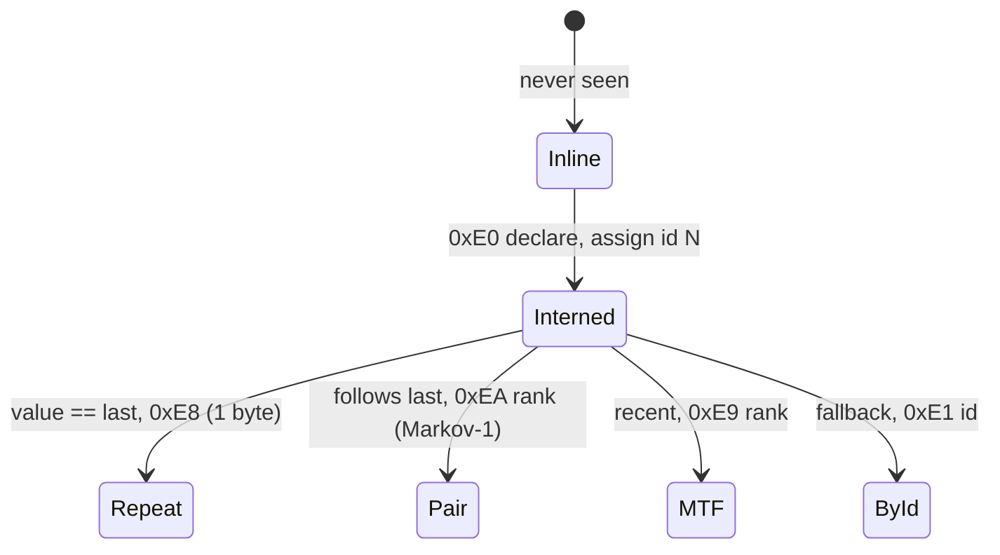
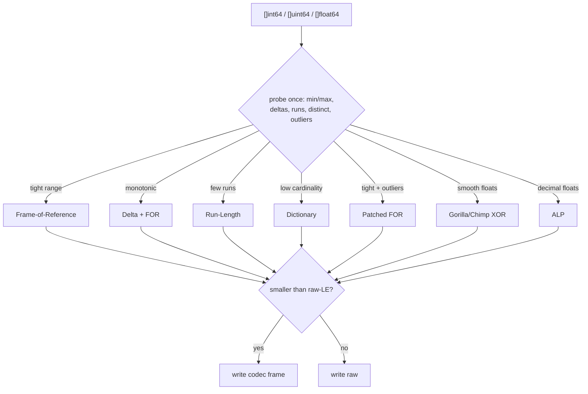
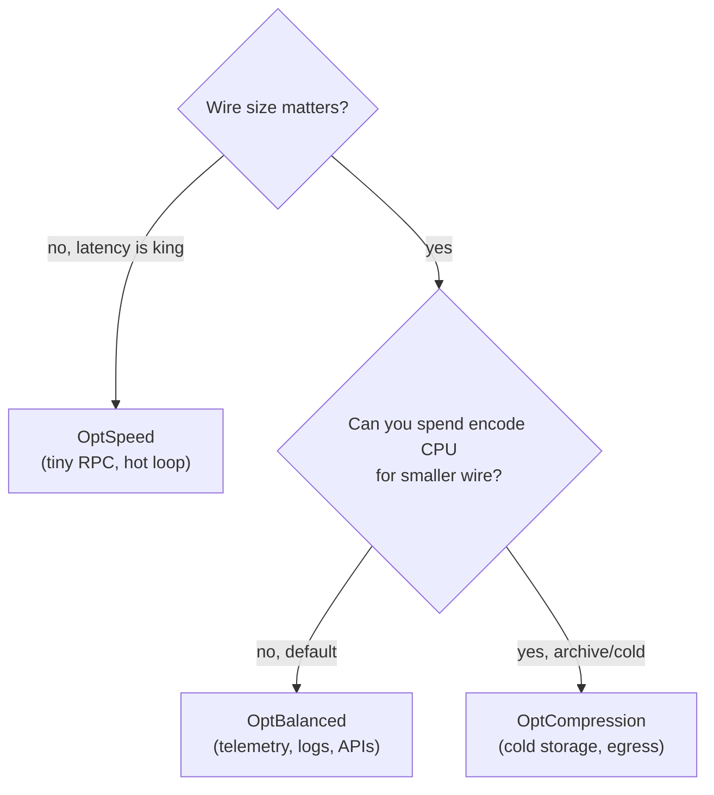
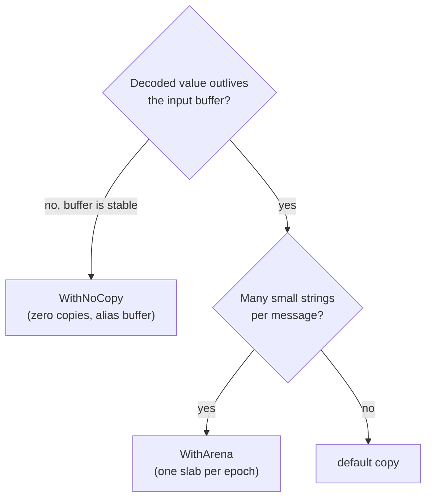

# qdf: a schemaless Go serializer you can run `WHERE` over

*A practical, byte-level deep-dive into a pure-Go binary format that is
JSON-flexible, protobuf-dense, and lets you filter and project the encoded bytes
without decoding them — plus a decision guide for picking the right modes, options,
decode strategy and build tags for **your** workload.*

---

## TL;DR

[qdf](https://github.com/alex60217101990/qdf) is a reflection-driven binary
serializer for Go. No `.proto`, no schema file, no mandatory codegen — you hand it
any Go value, exactly like `json.Marshal`. You get back a self-describing wire format
that:

- reaches **protobuf-class density** through a dense state machine (string interning +
  move-to-front + an order-1 Markov predictor + struct-shape interning);
- **transposes `[]struct` into columns** and picks, per column, the smallest of a
  dozen integer/float codecs (FOR, delta, RLE, dictionary, PFOR, Gorilla/Chimp, ALP) with a
  *never-larger* guarantee;
- lets you run **`Where(...)` / `Select(...)` over the encoded bytes** — predicate
  pushdown + column projection with SQL three-valued NULL logic;
- ships a **structural `Diff` / `Apply`** for its own wire — keyed-slice identity diff
  and columnar column-diff included.

Everything has a knob, and this post is mostly about **which knob to turn when**. By
the end you should know exactly how to wire qdf into your service and what it buys you.

> All numbers are freshly measured at the head of `main`. The real-data numbers come
> from a CI run on a clean Linux runner (Go 1.26, `cmd/qdf-bench` over real Active
> Directory dumps); ratio numbers come from an Intel i7-9750H laptop and are reported
> as **ratios on the same machine** so thermal throttling cancels. Commands to
> reproduce are at the end. Caveats are stated inline — including where qdf *loses*.

---

## Install & runnable docs

```bash
go get github.com/alex60217101990/qdf
```

Every headline feature has a **runnable example** on pkg.go.dev — open the
[examples section](https://pkg.go.dev/github.com/alex60217101990/qdf#pkg-examples)
and hit *Run* in the playground: `ExampleDiff`, `ExampleDiff_keyedSlice`,
`ExampleUnmarshal_predicatePushdown`, `ExampleUnmarshalColumns`, `ExampleWithNoCopy`,
`ExampleArena`, `ExampleStreamEncoder`, `ExampleOptions_canonical`, and more. Full API
reference: [pkg.go.dev/github.com/alex60217101990/qdf](https://pkg.go.dev/github.com/alex60217101990/qdf).

## Why another format?

| | schemaless | dense | query the bytes | structural diff |
|---|:---:|:---:|:---:|:---:|
| JSON | ✓ | ✗ | ✗ | ✗ |
| MessagePack / CBOR | ✓ | partial | ✗ | ✗ |
| Protocol Buffers | ✗ (`.proto`) | ✓ | ✗ | ✗ |
| FlatBuffers | ✗ (`.fbs`) | ✓ | read-only, row-wise | ✗ |
| **qdf** | **✓** | **✓** | **✓** | **✓** |

JSON/MessagePack are schemaless but leave density on the table. Protobuf/FlatBuffers
are dense but need a schema + codegen and still can't filter the wire. qdf's bet: stay
schemaless and reflection-driven, but borrow the encoding playbook of columnar
analytics engines, and expose it through a tiny query API.

---

## The mental model: four independent knobs

qdf has exactly four things you tune. Keep them separate in your head:

```
            ENCODE                                 DECODE
  ┌───────────────────────────┐        ┌──────────────────────────────┐
  │ 1. Profile (Options)       │        │ 3. Decode mode (QueryOption) │
  │    OptSpeed / OptBalanced  │        │    copy (default)            │
  │    / OptCompression        │        │    WithNoCopy / WithArena    │
  │    + à-la-carte bits        │        │    + Select / Where          │
  └───────────────────────────┘        └──────────────────────────────┘
  ┌───────────────────────────────────────────────────────────────────┐
  │ 2. Code path:  reflection (default)  vs  qdfgen codegen             │
  │ 4. Build tags: qdf_simd (SIMD bitpack), qdf_reflect2 (reflect2)     │
  └───────────────────────────────────────────────────────────────────┘
```

- **Profile** is an `Options` bitmask passed to `Marshal(v, opts)`. It chooses how hard
  the encoder works. The decoder doesn't need it — the wire header self-describes.
- **Decode mode** is `...QueryOption` passed to `Unmarshal(data, &v, opts...)`. It
  controls allocation and lets you filter/project.
- **Code path** and **build tags** are pure performance — same wire, faster execution.

The rest of this post drills into each, after a tour of what's actually on the wire.

---

## The wire, from the outside in

### Stream header (5 bytes)

```
┌──────┬──────┬──────┬─────────┬────────┐
│ 'Q'  │ 'D'  │ 'F'  │ version │ flags  │
│ 0x51 │ 0x44 │ 0x46 │  0x01   │ 1 byte │
└──────┴──────┴──────┴─────────┴────────┘
         flags: bit0 Dense  bit1 QPack  bit2 rANS  bit3 ColIndex
```

The flags tell the decoder which sub-dialects appear, so decode is driven by the wire,
not by remembering which `Options` you encoded with.

### Tag taxonomy

A tag-byte stream, MessagePack-shaped but with a denser low range and extra bands for
state and codecs:

```
0x00‥0x7F   positive fixint            (value in the byte)
0x80‥0x9F   fixstr len 0‥31            (0x80|len) + bytes
0xA0‥0xBF   fixarray len 0‥31
0xC0 nil   0xC1 false   0xC2 true
0xC3‥0xCA   uint8/16/32/64, int8/16/32/64
0xCB‥0xCC   float32, float64
0xCD‥0xCF   str8/16/32      0xD0‥0xD2 bin8/16/32      0xD5‥0xD7 map8/16/32
0xD8‥0xDF   negative fixint -1‥-8
0xE0‥0xEA   intern + state-refs        ← Dense mode
0xE3‥0xEF   QPack numeric codecs       ← per-slice
0xEF / 0xF7 columnar struct (pure / hybrid)
0xF4‥0xFB   ALP floats, string columns (dict / FSST / raw / const / front-coded / alphabet-packed), timestamp
```

`"hi"` is `0x82 'h' 'i'` — three bytes, no quotes, no separate length.

---

## Dense mode: pay for a string once

In Dense mode the first sighting of a string is interned; every later occurrence is the
cheapest of four back-references:



Encoder and decoder keep mirrored state: an id table, an LRU chain (move-to-front), and
a top-1 successor ring keyed on the previous id. On structured data — log levels, status
codes, hostnames, repeated keys — the common case is **one byte** per value. Struct
field names get the same treatment via **shape interning**:

```
record 0:  EC 00 03  82"id" 84"name" 86"status"   v0 v1 v2   ← declares shape #1
record 1:  EC 01                                   v0 v1 v2   ← reuses shape #1 (id only)
record 2:  EC 01                                   v0 v1 v2
```

Field names written once across a `[]Service`, no schema declared.

---

## QPack: a codec picker for numeric slices



Each candidate computes its exact byte cost; the keeper is the minimum, compared against
raw little-endian so the result is **never larger** than writing the numbers plainly. A
frame-of-reference frame:

```
┌──────┬──────┬──────┬────────┬────────┬────────────────────────┐
│ 0xE5 │ kind │ bits │  min   │ count  │  bit-packed offsets     │
└──────┴──────┴──────┴────────┴────────┴────────────────────────┘
   value[i] = min + offset[i]      offsets packed at `bits` bits, LSB-first
```

The bit-packing has AVX2 (amd64) and NEON (arm64) kernels behind `qdf_simd`, pure-Go by
default.

---

## Columnar mode + the two query superpowers

A `[]struct` of scalar-ish fields transposes to columns (`tagColStruct`, `0xEF`):

```
row-major (per record)            columnar (per column)
┌────┬──────┬────────┐            id    : [FOR codec over all ids]
│ id │ name │ status │   ───►     name  : [dict / raw string column]
│ …  │  …   │   …    │            status: [dictionary, 3 distinct]
└────┴──────┴────────┘            ↑ one codec per column, not per row
```

String columns pick their own form: **dictionary** (low cardinality), **front-coded
dictionary** (`0xFA`, prefix-shared distinct values — SID / path / DN / URL columns —
sorted with `sharedPrefixLen + suffix` per entry; −36.5 % on real AD tables, up to
−92.6 % on SID columns), **constant** (all rows equal), **FSST** (substring-sharing
text), or a bulk raw blob decoded in one alloc.
A *hybrid* frame (`0xF7`) keeps eligible fields columnar and leaves residual fields
(nested structs, maps) row-major in the same frame.

Columns unlock two things row-major formats fundamentally can't:

**1. Selective decode** (`Select` + `OptColumnIndex`) — the frame carries a `uint32`
length per column; the decoder seeks past columns you didn't ask for:

```
Select 3 of 16 columns, 1000 rows:
  full   : ~100,000 ns   247 KB   69 allocs   (≈290 MB/s)
  subset :  ~18,000 ns    54 KB   37 allocs   (≈1680 MB/s)
            5.5× faster    4.6× less memory
```

**2. Predicate pushdown** (`Where`) — compiles the predicate to a typed closure tree
(one native `func` per leaf, no per-row boxing), evaluates per column into bitsets,
AND/OR/NOTs them, then materializes only survivors. Nullable columns carry a presence
bitmap, giving real SQL **three-valued logic** (TRUE/FALSE/UNKNOWN):

```
WHERE status == "error", 1000 rows, ~1% match:
  decode-then-filter : ~78,000 ns   170 KB
  pushdown (Where)   : ~46,000 ns    68 KB
                        1.7× faster   2.5× less memory
```

```go
// filter + project, arena-backed, in one call:
var hits []Row
err := qdf.Unmarshal(buf, &hits,
    qdf.Where[string]("status", func(s string) bool { return s == "error" }),
    qdf.Select("id", "status", "latency"),
    qdf.WithArena(a),
)
```

---

## Feature deep-dives

Each headline feature, three ways: **how it works**, **why it's fast**, **how to use
it**. The snippets are illustrative; each has a corresponding **runnable** `Example` on
[pkg.go.dev](https://pkg.go.dev/github.com/alex60217101990/qdf#pkg-examples) you can edit
and run in the playground.

### `Marshal` / `Unmarshal` — the base

**How.** `Marshal(v any, opts) []byte` reflects over `v` once, caches a `typeDesc`
(field offsets, codecs, shape) keyed by `reflect.Type`, and walks it with cached
closures + `unsafe.Pointer` field access — no per-field reflection on the hot path.
`Unmarshal(data, &v, opts...)` is driven entirely by the wire (the 5-byte header's flags
say Dense/QPack/rANS), so you never pass the encode profile to decode.

**Why fast.** The reflection walk is paid once per type and pooled; encoders come from a
`sync.Pool` and reach **zero steady-state allocations** after warmup (interning packs
into a reused arena). On AD data that's **3 encode allocs** vs msgpack's 393.

```go
b, _ := qdf.Marshal(v, qdf.OptBalanced)
var out T
_ = qdf.Unmarshal(b, &out)
// generics, no `any` boxing:
b, _ := qdf.MarshalT(v, qdf.OptBalanced)
_ = qdf.UnmarshalT(b, &out)
```

### `Diff` — a structural diff for the wire

**How.** `Diff(old, new, opts)` walks the shared `typeDesc` of the two values and emits
a **sparse patch**: unchanged fields are omitted entirely; a changed field is either a
full `opReplace` or a recursive `opMerge`. Three things make it more than a naive
field-compare:

- **Keyed slices** — tag an identity field `qdf:"id,key"` and elements are matched by
  *key*, not position. A reordered or partially-edited `[]Service` becomes a re-order
  plus a few per-element merges, not N replacements.
- **Columnar column-diff** — for an equal-length `[]struct`, the diff groups changes by
  *column* and ships each changed column in the cheapest of sparse (changed-row
  indices), delta (per-row arithmetic), or whole-column form.
- **Baseline registry** — a content-addressed registry lets a stream of patches chain
  off a 64-bit fingerprint, so you never re-send the base.

Every choice runs the same **never-larger trial** as the codec picker: build the
candidate bodies, keep the smaller, guarantee the patch never exceeds a full re-encode.

**Why fast.** Only the delta travels — a one-field change in a 10 MB document is a
handful of bytes. Keyed matching turns an O(N) reorder into O(changes). The columnar
column-diff means a metric batch where one column moved ships *one* column, not the
batch. The never-larger trial means the patch is never a pessimization.

```go
patch, _ := qdf.Diff(old, new, qdf.OptBalanced)   // compact, self-describing
// tag identity fields so reorders are cheap:
type Service struct {
    ID     string `qdf:"id,key"`
    Status string `qdf:"status"`
}
```

### `Apply` — reconstruct in place, safely

**How.** `Apply(&base, patch)` mutates `base` into `new`, applying replaces/merges
directly onto the existing value — no decode-then-overwrite. The patch header carries a
**schema fingerprint** (rejects a patch built for a different type:
`ErrPatchSchemaMismatch`) and an optional **base fingerprint** (rejects applying onto the
wrong base: `ErrPatchBaseMismatch`) — so a mismatched patch fails loudly instead of
corrupting state.

**Why fast.** Applying onto `base` reuses its allocations (slices, maps, strings) instead
of building `new` from scratch. The fingerprints are single 64-bit hashes, not full
walks. When you can guarantee the base, `OptDeltaNoBaseFingerprint` skips the base hash
entirely — a big win for a huge base with a tiny patch.

```go
err := qdf.Apply(&base, patch)            // base becomes new
// trusted base, skip the guard for speed:
patch, _ := qdf.Diff(old, new, qdf.OptBalanced|qdf.OptDeltaNoBaseFingerprint)
```

### `Select` — project columns without decoding the rest

**How.** With `OptColumnIndex`, a columnar frame carries a `uint32` byte-length per
column after the shape. `Select("a","c")` reads the index and **advances the input
pointer past** the columns you didn't ask for (`d.i += colLen`), decoding only the
wanted ones. String columns decode as a single bulk blob (one allocation for the whole
column), and predicates read rows via an alloc-free `unsafe.String` view into that blob.

**Why fast.** Cost is **O(columns wanted)**, not O(all columns) — and the skipped columns
are never touched, allocated, or copied. Measured: 3 of 16 columns → **5.5× faster,
4.6× less memory** than a full decode.

```go
var rows []Row
_ = qdf.Unmarshal(buf, &rows, qdf.Select("id", "latency"))
// or the dedicated entry point:
_ = qdf.UnmarshalColumns(buf, &rows, "id", "latency")
```

### `Where` — predicate pushdown over the bytes

**How.** `Where[T](field, pred)` compiles into a typed closure tree at decode time: each
leaf holds exactly **one** native predicate (`func(int64) bool`, `func(string) bool`, …)
matched to the column's type once — zero per-row interface boxing. The decoder evaluates
each predicate **per column into a TRUE/FALSE bitset**, combines them with `And`/`Or`/
`Not`, and only then enumerates survivors. Nullable columns carry a presence bitmap, so
the evaluator does real SQL **three-valued logic** (a NULL row is neither TRUE nor FALSE).
Survivor enumeration uses `bits.TrailingZeros64` to **skip whole zero words** of the
bitset.

**Why fast.** You evaluate columns, not rows; you never box a value into an `interface`;
you never materialize a rejected row; and the more selective the filter, the *less* work
(opposite of decode-then-filter). On a 1%-selective query: **1.7× faster, 2.5× less
memory**.

```go
var hits []Row
_ = qdf.Unmarshal(buf, &hits,
    qdf.And(
        qdf.Where[string]("status", func(s string) bool { return s == "error" }),
        qdf.Where[float64]("latency", func(v float64) bool { return v > 0.95 }),
    ),
    qdf.Select("id", "status", "latency"),   // compose: filter AND project
)
```

### Streaming — one intern table across a whole stream

**How.** `NewStreamEncoder(w, mode)` writes the 5-byte header once, then in Dense mode
keeps the **intern table and declared shapes alive across every `Encode` call**, so a
back-reference in message #10,000 can point at a string first seen in message #1. The
buffer auto-flushes when it crosses 16 KiB (or call `Flush`). A `StreamEncoder` is
reusable via `Reset(w)` — it keeps its grown intern/shape state instead of reallocating.

**Why fast.** Interning is amortized over the *whole* stream, not per message, so a
high-cardinality log stream converges to one byte per repeated token. Memory is bounded
by an adaptive arena-retention policy (spike slabs are shed after sustained small
batches), so a long-running stream doesn't grow without limit.

```go
enc := qdf.NewStreamEncoder(w, qdf.Balanced)
for rec := range records {
    _ = enc.Encode(rec)        // back-refs span the whole stream
}
_ = enc.Flush()
```

### `OptCanonical` — deterministic bytes for hashing & signing

**How.** Encode-side only: map keys are emitted in sorted order (every key kind) and
floats are normalized (`-0.0 → +0.0`, any NaN → one canonical quiet NaN). Two
logically-equal values produce **byte-identical** output; the bytes are ordinary qdf and
decode normally.

**Why it's great.** Content-addressing, dedup, and signing all need stable bytes —
something JSON (float formatting, key order), MessagePack (no normalization) and Protobuf
(undefined map order) don't guarantee. It's lossy for the sign of zero / NaN payloads, so
use the default mode when you need bit-exact float round-trip.

```go
b, _ := qdf.Marshal(doc, qdf.OptBalanced|qdf.OptCanonical)
sum := sha256.Sum256(b)        // same doc → same hash, every run, every machine
```

---

## Encode profiles: pick one

Three presets cover most needs; reach for à-la-carte bits only when a profile is close
but not perfect.



- **`OptSpeed`** (= `0`, "Fast"): no codecs, no interning. Largest wire, lowest CPU,
  near-zero per-call work. The closest analogue to `json`/`msgpack` shape.
- **`OptBalanced`** (`Dense | QPack | ShapeIntern | PairPred | MTF`): **the default.**
  Every codec that doesn't trade CPU for size beyond its sweet spot. Right for
  telemetry, log batches, APIs — anything with repetitive strings or numeric slices.
- **`OptCompression`** (`Balanced + GorillaFloat + RANS + FSST`): every codec that
  spends CPU for wire. For cold storage, egress, archival — where bytes dominate latency.

Real Active Directory dumps (typed structs, CI runner), so you can see the trade:

| profile | wire (B) | encode (ns) | decode (ns) | when |
|---|--:|--:|--:|---|
| OptSpeed | 501,245 | 512,996 | 877,241 | hot path, size doesn't matter |
| OptBalanced | 208,990 | 305,528 | 887,815 | **default** — best size at sane CPU |
| OptCompression | 152,391 | 8,064,373 | 2,022,489 | bytes ≫ CPU (archive) |

`OptBalanced` is the sweet spot: **2.4× smaller wire than `OptSpeed`** *and* faster
encode (the smaller buffer wins back the codec cost). `OptCompression` shaves another
~27% off the wire but pays **>10× encode CPU** — only worth it when the bytes travel far
or sit cold.

### À-la-carte bits (add to `OptBalanced`)

| option | what it adds | turn on when |
|---|---|---|
| `OptColumnIndex` | per-column length table | you'll `Select` a subset of columns; ~4 B/col, otherwise free |
| `OptMapShape` | interns recurring `map` key-sets | maps with stable keys (telemetry tags, labels) |
| `OptGorillaFloat` | XOR float codec — encodes both Gorilla and Chimp128 for `float64` and keeps the smaller (`float32` stays Gorilla) | smooth float time-series (sensor/metric streams) |
| `OptFSST` | FSST string codec for columns | high-cardinality, substring-sharing text (URLs, log lines, paths) |
| `OptRANS` | final order-0 tANS/FSE entropy pass (option name kept; legacy rANS payloads still decode) | last-mile size; ~1.5× smaller; the entropy stage itself is 3.2×/2× faster enc/dec than the old rANS |
| `OptCanonical` | sorted keys + float normalization | hashing / signing / dedup of bytes |
| `OptDeltaNoBaseFingerprint` | drops the patch base check | `Diff/Apply` when you guarantee the base |

Every one is **never-worse**: `OptFSST`/`OptGorillaFloat`/codecs only fire when strictly
smaller, `OptRANS` only when the compressed body shrinks. The cost is CPU, not size.
Honest data point: on AD data `OptFSST` *didn't* help (those strings don't share
substrings) and cost encode CPU — FSST is for log lines and URLs, not arbitrary text.
`OptGorillaFloat` was a no-op there too (no smooth float columns). Profiles are
workload-shaped; measure on *your* data.

---

## Decode modes: copy / NoCopy / arena / pooled

Decode is almost never CPU-bound — it's **allocation- and GC-bound**, dominated by the
string/`[]byte` copies handed back to you. qdf gives you four strategies:



- **default (copy)** — each string/`[]byte` is its own allocation. Safe, simplest, but
  the alloc count scales with the data.
- **`WithNoCopy()`** — decoded strings/`[]byte` **alias the input buffer**: zero copies.
  The big win on string-heavy payloads. **Lifetime contract:** the buffer must outlive
  the values and never be mutated/recycled — the classic use-after-free if you return it
  to a pool. Safe when the buffer is `mmap`'d or freshly read per message; *unsafe* in a
  handler whose request buffer goes back to a `sync.Pool`. (The race detector won't
  catch this — it's your invariant.)
- **`WithArena(a)`** — copied strings are bump-packed into one arena slab per decode
  epoch (reset between epochs), collapsing thousands of small allocations to a handful.
  Safe (values are real copies, just batched), no buffer-lifetime hazard. Use for
  request/batch-scoped decodes where you control the arena's lifetime.
- **pooled slice** — decode into an existing slice; the backing array is reused.

Measured on AD dumps (map repr, Balanced), `WithNoCopy` vs default copy:

```
              decode ns      decode bytes
  copy        1,526,627      817,794
  nocopy      1,343,478      616,522
              −12% time      −25% memory
```

`WithArena` lands between the two: most of the alloc reduction of nocopy, without the
lifetime hazard. Rule of thumb: **string-heavy + buffer you own → NoCopy; string-heavy +
buffer you don't control → Arena; otherwise default.**

---

### Worked combinations: profile × decode strategy

The profile (encode) and the decode strategy are orthogonal, and the *combination* is
where the real wins live. Here's each useful pairing — what happens on the wire, why
it's fast, and when to reach for it.

**1. `OptSpeed` + `WithNoCopy` — lowest-latency RPC, you own the buffer**

```go
b, _ := qdf.Marshal(req, qdf.OptSpeed)              // no codecs, strings inline
var resp Resp
_ = qdf.Unmarshal(b, &resp, qdf.WithNoCopy())       // strings alias b, zero copies
```

*How:* `OptSpeed` writes strings inline (no interning), so on decode each string is a
plain slice of the input; `WithNoCopy` returns those as `unsafe.String` views straight
into `b` — **no intern table, no copy, no allocation** for any string. *Gives:* the
absolute fastest decode path qdf has. *When:* request/response in one goroutine where
`b` lives for the whole handler and isn't recycled mid-use. *Not when:* `b` returns to a
`sync.Pool` while `resp` is still alive → use-after-free.

**2. `OptBalanced` + `WithNoCopy` — small wire *and* zero string copies**

```go
b, _ := qdf.Marshal(batch, qdf.OptBalanced)         // dense: interned, ~2.4× smaller
var out []Rec
_ = qdf.Unmarshal(b, &out, qdf.WithNoCopy())         // interned bodies aliased, no copy
```

*How:* Dense mode interns repeated strings (smaller wire); `WithNoCopy` makes the
first materialization of each interned body alias `b` instead of copying, and every
back-reference reuses that view. *Gives:* the size win of dense **plus** near-zero
decode allocations — measured **−25% decode memory, −12% time** vs the default copy on
real AD data. *When:* you control the buffer and want both small bytes and cheap decode.

**3. `OptBalanced` + `WithArena` — batch decode, buffer you *don't* own**

```go
arena := qdf.NewArena()
for msg := range stream {                            // e.g. a request body from a pool
    var out []Rec
    arena.Reset()                                    // one epoch per message
    _ = qdf.Unmarshal(msg, &out, qdf.WithArena(arena))
    use(out)                                          // out valid until next Reset
}
```

*How:* interned strings are copied **once each into one arena slab**, not one heap
allocation per field. *Gives:* most of NoCopy's allocation win **without** the
buffer-lifetime hazard — `out`'s strings are real copies, safe even after `msg` goes
back to its pool; you only need the arena (and the values) dead before `Reset`. *When:*
server handlers, anything where the input buffer is recycled but you can scope an arena
to the message/batch.

**4. Columnar + `Select` + `WithArena` — analytics projection**

```go
b, _ := qdf.Marshal(rows, qdf.OptBalanced|qdf.OptColumnIndex)   // transpose + index
arena := qdf.NewArena()
var slim []Row
_ = qdf.Unmarshal(b, &slim,
    qdf.Select("id", "status"),                       // decode 2 columns, skip the rest
    qdf.WithArena(arena))                             // their strings batch into the slab
```

*How:* `OptColumnIndex` lets `Select` seek past unwanted columns; the projected string
column decodes as one bulk blob, and the arena absorbs its copies in one slab. *Gives:*
you touch only the columns you asked for **and** pay a handful of allocations for all of
them — the projection win (5.5× faster, 4.6× less memory) compounded with the arena's
batching. *When:* read-heavy columnar stores you query repeatedly.

**5. Columnar + `Select` + `Where` + `WithNoCopy` — max-throughput filtered scan**

```go
var hits []Row
_ = qdf.Unmarshal(b, &hits,
    qdf.Where[string]("status", func(s string) bool { return s == "error" }),
    qdf.Select("id", "status", "latency"),
    qdf.WithNoCopy())                                 // survivor strings alias b
```

*How:* the predicate runs over the encoded column into a bitset (no rows materialized);
only survivors are built, and `WithNoCopy` makes their string fields alias `b`. *Gives:*
filter + project + zero-copy in one pass — the predicate skips ~99% of the data on a
selective query, and the survivors cost no string allocations. *When:* hot read paths
over a stable, owned buffer (e.g. an `mmap`'d columnar segment).

> Rule of thumb for the decode knob, independent of the profile:
> **own the buffer & it stays put → `WithNoCopy`** (fastest, zero copies);
> **don't own it / it's pooled → `WithArena`** (safe, batched allocs);
> **simplest, occasional decode → default copy.** `Select`/`Where` compose with all three.

---

## Build tags: free speed, same wire

Two tags change *how* code runs, never the bytes:

- **`qdf_simd`** — compiles AVX2 (amd64) / NEON (arm64) kernels for the bit-packing in
  the integer codecs; pure-Go scalar fallback otherwise, with a runtime CPU check. On
  amd64 it needs `GOEXPERIMENT=simd`. Worth it when you encode/decode large numeric or
  columnar slices. `go test -tags qdf_simd ./...`
- **`qdf_reflect2`** — swaps in a [reflect2](https://github.com/modern-go/reflect2)
  backend that skips reflect's type checks on the hot path; mostly visible on map-heavy
  decodes. `go build -tags qdf_reflect2`

Both are opt-in, both keep the wire byte-identical, both have zero API impact.

---

## Codegen vs the reflection default

`qdfgen` generates `MarshalQDF` / `UnmarshalQDF` methods for your types. The crucial
property most generators don't have: **the generated wire is byte-identical to the
reflection path** (it calls the same encoder primitives). So codegen is a pure
speed/allocation optimization you adopt **per type**, and you can freely mix — encode
with reflection, decode with codegen, or vice versa, even for a type carrying a
`map[string]any` field.

| | reflection (`OptBalanced`) | codegen (`qdfgen`) |
|---|---|---|
| setup | none | `go:generate qdfgen -type T` |
| wire | identical | identical |
| encode allocs | low (pooled) | **lower** (monomorphized, no reflect) |
| decode allocs | low | **lower** |
| best for | most code, dynamic types, `any` | hot types in a tight loop |

Contrast protobuf/flatbuffers, where codegen is **mandatory** and the schema is the
source of truth. Here the Go type is the source of truth and codegen is opt-in — start
with reflection + `OptBalanced`, generate only the types a profiler flags.

---

## Numbers

### Real-world corpus — Active Directory dumps (CI runner, Go 1.26 linux/amd64)

`cmd/qdf-bench` over real `adalanche` localmachine dumps. `OptBalanced`, typed structs,
ratio = baseline / qdf (>1 ⇒ qdf better):

| metric | qdf | json | msgpack | qdf/json | qdf/msgpack |
|---|--:|--:|--:|--:|--:|
| wire bytes | 208,990 | 531,674 | 500,126 | **2.54×** | **2.39×** |
| decode ns | 887,815 | 4,958,812 | 1,228,273 | **5.59×** | **1.38×** |
| decode allocs | 6,278 | 15,851 | 13,261 | **2.52×** | **2.11×** |
| encode ns | 752,554 | 1,634,387 | 682,194 | 2.17× | **0.91× (slower)** |
| encode allocs | 3 | 7,037 | 393 | 2345× | **131×** |

The honest picture: qdf wins decisively on **wire size, decode speed, and allocation
count** (3 encode allocs vs msgpack's 393 — it interns into a reused arena instead of
emitting strings inline), and **loses to msgpack on raw encode CPU** because it runs the
codec picker. That's the trade: a bit more encode work for much smaller, much
cheaper-to-decode output. `OptCompression` pushes wire to **3.28× smaller than msgpack**
but encode CPU to ~10× — strictly an archival choice.

### Wire size by payload (deterministic — hardware-independent)

From `go test -run TestSizes`/`TestProfile_SizesSummary` (exact byte counts):

| payload | json | msgpack | qdf (dense) | qdf/json |
|---|--:|--:|--:|--:|
| Deep16 (nested) | 239 | 139 | **63** | 0.26× |
| Wide × 1000 ints | 212,901 | 135,626 | **29,576** | 0.14× |
| LogBatch × 1000 | 251,902 | 185,639 | **87,156** | 0.35× |
| status × 1024 (low-card) | 4,136 | 9,251 | **99** | **0.024×** |
| metric (smooth) × 1024 | 29,024 | 19,519 | **1,672** | **0.058×** |

On a low-cardinality column dense+columnar reaches **42× smaller than JSON / 93× smaller
than MessagePack**; on smooth numerics ALP/Gorilla reach **17× smaller than JSON**.

### Query / selective decode (i7-9750H, ratios same-machine)

- Select 3 of 16 columns: **5.5× faster, 4.6× less memory** than full decode.
- 1%-selective `Where`: **1.7× faster, 2.5× less memory** than decode-then-filter.

### Honest caveats

- **Encode CPU**: `OptBalanced` encode is ~10% slower than msgpack on this data;
  heavy codecs (`OptCompression`, `OptRANS`, `OptFSST`) are multiples slower. The wins
  are size, decode, and allocs — which usually dominate total cost, but measure yours.
- **`WithNoCopy`** is a sharp tool — the lifetime contract is on you.
- Profiles are workload-shaped: FSST/Gorilla were no-ops on AD data. Run the matrix on
  *your* corpus.
- Laptop ns are noisy; that's why competitive numbers are from CI and micro-numbers are
  ratios.

---

## Recipes: scenario → exact config

```go
// High-throughput structured logging / telemetry (the default sweet spot)
b, _ := qdf.Marshal(batch, qdf.OptBalanced)
var out []LogRecord
_ = qdf.Unmarshal(b, &out, qdf.WithArena(arena))   // batch decode, few allocs

// Low-latency RPC, tiny messages, size doesn't matter
b, _ := qdf.Marshal(req, qdf.OptSpeed)             // minimal CPU
_ = qdf.Unmarshal(b, &resp)                         // buffer owned → add WithNoCopy()

// Columnar analytics: store once, query many times
b, _ := qdf.Marshal(rows, qdf.OptBalanced|qdf.OptColumnIndex)
var hits []Row
_ = qdf.Unmarshal(b, &hits,
    qdf.Where[float64]("latency", func(v float64) bool { return v > 0.95 }),
    qdf.Select("id", "latency"))

// Maps with recurring keys (labels, tags)
b, _ := qdf.Marshal(series, qdf.OptBalanced|qdf.OptMapShape)

// Content-addressing / signing (deterministic bytes)
b, _ := qdf.Marshal(doc, qdf.OptBalanced|qdf.OptCanonical)
sum := sha256.Sum256(b)                             // stable across runs

// Cold storage / egress (bytes ≫ CPU)
b, _ := qdf.Marshal(archive, qdf.OptCompression)

// State sync / replication (send deltas, not snapshots)
patch, _ := qdf.Diff(prev, next, qdf.OptBalanced)   // tag identity fields qdf:"id,key"
_ = qdf.Apply(&prev, patch)

// Hot type in a tight loop → generate, keep the same wire
//go:generate qdfgen -type HotType
b, _ := hot.MarshalQDF(nil)
```

**Build tags to add in CI/prod:** `-tags qdf_simd` (with `GOEXPERIMENT=simd` on amd64)
for numeric/columnar-heavy workloads; `-tags qdf_reflect2` for map-heavy decode.

---

## Where to look in the code

| concern | file |
|---|---|
| wire tags & flags | `wire.go` |
| dense state machine | `state.go`, `encoder.go`, `decoder_read.go` |
| numeric codec picker | `qpack.go`, `qpack_*.go` |
| SIMD bit-packing | `internal/bitpack/` |
| columnar encode | `columnar.go`, `colcodegen.go` |
| predicate pushdown | `query.go`, `columnar_select.go` |
| structural delta | `delta*.go` |
| canonical encoding | `canonical.go` |
| codegen | `cmd/qdfgen/` |
| benchmarks | `bench/`, `cmd/qdf-bench/` |

---

## Reproducing the numbers

```bash
git clone https://github.com/alex60217101990/qdf && cd qdf

# deterministic wire sizes
go test -C bench -run 'TestSizes$|TestProfile_SizesSummary' -v

# query / selective-decode ratios
go test -C bench -run='^$' -bench='Select_FullVsSubset|Query_VsFullManual' -benchmem -count=6

# full competitive matrix (qdf vs json/msgpack/protobuf/flatbuffers)
go test -C bench -run='^$' -bench=. -benchmem

# real-data matrix (AD dumps, every profile × decode mode vs msgpack)
go run ./cmd/qdf-bench

# SIMD path
GOEXPERIMENT=simd go test -tags qdf_simd ./...
```

---

## Closing

qdf is one bet: a schemaless, reflection-driven serializer can borrow columnar
analytics' encoding playbook — adaptive codecs, columnar transpose, predicate pushdown,
a never-larger guarantee — without a schema, and add a structural diff on top. You get
JSON ergonomics, better-than-protobuf density on structured data, a query layer, and a
diff nobody else in the space ships — and you dial the CPU/size/safety trade with four
orthogonal knobs.

Code & benchmarks: **https://github.com/alex60217101990/qdf** ·
API reference + runnable examples: **https://pkg.go.dev/github.com/alex60217101990/qdf**

*Feedback, numbers from your own data, and especially "here's where it loses" reports
are all welcome.*
