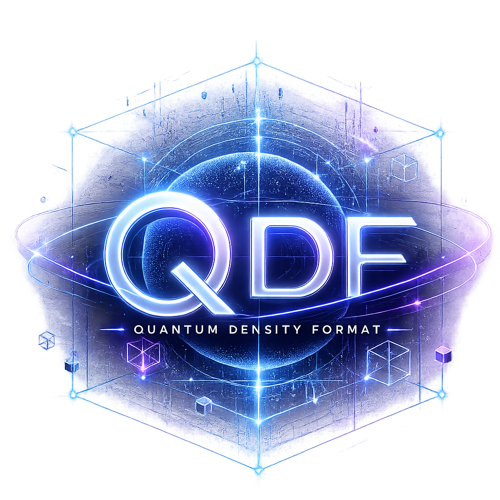

# qdf

[](https://github.com/alex60217101990/qdf/actions/workflows/ci.yml)
[](https://github.com/alex60217101990/qdf/actions/workflows/codeql.yml)
[](https://pkg.go.dev/github.com/alex60217101990/qdf)
[](https://goreportcard.com/report/github.com/alex60217101990/qdf)


<p align="center">
  
</p>

**Quantum-inspired data serialization format designed for ultra-fast
and lightweight data exchange.**

qdf gives you `encoding/json`-style ergonomics (`Marshal` / `Unmarshal` /
`NewEncoder` / `NewDecoder`) and a compact tagged binary wire format
with an optional inline string-interning table. The reflect path ships
with specialised encoders for the common slice / map shapes. A
`go:generate` tool emits reflection-free `MarshalQDF` / `UnmarshalQDF`
methods when you need the last 10–15 %.

---

## Where the name comes from

**Quantum Density Format** is a borrowed metaphor, not physics. A
classical CPU cannot store qubits; what qdf borrows from quantum
information theory is a way of thinking about repetitive structured
data.

The starting observation: in a payload like

```json
{ "users": [
    {"country": "LT"},
    {"country": "LT"},
    {"country": "LT"} ] }
```

the byte `"LT"` is written three times even though, from an
information-theoretic point of view, it is a single state with high
probability. Classical formats (JSON, MessagePack, CBOR, Protobuf)
treat data as `tree → bytes`. qdf treats it as

> `data = (state set, references, entropy weights)`

— a finite set of distinct values plus a stream that "collapses" each
position onto one of them. The wire dialect that ships today realises
the practical subset of that idea:

| Quantum-inspired concept | What it maps to in qdf today |
| ------------------------ | ---------------------------- |
| **State set** — the discrete values a position can take. | The Dense-mode intern table. The first occurrence of a string or `[]byte` value writes it in full and assigns it a stable ID. |
| **Wavefunction collapse** — a single observation picks one state. | Every subsequent occurrence emits a `state_ref` tag plus a varint ID. Decoding "collapses" the reference back to its stored value. |
| **Density** — keep only what carries information; minimise entropy `H(D \| C)` against the existing context. | Repeated keys / values across a message (and across a Dense stream) cost 1–3 bytes rather than their full length. Field-name headers in generated code are pre-encoded once per type and concatenated without further work. |
| **Entanglement** — correlated values that constrain each other (e.g. `city = "Vilnius"` ⇒ `country = "Lithuania"`). | Not in MVP. The wire format reserves tag space for it; an inference layer would sit above the current encoder. |
| **Probabilistic / arithmetic coding** — drive the residual stream to its Shannon limit. | Not in MVP. The state-table + back-reference pair already captures most of the win on real telemetry payloads; arithmetic coding would buy more bytes at a real CPU cost. |

The conceptual roadmap (state table → entanglement graph → predictive
encoder) is preserved in the codebase: tag space and the encoder
interface are designed to let those layers slot in above the current
one without a format break. The MVP that ships now is the part of the
idea that has a positive CPU / size tradeoff on day-one workloads —
logs, traces, columnar rows, embedding vectors.

The realistic conclusion: the real shift is not the "quantum" framing
but the move from "data as bytes" to "data as a model of the world
that produced it".

---

## Why another format

`encoding/json` is verbose and slow. `vmihailenco/msgpack/v5` is fast
but allocates a lot on decode and has no built-in deduplication for
repeated keys / values — which is the dominant cost on real telemetry,
log, and trace payloads where the same handful of strings (service
names, log levels, region codes, span attributes) appears thousands of
times per batch.

qdf attacks two costs at once:

1. **Wire size on repetitive data.** A Dense-mode encoder maintains an
   inline interning table: the first time `"region":"eu-west-1"`
   appears it is written in full; subsequent occurrences emit a 2-byte
   back-reference. Streams share that table across messages, so a
   1000-event log batch with eight distinct region codes carries each
   code once. The decoder follows the same protocol — no out-of-band
   dictionary, no two-pass encode.

2. **CPU and allocations on decode.** The reflect path uses a cached
   per-type descriptor with `unsafe.Pointer + field offset` access
   instead of `reflect.Value.Field(i)`, plus specialised type-specific
   decoders for `[]string`, `[]int*`, `[]float*`, `map[string]string`,
   `map[string]int`, `map[string]any`, etc. A direct-mapped key
   interner deduplicates map keys across decode calls without a pool
   or chained hash table. On a `map[string]any` decode with repeated
   keys the allocator runs **3 times per call** versus json's 37.

The format is single-pass and streaming-safe in both directions. There
is no schema language, no IDL, no compile-time registration — types
are picked up via Go struct tags (`qdf:"name"`, falling back to
`json:"name"`).

### Wire layout

```
+-----+-----+-----+-----+-----+
| 'Q' | 'D' | 'F' | ver |flags|
+-----+-----+-----+-----+-----+
| body (tagged values)        |
+-----------------------------+
```

A 5-byte header (3-byte magic + 1-byte version + 1-byte flags) and a
tagged body. The flag bit distinguishes Fast from Dense; the decoder
auto-detects.

Tag space is msgpack-inspired with a few additions:

| Range                | Purpose                                       |
| -------------------- | --------------------------------------------- |
| `0x00..0x7F`         | positive fixint (0..127)                      |
| `0x80..0x9F`         | fixstr (len 0..31)                            |
| `0xA0..0xBF`         | fixarr (len 0..31)                            |
| `0xC0..0xCF`         | nil, bool, int / uint / float of width 8–64   |
| `0xCD..0xCF`         | str8 / str16 / str32                          |
| `0xD0..0xD2`         | bin8 / bin16 / bin32                          |
| `0xD3..0xD4`         | arr16 / arr32                                 |
| `0xD5..0xD7`         | map8 / map16 / map32                          |
| `0xD8..0xDF`         | negfixint (-1..-8)                            |
| `0xE0..0xE2`         | intern\_str / state\_ref / intern\_bin (Dense)|
| `0xF0..0xF3`         | ext / timestamp                               |

All multi-byte integers and floats are little-endian. amd64 and arm64
are the supported targets.

---

## Quick start

```bash
go get github.com/alex60217101990/qdf
```

Requires Go 1.26.

```go
package main

import (
    "fmt"

    "github.com/alex60217101990/qdf"
)

type Event struct {
    ID      int               `qdf:"id"`
    Source  string            `qdf:"source"`
    Payload []byte            `qdf:"payload"`
    Attrs   map[string]string `qdf:"attrs"`
}

func main() {
    in := Event{
        ID:     42,
        Source: "ingest",
        Attrs:  map[string]string{"region": "eu-west-1", "version": "v3"},
    }

    b, err := qdf.Marshal(in)
    if err != nil {
        panic(err)
    }
    fmt.Printf("wire: %d bytes\n", len(b))

    var out Event
    if err := qdf.Unmarshal(b, &out); err != nil {
        panic(err)
    }
    fmt.Printf("%+v\n", out)
}
```

### Two wire dialects

| Mode          | When to use                                                  |
| ------------- | ------------------------------------------------------------ |
| `qdf.Fast`    | Default. Tightest CPU cost; size comparable to msgpack.      |
| `qdf.Dense`   | Repetitive payloads — logs, telemetry, columnar rows. Strings appear once and reference back by ID. |

```go
b, _ := qdf.MarshalDense(rows) // ~half the bytes on repetitive data
```

A single decoder handles both. `qdf.Unmarshal` reads the header flag
and picks the right path automatically.

### Streaming

```go
var w bytes.Buffer
enc := qdf.NewStreamEncoder(&w, qdf.Dense)
for _, ev := range events {
    if err := enc.Encode(ev); err != nil {
        return err
    }
}
enc.Close()

dec := qdf.NewStreamDecoder(&w)
defer dec.Close()
for {
    var ev Event
    if err := dec.Decode(&ev); err == io.EOF {
        break
    } else if err != nil {
        return err
    }
    // ...
}
```

Dense streams preserve the intern table across messages — the second
occurrence of `"region":"eu-west-1"` in the batch is a 2-byte reference
rather than a 13-byte string.

### Zero-extra-copy encode

`AppendMarshal` lets callers own the destination buffer:

```go
out, err := qdf.AppendMarshal(out[:0], v)
```

Pair with a goroutine-local buffer to drop the per-call allocation
entirely.

---

## Code generation

For fixed-schema types where every nanosecond matters, generate
reflection-free methods:

```bash
go install github.com/alex60217101990/qdf/cmd/qdfgen@latest
```

```go
//go:generate qdfgen -type Event,User .
type Event struct {
    ID     int    `qdf:"id"`
    Source string `qdf:"source"`
    // ...
}
```

`qdfgen` writes `<package>_qdf.go` with concrete `MarshalQDF` /
`UnmarshalQDF` methods using only the public `qdf` API. No `reflect.*`
at runtime. See [`cmd/qdfgen/README.md`](cmd/qdfgen/README.md) for
flags and supported types.

On the test fixture (11-field struct with nested struct, slice, map,
pointer, fixed array, `[]byte`, `time.Time`) the generated code is
**2.65× faster** than `encoding/json` on encode and **8.49× faster**
on decode.

---

## Benchmarks

Darwin amd64 / Intel i7-9750H @ 2.6 GHz, Go 1.26.0, `-benchtime=2s`,
`-race` cross-check. Full numbers, realistic / unique-data scenarios,
memory tables and reproduction commands are in
[`docs/BENCH.md`](docs/BENCH.md).

### Encode — ns/op

| Payload                  | json    | msgpack | qdf\_fast | qdf\_dense | vs json    | vs msgpack |
| ------------------------ | ------: | ------: | --------: | ---------: | ---------: | ---------: |
| Tiny (`{id,name}`)       |     192 |     286 |       227 |        398 |       0.85× | 1.26×      |
| Flat (20 primitive fields) |   1182 |    1262 |   **480** |        948 | **2.46×**  | **2.63×**  |
| Nested (4 deep)          |     446 |     793 |   **331** |        786 | **1.35×**  | **2.40×**  |
| Deep linked-list (16)    |    1157 |    3060 |   **477** |        814 | **2.43×**  | **6.42×**  |
| Wide × 1000              |   991 k |   991 k |  **213 k**|      289 k | **4.66×**  | **4.66×**  |
| Log batch × 1000         |   998 k |   624 k |  **171 k**|      562 k | **5.84×**  | **3.65×**  |
| Map-heavy (40 entries)   |    8446 |    5282 |  **1391** |       2019 | **6.07×**  | **3.80×**  |
| `[]float32` × 512        |  30 054 |  18 270 |  **1821** |          – | **16.5×**  | **10.0×**  |
| `[]float64` × 512        |  39 819 |  23 856 |  **2450** |          – | **16.3×**  | **9.74×**  |
| UniqueLog (fresh per iter) |    2419 |    2080 |  **1510** |          – | **1.60×**  | **1.38×**  |

### Decode — ns/op

| Payload                  | json    | msgpack | qdf\_fast | vs json   | vs msgpack |
| ------------------------ | ------: | ------: | --------: | --------: | ---------: |
| Tiny                     |     729 |     383 |   **170** | **4.29×** | **2.25×**  |
| Flat                     |    4411 |    1862 |  **1122** | **3.93×** | **1.66×**  |
| Nested                   |    2483 |    1206 |   **425** | **5.84×** | **2.84×**  |
| Deep16                   |    7363 |    4170 |  **1972** | **3.73×** | **2.11×**  |
| Wide × 1000              |  4.40 M |  1.83 M | **990 k** | **4.44×** | **1.85×**  |
| Log batch × 1000         |  3.29 M |  1.32 M | **449 k** | **7.31×** | **2.93×**  |
| Map-heavy (40 entries)   |  16 621 |    8096 |  **3108** | **5.35×** | **2.61×**  |
| `[]float32` × 512        |  72 928 |  28 521 |  **3960** | **18.4×** | **7.20×**  |
| UniqueLog (fresh bytes)  |    3569 |    1296 |   **509** | **7.01×** | **2.55×**  |
| UniqueLog (RunParallel)  |     667 |     682 |   **487** | **1.37×** | **1.40×**  |

### Memory — bytes per decode

| Payload                  | json    | msgpack | qdf\_fast | vs json    | vs msgpack |
| ------------------------ | ------: | ------: | --------: | ---------: | ---------: |
| Tiny                     |     248 |      77 |    **29** | **0.12×**  | **0.38×**  |
| Nested                   |     664 |     160 |   **112** | **0.17×**  | 0.70×      |
| Log batch × 1000         | 442 536 | 407 698 | **251 838** | **0.57×** | **0.62×**  |
| Map-heavy                |    4912 |    3089 |  **2359** | **0.48×**  | 0.76×      |
| `[]float32` × 512        |    4384 |    4282 |  **2113** | **0.48×**  | **0.49×**  |
| MapStringAny (rep. keys) |     790 |       – |   **345** | **0.44×**  | –          |

### Allocations per decode

| Payload                  | json | msgpack | qdf\_fast |
| ------------------------ | ---: | ------: | --------: |
| Nested                   |   15 |       6 |     **5** |
| Map-heavy (40 entries)   |  124 |     112 |    **32** |
| MapStringAny (rep. keys) |   37 |       – |     **3** |
| `[]float32` × 512        |   16 |       8 |     **3** |

### Encoded size

| Payload                  | json    | msgpack | qdf\_fast | qdf\_dense | dense vs json |
| ------------------------ | ------: | ------: | --------: | ---------: | ------------: |
| Flat                     |     210 |     134 |   **132** |        137 | 0.65×         |
| Deep16                   |     239 |     139 |       166 |    **122** | **0.51×**     |
| Wide × 1000              | 212 901 | 135 626 |   128 632 |**106 660** | **0.50×**     |
| Log batch × 1000         | 251 902 | 185 639 |   185 649 |**107 416** | **0.43×**     |

On a 1000-entry Dense **stream** the same log batch encodes to
**107 bytes per entry**, against 251 for json and 186 for msgpack —
shared intern table across messages.

### Reproduce

```bash
# Default build
cd bench
go test -bench=. -benchmem -benchtime=2s -timeout=10m

# Realistic unique-data scenarios
go test -bench='BenchmarkEncode_UniqueLog|BenchmarkDecode_UniqueLog|BenchmarkEncode_MixedTypes|BenchmarkEncode_RandomSize' -benchmem

# Encoded sizes
go test -run TestSizes -v

# Codegen vs reflect on the Sample fixture
cd ../internal/codegen_test
go test -run TestGenerate .
go test -bench=. -benchmem -benchtime=2s
```

---

## Build tags

Opt-in fast paths. None are required for the numbers above; the
defaults already include the specialised slice / map encoders.

| Tag             | Effect                                                  | Build prerequisite      |
| --------------- | ------------------------------------------------------- | ----------------------- |
| `qdf_reflect2`  | Swap `reflect.MakeSlice` / `MakeMapWithSize` for `modern-go/reflect2` unsafe equivalents. | none                    |
| `qdf_simd`      | Tighter inlined loop for `[]float32` / `[]float64` encode. 17–29 % over the default float path. | `GOEXPERIMENT=simd` on amd64; none on arm64 |

```bash
go build -tags qdf_reflect2 ./...
GOEXPERIMENT=simd go build -tags qdf_simd ./...
```

---

## Correctness

The test suite runs under `-race` and covers:

- Primitive round-trip across every wire-tag boundary.
- Boundary integers from `math.MinInt64` to `math.MaxUint64`.
- Strings at the fixstr / str8 / str16 / str32 boundaries (0, 1, 31,
  32, 255, 256, 65535, 65536, 1 MiB) plus Unicode and invalid UTF-8.
- Every specialised fast path against the generic reflect path.
- Truncated input — every prefix from 0 to N-1 decodes to an error,
  never a panic.
- Bad magic / bad version — errors, not panics.
- Cross-mode interop (Fast bytes decoded via Dense decoder and vice
  versa).
- Streaming with mixed message types under Dense intern.
- Concurrency: 32 × 500 marshal+unmarshal goroutines under `-race`.
- Fuzz: `FuzzDecoder_NeverPanics` and `FuzzRoundTrip_StringSlice` with
  3 M+ iterations and a persistent corpus under `testdata/fuzz/`.

Length prefixes are validated against the remaining buffer
(`Decoder.CheckLength`) before any `make`, so a hostile payload
claiming a multi-billion-element map cannot OOM the process.

```bash
go test -race -count=1 ./...

# Fuzz (extend -fuzztime as desired)
go test -run=^$ -fuzz=FuzzDecoder_NeverPanics -fuzztime=30s
go test -run=^$ -fuzz=FuzzRoundTrip_StringSlice -fuzztime=30s

# Build-tag combinations
go test -tags qdf_reflect2 -race ./...
GOEXPERIMENT=simd go test -tags qdf_simd -race ./...
```

---

## Project layout

```
qdf/
├── qdf.go              public API: Marshal, MarshalDense, Unmarshal, AppendMarshal
├── encoder.go          *Encoder + tag emitters
├── decoder.go          *Decoder + length validation + key intern
├── stream.go           streaming encoder/decoder
├── state.go            Dense intern table
├── maps_fast.go        type-specific map encoders/decoders
├── slices_fast.go      type-specific slice encoders/decoders
├── floats_default.go   default float-slice bulk path
├── floats_simd.go      tighter loop under -tags qdf_simd
├── reflect_alloc*.go   slice/map allocator (default vs reflect2)
├── reflect_encode.go   reflect-based encode/decode with descriptor cache
├── wire.go             tag constants + varint
├── errors.go
├── internal/
│   ├── bufpool/        size-classed sharded byte-slice pool
│   ├── intern/         decoder-side string-key intern cache
│   └── unsafestr/      zero-copy string ↔ []byte
├── cmd/
│   └── qdfgen/         code generator (separate module)
├── bench/              comparison benchmarks (separate module)
└── docs/
    └── BENCH.md        full benchmark report
```

---

## Status

Alpha. The wire format is stable for the `0x01` version byte; future
versions will bump it. The public API may change before the first
tagged release — pin a commit if you depend on it.

## License

MIT. See [LICENSE](LICENSE).
