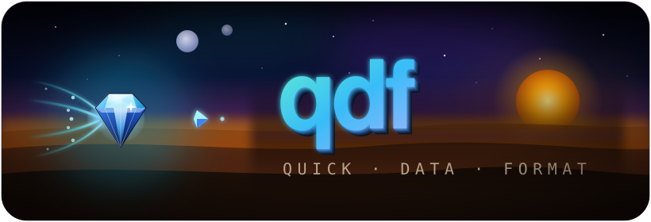

# qdf

[](https://github.com/alex60217101990/qdf/actions/workflows/ci.yml)
[](https://github.com/alex60217101990/qdf/actions/workflows/codeql.yml)
[](https://codecov.io/gh/alex60217101990/qdf)
[](https://alex60217101990.github.io/qdf/dev/bench/)
[](https://pkg.go.dev/github.com/alex60217101990/qdf)
[](https://goreportcard.com/report/github.com/alex60217101990/qdf)


<p align="center">
  
</p>

<p align="center">
  <b>Fast, compact binary serialization for Go.</b><br>
  <code>encoding/json</code>-style API · columnar per-column codecs · up to <b>68% smaller than Protobuf</b>, <b>6× smaller than JSON</b>
</p>

qdf is a single-pass, streaming binary format with `encoding/json`
ergonomics (`Marshal` / `Unmarshal` / `NewEncoder` / `NewDecoder`) — no
IDL, no schema registry, types picked up from struct tags. It dedups
repeated strings and keys inline and columnar-compresses slices of
structs with per-column codecs (frame-of-reference, delta, RLE,
dictionary, Gorilla XOR, FSST, rANS), so it shrinks *across* records
where per-record formats can't. A `go:generate` tool emits
reflection-free `MarshalQDF` / `UnmarshalQDF` for the last 10–15 %.

### Wire size on real telemetry batches · GitHub Actions `ubuntu-latest` · Go 1.26

| batch | `encoding/json` | protobuf | **qdf** balanced | **qdf** compression |
| --- | ---: | ---: | ---: | ---: |
| OTLP traces | 1 027 KB | 562 KB | **138 KB** | **130 KB** |
| logs        |   245 KB | 156 KB |  **44 KB** |  **44 KB** |
| RTB bids    |   559 KB | 328 KB | **244 KB** | **201 KB** |
| events      |   123 KB |  65 KB |  **40 KB** |  **40 KB** |
| IoT floats  |   469 KB | 208 KB | **158 KB** | **148 KB** |

qdf's wire is **smaller than Protobuf on every fixture (−24 … −77 %)** and
**2.3–7.5× smaller than JSON** — it interns repeated strings and
columnar-compresses *across* records, where per-record formats can't. On a
real Active-Directory host dump it also decodes **≈6× faster than JSON**
and **~1.5× faster than msgpack** at **~40 % of the allocations**, and encodes
faster than both on telemetry-shaped batches (msgpack edges encode on some
high-cardinality sets). Honest trade-offs: `OptCompression` spends encode CPU
for the smallest wire, and protobuf/flatbuffers still win raw single-tiny-message
decode. Full tables + reproduction recipe: **[docs/COMPETITIVE.md](docs/COMPETITIVE.md)**.

**Deep dives:**
[qdf — decodes less, packs harder, and lets you query the bytes](https://dev.to/alex_602/qdf-a-go-serializer-that-decodes-less-packs-harder-and-lets-you-query-the-bytes-2a39)
· [Shrinking AI embeddings on the wire — a lossy vector codec that beats Google's TurboQuant at equal recall](https://dev.to/alex_602/shrinking-ai-embeddings-on-the-wire-a-lossy-vector-codec-that-beats-googles-turboquant-at-equal-4hme)

---

## Design philosophy — from "data as bytes" to "data as a model"

qdf treats a message not as a tree to serialize byte-for-byte, but as a
small set of distinct values plus a stream of references and residuals
against the context already seen. (The original working name, *Quantum
Density Format*, was a borrowed metaphor for this state/collapse view —
not physics; the engineering below is what actually ships.)

The starting observation: in a payload like

```json
{ "users": [
    {"country": "LT"},
    {"country": "LT"},
    {"country": "LT"} ] }
```

the byte `"LT"` is written three times even though, from an
information-theoretic point of view, it is a single state with high
probability. Classical formats (JSON, MessagePack, CBOR, Protobuf)
treat data as `tree → bytes`. qdf treats it as

> `data = (state set, references, entropy weights)`

— a finite set of distinct values plus a stream that "collapses" each
position onto one of them. The wire dialect that ships today realises
the practical subset of that idea:

| Concept | What it maps to in qdf today |
| ------------------------ | ---------------------------- |
| **State set** — the discrete values a position can take. | The Dense-mode intern table. The first occurrence of a string or `[]byte` value writes it in full and assigns it a stable ID. |
| **Wavefunction collapse** — a single observation picks one state. | Every subsequent occurrence emits a `state_ref` tag plus a varint ID. Decoding "collapses" the reference back to its stored value. |
| **Density** — keep only what carries information; minimise entropy `H(D \| C)` against the existing context. | Repeated keys / values across a message (and across a Dense stream) cost 1–3 bytes rather than their full length. Numeric and bool slices use QPack codecs (FOR, Delta+FOR, RLE, dictionary, Gorilla XOR, ALP decimal, raw-LE bulk) that auto-select the smallest predicted form per slice; slices of homogeneous structs transpose to per-column codecs, and an enum-like string column is dictionary-coded (distinct table + bit-packed index per row) when that beats the per-value floor of one ref byte per row — including a *skewed* low-cardinality column whose dominant value clusters into few runs (the gate compares the index against `n`, not the run count, so clustered enums are no longer wrongly sent to the per-value path). When the index itself is skewed, it is QPack-coded (`tagColStrDictQ`, `0xFC`) — RLE / dictionary / FOR over the per-row indices — so the index costs its entropy, not `ceil(log2 d)` bits, emitted only when strictly smaller than the flat pack (the Balanced-tier counterpart to the whole-body rANS pass). A dictionary whose distinct values share prefixes (SID / path / DN / URL columns) is front-coded (`tagColStrDictFC`, `0xFA`): the table is sorted and each entry stored as `sharedPrefixLen + suffix`, emitted only when strictly smaller (−36.5 % on real AD dictionary tables, up to −92.6 % on SID columns). A *mixed* struct — mostly scalar/string columns with one or two `map` / slice / nested fields (the common log / AD / span / RTB record shape) — transposes its eligible columns and keeps the rest as a per-row residual tail (**hybrid columnar**, `tagHybridColStruct`, `0xF7`), under `OptCompression`, instead of falling back to fully row-major. High-cardinality string columns (URLs, log lines, paths) where the whole-string dictionary can't help are eligible for FSST (`tagColStrFSST`, `0xF6`), which learns a symbol table of up to 255 substrings and compresses at the byte level — emitted only when strictly smaller. A high-cardinality column whose values are drawn from a small alphabet (hex / base32 / base64 / decimal IDs — trace, span, request IDs, hashes, GUIDs) is alphabet-packed (`tagColStrAlpha`, `0xFB`): each character is stored in `ceil(log2 \|A\|)` bits instead of 8 (hex halves the body), the one class the dictionary, front-coding and FSST all miss — captured without the rANS CPU cost, so it lands on the Balanced tier, emitted only when strictly smaller. Field-name headers in generated code are pre-encoded once per type and concatenated without further work. |
| **Probabilistic / residual coding** — predict, then store only the deviation. | QPack's Delta+FOR codec is exactly this for monotonic integer sequences: encode the first value plus the bit-packed residual against a `aᵢ = aᵢ₋₁ + minΔ` predictor. Gorilla does the same for floats by XOR-ing each sample against the previous one and storing the differing bits only. |
| **Entanglement** — correlated values that constrain each other (e.g. `city = "Vilnius"` ⇒ `country = "Lithuania"`). | Three stacked predictors on the Dense state stream. **Markov-0** (`tagStateRepeat`, `0xE8`) collapses an immediate repeat of the previously emitted state-ref to a single byte. **MTF rank** (`tagStateMTF`, `0xE9`) encodes the LRU rank of the touched ID when that varuint is shorter than the raw id. **Markov-1 pair** (`tagStatePair`, `0xEA`) stores the most-recent successor observed after each prev ID (top-1, K=1) and encodes a hit as `0xEA + 0x00` (rank always 0) — wins when the prev → curr transition is predictable and the raw id needs a multi-byte varuint. The encoder picks the shortest of the four variants per emission, so the wire is never larger than the plain `tagStateRef` encoding. A full conditional-probability table beyond order-1 stays in the reserved `0xEB / 0xED..0xEF` block. |
| **Shape interning** — repeated structure means the *layout* itself is information. | Dense mode emits structs (and `map[string]any` of stable shape via the reflect-struct path) through `tagMapShape` (`0xEC`). First occurrence declares the shape inline: `0xEC, 0, varuint(N), N × key`. Subsequent occurrences of the same shape emit `0xEC + varuint(shapeID) + N × value` — keys are *not* re-emitted. Per-record saving on an array of identical-shape structs is `N × 2` bytes for the elided state-refs plus the map header. The shape table is per-stream, addressed by `*typeDesc` on the encoder and by sequential ID on the wire. Shapes never collide across types because the encoder keys the binding on the descriptor pointer. |
| **Arithmetic / range coding (rANS)** — push the encoded stream to its Shannon limit. | Shipped behind `OptRANS` (in `OptCompression`): a static order-0 rANS pass over the whole body, applied only when it shrinks (never larger). Squeezes the residual byte-entropy the structural codecs leave — e.g. −37 % on trace batches — at ~4–6× CPU, so it stays in the opt-in compression tier. |

The conceptual roadmap (state table → entanglement graph → predictive
encoder) is preserved in the codebase: tag space and the encoder
interface are designed to let those layers slot in above the current
one without a format break. The MVP that ships now is the part of the
idea that has a positive CPU / size tradeoff on day-one workloads —
logs, traces, columnar rows, embedding vectors.

The realistic conclusion: the real shift is not the "quantum" framing
but the move from "data as bytes" to "data as a model of the world
that produced it".

---

## Why another format

`encoding/json` is verbose and slow. `vmihailenco/msgpack/v5` is fast
but allocates a lot on decode and has no built-in deduplication for
repeated keys / values — which is the dominant cost on real telemetry,
log, and trace payloads where the same handful of strings (service
names, log levels, region codes, span attributes) appears thousands of
times per batch.

qdf attacks two costs at once:

1. **Wire size on repetitive data.** A Dense-mode encoder maintains an
   inline interning table: the first time `"region":"eu-west-1"`
   appears it is written in full; subsequent occurrences emit a 2-byte
   back-reference. Streams share that table across messages, so a
   1000-event log batch with eight distinct region codes carries each
   code once. The decoder follows the same protocol — no out-of-band
   dictionary, no two-pass encode.

2. **CPU and allocations on decode.** The reflect path uses a cached
   per-type descriptor with `unsafe.Pointer + field offset` access
   instead of `reflect.Value.Field(i)`, plus specialised type-specific
   decoders for `[]string`, `[]int*`, `[]float*`, `map[string]string`,
   `map[string]int`, `map[string]any`, etc. A direct-mapped key
   interner deduplicates map keys across decode calls without a pool
   or chained hash table. On a `map[string]any` decode with repeated
   keys the allocator runs **3 times per call** versus json's 37.

The format is single-pass and streaming-safe in both directions. There
is no schema language, no IDL, no compile-time registration — types
are picked up via Go struct tags (`qdf:"name"`, falling back to
`json:"name"`).

### Measured against the field

On realistic batch payloads (GitHub Actions `ubuntu-latest` · Go 1.26), qdf's
wire is **smaller than protobuf on every fixture** — because it dedups and
columnar-compresses across records, while json/msgpack/protobuf/flatbuffers
encode each record independently:

| wire size vs protobuf | OTLP traces | logs | RTB | events | IoT floats |
| --- | ---: | ---: | ---: | ---: | ---: |
| `qdf_balanced` | **−75 %** | **−72 %** | −25 % | −39 % | −24 % |
| `qdf_compression` | **−77 %** | **−72 %** | −39 % | −39 % | −29 % |

It also allocates far less under load (IoT encode: `qdf_balanced` 3 allocs/op
vs protobuf 385). Honest trade-offs: `qdf_speed` wire ≈ msgpack;
`qdf_compression` encode trades CPU for bytes; protobuf and flatbuffers win
raw single-tiny-message decode. Full tables (json / msgpack / protobuf /
flatbuffers × five fixtures, wire + memory) and the reproduction recipe are in
**[docs/COMPETITIVE.md](docs/COMPETITIVE.md)**.

A concrete head-to-head on a real **Active-Directory host dump** (adalanche
`localmachine` data — unique GUID/SID identifiers alongside repeating group,
department, and object-class strings; same data through each library, typed
structs):

| AD host dump | wire | encode | decode | decode allocs |
| --- | ---: | ---: | ---: | ---: |
| `encoding/json` | 532 KB | 1.5 ms | 4.9 ms | 15 851 |
| `vmihailenco/msgpack` | 500 KB | **0.65 ms** | 1.2 ms | 13 261 |
| **qdf — `OptBalanced`** (default) | **209 KB** | 0.77 ms | **0.79 ms** | **6 413** |
| **qdf — `OptCompression`** | **127 KB** | 5.7 ms | 1.6 ms | **5 597** |

`OptBalanced` is **2.5× smaller than json / 2.4× smaller than msgpack**, decodes
**≈6× faster than json** and **~1.5× faster than msgpack**, at ~40 % of json's
allocations. msgpack edges it on encode wall-time for this high-cardinality set
(qdf wins encode on the telemetry fixtures above); `OptCompression` trades encode
CPU for the smallest wire. Protobuf/flatbuffers still win raw single-message
decode.

### Wire layout

```
+-----+-----+-----+-----+-----+
| 'Q' | 'D' | 'F' | ver |flags|
+-----+-----+-----+-----+-----+
| body (tagged values)        |
+-----------------------------+
```

A 5-byte header (3-byte magic + 1-byte version + 1-byte flags) and a
tagged body. The flag bit distinguishes Fast from Dense; the decoder
auto-detects.

Tag space is msgpack-inspired with a few additions:

| Range                | Purpose                                       |
| -------------------- | --------------------------------------------- |
| `0x00..0x7F`         | positive fixint (0..127)                      |
| `0x80..0x9F`         | fixstr (len 0..31)                            |
| `0xA0..0xBF`         | fixarr (len 0..31)                            |
| `0xC0..0xCF`         | nil, bool, int / uint / float of width 8–64   |
| `0xCD..0xCF`         | str8 / str16 / str32                          |
| `0xD0..0xD2`         | bin8 / bin16 / bin32                          |
| `0xD3..0xD4`         | arr16 / arr32                                 |
| `0xD5..0xD7`         | map8 / map16 / map32                          |
| `0xD8..0xDF`         | negfixint (-1..-8)                            |
| `0xE0..0xE2`         | intern\_str / state\_ref / intern\_bin (Dense)|
| `0xE3`               | QPack: bit-packed `[]bool`                    |
| `0xE4`               | QPack: raw-LE numeric slice                   |
| `0xE5`               | QPack: Frame-of-Reference bit-packed ints     |
| `0xE6`               | QPack: Delta + zigzag + FOR (monotonic ints)  |
| `0xE7`               | QPack: Gorilla XOR-coded float slice          |
| `0xE8`               | Dense: state-ref repeat (Markov-0 predictor)  |
| `0xE9`               | Dense: state-ref MTF rank (Move-To-Front)     |
| `0xEA`               | Dense: state-ref pair rank (Markov-1)         |
| `0xEB`               | QPack: run-length encoded integer slice       |
| `0xEC`               | Dense: struct/map shape declare / reuse       |
| `0xED`               | QPack: dictionary-coded integer slice         |
| `0xEE`               | QPack: Patched FOR integer slice (outliers)   |
| `0xEF`               | QPack: columnar `[]struct` container          |
| `0xF0..0xF3`         | ext / timestamp                               |
| `0xF4`               | QPack: ALP decimal-coded `[]float64` / `[]float32` slice (kind byte selects width) |
| `0xF5`               | QPack: dictionary-coded string column          |
| `0xF6`               | QPack: FSST-coded string column (inside columnar) |
| `0xF7`               | QPack: hybrid columnar container (mixed `[]struct`) |
| `0xF8`               | QPack: bulk-slab string column (inside columnar) |
| `0xF9`               | QPack: constant string column (inside columnar) |
| `0xFA`               | QPack: front-coded dictionary string column (inside columnar) |
| `0xFB`               | QPack: alphabet-packed string column (inside columnar) |
| `0xFC`               | QPack: dictionary string column with QPack-coded index (inside columnar) |
| `0xFD..0xFF`         | reserved (n-gram graph, future)               |

The 5th header byte holds two flag bits: `FlagDense` (`0x01`) for the
intern dialect, and `FlagQPack` (`0x02`) as an early hint that the body
may carry codec tags from the QPack codec range (`0xE3..0xEF`, `0xF4..0xFC`). A reader that does
not implement the QPack tags fails with `ErrBadTag` on first contact;
it never decodes a packed payload as scalar by accident.

> **Alpha note:** qdf is pre-1.0. The wire format is still being
> shaped — tags may shift, version may bump, and "older" decoders
> here mean "earlier in alpha", not stable releases. No
> backwards-compat promise yet.

All multi-byte integers and floats are little-endian. amd64 and arm64
are the supported targets.

---

## Quick start

```bash
go get github.com/alex60217101990/qdf
```

Requires Go 1.26.

**Runnable examples** (`go run ./examples/<name>`):
[`telemetry`](examples/telemetry) (dedup vs json) ·
[`query`](examples/query) (predicate pushdown) ·
[`embeddings`](examples/embeddings) (lossy vector codec) ·
[`streaming`](examples/streaming) (shared-dict stream) ·
[`decodealloc`](examples/decodealloc) (arena zero-alloc decode).
More runnable snippets — arena, no-copy, options, delta, columns — render on
[**pkg.go.dev**](https://pkg.go.dev/github.com/alex60217101990/qdf#pkg-examples).

```go
package main

import (
    "fmt"

    "github.com/alex60217101990/qdf"
)

type Event struct {
    ID      int               `qdf:"id"`
    Source  string            `qdf:"source"`
    Payload []byte            `qdf:"payload"`
    Attrs   map[string]string `qdf:"attrs"`
}

func main() {
    in := Event{
        ID:     42,
        Source: "ingest",
        Attrs:  map[string]string{"region": "eu-west-1", "version": "v3"},
    }

    b, err := qdf.Marshal(in, qdf.OptSpeed)
    if err != nil {
        panic(err)
    }
    fmt.Printf("wire: %d bytes\n", len(b))

    var out Event
    if err := qdf.Unmarshal(b, &out); err != nil {
        panic(err)
    }
    fmt.Printf("%+v\n", out)
}
```

### Encode profile is per-call

There is one encode entry point — `Marshal(v, opts)` — and the
`opts` bit-mask picks which codecs run for that specific call. The
convenience bundles cover the common tradeoffs:

| Bundle             | When to use                                                  |
| ------------------ | ------------------------------------------------------------ |
| `qdf.OptSpeed`     | Fast path. Tightest CPU cost; size comparable to msgpack. Drop-in for `encoding/json` behaviour. |
| `qdf.OptBalanced`  | Repetitive payloads — logs, telemetry, columnar rows. Strings intern once; numeric and bool slices use QPack codecs; struct shapes intern; Markov-1 + MTF run on state-refs. |
| `qdf.OptCompression` | `OptBalanced` plus the heavier wire-size codecs: Gorilla XOR for smooth float series, ALP for quantized/decimal `[]float64` and `[]float32`, FSST substring-level compression for high-cardinality string columns (URLs, log lines, paths), **hybrid columnar** (transposes the eligible columns of a *mixed* struct — one with a map / slice / nested field — keeping the rest row-major, so log / AD / span records get columnar treatment they otherwise couldn't), and a final order-0 rANS entropy pass over the whole body (never larger). Trades encode CPU for smaller wire — pick it for backup / cold storage. |
| custom mix         | Or-combine individual bits (`OptDense \| OptQPack \| OptShapeIntern …`) when one of the bundles is one click off the desired tradeoff. |

```go
b, _ := qdf.Marshal(event,    qdf.OptSpeed)        // hot path
b, _ := qdf.Marshal(batch,    qdf.OptBalanced)     // telemetry / logs
b, _ := qdf.Marshal(snapshot, qdf.OptCompression)  // backup / archive
b, _ := qdf.Marshal(payload,                       // tuned mix
    qdf.OptDense|qdf.OptQPack|qdf.OptShapeIntern)
```

A single `qdf.Unmarshal` reads everything. The wire header is self-
describing; the receiver never has to know which option mix the
sender picked.

Picking the right combo for a concrete workload — hot path, telemetry,
metric series, embeddings, backup — is covered in
[`docs/CHOOSING.md`](docs/CHOOSING.md), with head-to-head numbers vs
json and msgpack per scenario.

### Dense mode internals — what each bit buys you

`OptDense` activates the inline intern table. The four codec bits
that compose `OptBalanced` layer on top of it. They share one rule:
**the encoder picks the shortest variant per emission, so Dense wire
is never larger than the same payload at `OptSpeed`.** If the
predictors do not pay, the byte cost is identical to a plain
state-ref.

| Tag | Predictor | Wins when | Doesn't help when |
| --- | --------- | --------- | ----------------- |
| `0xE8` | Markov-0: same ID as the previous emission | Runs of the same value (`region`, `region`, `region`). | Distinct values in a row. |
| `0xE9` | MTF: encode LRU rank instead of raw id | Heavy reuse of a small hot subset of strings that were interned early. | Random access pattern with no recency. |
| `0xEA` | Markov-1: top-1 predictor of the previous emission's successor | Correlated pairs — `country` → `city`, `service` → `region`. Only emits when the raw id needs ≥ 2 varuint bytes, so the wire never grows on small state tables. | Unique transitions, low-cardinality state. |
| `0xEC` | Shape interning: declare struct shape once, reuse by id | Arrays / streams of the same struct type. Per-record saving is ≈ `N × 2` bytes (elided key state-refs + map header). | One-shot encodes of a unique struct type. |

The state table is shared **per stream** in `StreamEncoder` /
`StreamDecoder`, so a batch of 1 000 log events with eight distinct
region codes ships each region once. `Marshal*` calls do not share —
each call starts with an empty table.

**Where Dense is worth it:** logs, traces, telemetry, columnar rows,
event batches, audit streams, snapshot dumps — anything where a small
vocabulary of strings and a stable struct shape repeat thousands of
times. Expected envelope: 25 – 55 % smaller than JSON at 2–6× the
encode speed.

**Where Dense is *not* worth it:** single-shot encodes of small
unique payloads (Markov / shape predictors never reach their
amortisation point, you pay ≤ 2 bytes of prelude for nothing), or
strict-throughput paths where decode CPU is the bottleneck — Dense
decode is ~15 % slower than Fast because of the state-table lookups.
Reach for `OptSpeed` or `OptQPack` there.

**Where it is wrong:** *cryptographic / forensic* contexts that need
byte-stable wire across implementations and versions. Dense embeds
predictor state, intern-ID ordering, and shape IDs that depend on
emission order. Use `OptSpeed` if you hash or sign the wire.

### Bit reference

| Bit | What it gates |
| --- | -------------- |
| `OptDense`        | Inline intern table; required by everything below. |
| `OptQPack`        | Numeric / bool slice codecs (FOR, Delta+FOR, Gorilla, bit-pack). |
| `OptShapeIntern`  | `tagMapShape` for struct emissions (declare once, reuse by id). |
| `OptPairPred`     | Markov-1 successor predictor (`tagStatePair`, `0xEA`). |
| `OptMTF`          | Move-to-Front rank coding on state-refs (`tagStateMTF`, `0xE9`). |
| `OptColumnIndex`  | Column-length index on columnar `[]struct` for selective decode (opt-in, ~4 B/column; default wire unchanged when off). |
| `OptMapShape`     | Key-set interning for `map[string]V` fields (declare keys once, reuse by shape id). ~−24 % encode CPU and ~−26 % wire on recurring-key tag-maps (telemetry/logs); opt-in, default wire unchanged when off. |

| Bundle | Composition |
| ------ | ----------- |
| `OptSpeed`       | `0` — Fast mode, no codecs. |
| `OptBalanced`    | `OptDense \| OptQPack \| OptShapeIntern \| OptPairPred \| OptMTF`. |
| `OptCompression` | `OptBalanced` + Gorilla XOR + ALP decimal floats (`[]float64` / `[]float32`) + FSST for high-cardinality string columns + an order-0 rANS entropy pass (never larger). Trades CPU for wire size; for backup / cold storage. |

`Options` is a `uint32` carried by value, so `Marshal` and
`AppendMarshal` add **zero per-call allocations** over the pool /
output-clone overhead. Encoders are pooled in a single shared pool
(`encPool`) keyed only by buffer; the configuration is applied on
each acquire via `applyOpts`. Markov-0 (`tagStateRepeat`, `0xE8`)
is always on inside `OptDense` because it costs nothing on the wire
when the predictor misses.

A note on tuning knobs that do *not* live on the bit-mask: the
intern threshold (`SetIntern`) and the cycle-depth ceiling
(`SetMaxDepth`) stay on the `*Encoder` itself. Use the low-level
encoder API for those.

### Generic API (Go 1.18+ generics)

`Marshal(v any, opts)` boxes the argument through `interface{}` and
then makes one reflect copy for value-typed inputs. The generic
helpers skip both: `T` is fixed at the call site,
`reflect.TypeFor[T]()` resolves at compile time, and
`unsafe.Pointer(&v)` points directly at the caller's stack.

| Generic                    | Equivalent to                 |
| -------------------------- | ----------------------------- |
| `MarshalT[T any]`          | `Marshal` (typed)             |
| `AppendMarshalT[T any]`    | `AppendMarshal` (typed)       |
| `UnmarshalT[T any]`        | `Unmarshal` (typed)           |

Wire output is byte-identical. The win is on the encode side: one
fewer allocation per call (-80 B) and 25–40 % faster on small/medium
payloads.

```go
buf, _ := qdf.MarshalT(event, qdf.OptSpeed)
var out Event
_ = qdf.UnmarshalT(buf, &out)
```

### Direct entry points (skip reflection entirely)

`MarshalT` still goes through `descOf` to walk the type. Types that
already implement `MarshalQDF` / `UnmarshalQDF` (either hand-written or
generated by `cmd/qdfgen`) can bypass the descriptor cache and the
runtime type assertion via the *Direct* generics. The type parameter
is constrained to the `Marshaler` / `Unmarshaler` interface, so the
method call is resolved at compile time and the compiler inlines it.

| Direct                                                  | When to use                                                   |
| ------------------------------------------------------- | ------------------------------------------------------------- |
| `MarshalDirect[T Marshaler](v T) ([]byte, error)`       | Hot paths where the type is known to have generated codecs.   |
| `AppendMarshalDirect[T Marshaler](dst []byte, v T)`     | Same, when the caller owns the destination buffer.            |
| `UnmarshalDirect[T Unmarshaler](data []byte, out T)`    | Inverse of `MarshalDirect`. Falls back to `Unmarshal` on `FlagDense` because generated code does not maintain the intern table. |

Wire is identical to `Marshal` / `Unmarshal`; the path is Fast-mode
only (Dense or QPack stay on the reflect path so the intern table is
correctly resolved). On the `cmd/qdfgen` `Sample` fixture
(11-field struct):

| Encode      | ns/op   | B/op | allocs |
| ----------- | ------: | ---: | -----: |
| json        |    2760 |  576 |      8 |
| qdf_reflect |     910 |  480 |      3 |
| qdf_codegen |     800 |  504 |      6 |
| **qdf_direct** | **545** | **160** | **1** |

(i7-9750H · Go 1.26 · `-count=6` median. Absolute ns are machine-specific;
the ratios — `qdf_direct` ≈ 5× faster than json, ≈ 1.6× faster than the
reflect path, at 1 alloc vs json's 8 — are the stable signal.)

Decode-side performance is bounded by the receiver's `UnmarshalQDF`.
The reflect path is heavily pooled (Decoder pool + per-decoder key
intern cache); generated code from `qdfgen` uses `Decoder.InternKey`
and matches it. Hand-rolled receivers that allocate a new Decoder per
call will not.

```go
buf, _ := qdf.MarshalDirect(&event)
var out Event
_ = qdf.UnmarshalDirect(buf, &out)
```

### QPack: math-driven slice codecs

QPack auto-selects, per slice, the codec with the smallest predicted
wire form. Round-trip is lossless for every type (NaN/±Inf survive on
floats).

| Codec      | Trigger                                            | Math                                                                  |
| ---------- | -------------------------------------------------- | --------------------------------------------------------------------- |
| Bitpack    | `[]bool`                                           | 1 bit per element, LSB-first per byte. 8× smaller for free.           |
| Raw-LE     | numeric slice, large delta range                   | Unsafe-slice cast → single `memmove` of LE bytes. 10-50× faster.      |
| FOR        | numeric slice, clustered values                    | Frame-of-Reference: store `min` and `ceil(log₂(max-min+1))`-bit deltas.|
| Delta+FOR  | monotonic / near-monotonic integers                | Δᵢ = aᵢ - aᵢ₋₁, zigzag bias, FOR over the deltas.                     |
| Patched FOR| integer slice with rare outliers (latency spikes)  | FOR body at a reduced width `b` + an exception list for the few values that don't fit. ~50% smaller than FOR on spiky columns. |
| Gorilla    | float slices (explicit opt-in via low-level API)   | XOR with previous, run-length leading/meaningful-bit window. (Facebook VLDB 2015.) |
| FSST       | high-cardinality columnar string column (URLs, log lines, paths) under `OptCompression` | Learns a symbol table of up to 255 substrings (1–8 bytes each); replaces frequent substrings with 1-byte codes. Complements the dictionary codec: dict deduplicates whole strings; FSST compresses at the substring level where cardinality is too high for a dictionary. ~76–79 % wire reduction on URL/log-line corpora. (Boncz/Neumann/Leis, VLDB 2020.) |

Head-to-head on a mixed 256-bool / 512-monotonic-u64 / 512-i64 / 256-f64
payload (Intel i7-9750H):

| Format      | Bytes  | Encode (ns/op) | Decode (ns/op) |
| ----------- | -----: | -------------: | -------------: |
| json        | 10,739 |         48,000 |        200,000 |
| msgpack     | 11,808 |         64,000 |         80,000 |
| qdf_fast    |  6,694 |          6,500 |         14,000 |
| qdf_qpack   |  2,132 |          2,300 |          2,600 |
| qdf_dense   |  2,134 |          2,500 |          2,500 |

For sequences where the deltas alone collapse, the gain is much
larger — e.g. 1024 consecutive Unix-second timestamps shrink from
8201 bytes (raw) to 16 bytes (Delta+FOR), a 512× reduction.

### Streaming

```go
var w bytes.Buffer
enc := qdf.NewStreamEncoder(&w, qdf.Dense)
for _, ev := range events {
    if err := enc.Encode(ev); err != nil {
        return err
    }
}
enc.Close()

dec := qdf.NewStreamDecoder(&w)
defer dec.Close()
for {
    var ev Event
    if err := dec.Decode(&ev); err == io.EOF {
        break
    } else if err != nil {
        return err
    }
    // ...
}
```

Dense streams preserve the intern table across messages — the second
occurrence of `"region":"eu-west-1"` in the batch is a 2-byte reference
rather than a 13-byte string.

Each message is length-framed (a `uvarint` byte-count precedes its body;
the 5-byte header is written once up front), so a message of any size
round-trips — even across a reader that delivers one byte at a time — and
`io.EOF` cleanly marks the end. Struct tags and all Dense/codec options
work exactly as in one-shot `Marshal`. Decode-side allocation has two
levers: `dec.SetNoCopy(true)` aliases the window (zero copies, values valid
for the stream's lifetime), and `dec.SetArena(a)` bump-packs string bodies
into a caller-owned arena (one amortized copy, values valid as long as the
arena — `Reset` it per batch). To reuse one encoder/decoder across
independent streams (pay the intern-table construction once), `Reset` them
between streams; pair with the arena to bound a long stream's memory. The
encoder reuses one pooled buffer (allocation-free steady state); target a
`*bytes.Buffer` to collect into a `[]byte`. The three whole-batch
features — `OptColumnIndex`, `Where`/`Select` pushdown, and `OptRANS` —
are not part of streaming (they act on a single complete batch; use
one-shot `Marshal`/`Unmarshal` for those).

### Selective columnar decode (`OptColumnIndex`)

qdf transposes a slice of flat structs into a columnar container and
compresses it column-by-column. With `OptColumnIndex` the producer writes a
fixed-width column-length index (one `uint32` per column, ~4 B each) after the
shape declaration. A consumer that only needs some columns then **advances
past the rest using the index instead of decoding them** — cost becomes
*O(columns you read)*, not *O(all columns)*.

Two ways to read a subset:

```go
// Producer opts in to the index.
buf, _ := qdf.Marshal(events, qdf.OptBalanced|qdf.OptColumnIndex)

// 1) Typed subset — no new API. Decode into a struct whose fields are a
//    subset of the wire (matched by qdf tag / field name). Wire columns
//    absent from the target are skipped; target fields absent from the
//    wire are left zero.
type Subset struct {
    Level   string `qdf:"level"`
    Service string `qdf:"service"`
}
var sub []Subset
_ = qdf.Unmarshal(buf, &sub)

// 2) Explicit column names — drives a typed subset or the dynamic
//    *[]map[string]any form. With no fields it behaves like Unmarshal.
var rows []map[string]any
_ = qdf.UnmarshalColumns(buf, &rows, "level", "service")
```

Decoding a 3-field subset of a 16-field columnar batch (i7-9750H):

| | ns/op | B/op | allocs/op |
| --- | ---: | ---: | ---: |
| full (16 fields) | 94,000 | 283,100 | 66 |
| subset (3 fields) | 16,440 | 53,610 | 32 |

≈ **5.7× faster, ≈5.3× fewer bytes** — it decodes 3 columns and skips 13.

Notes: the option only affects payloads the encoder transposes into the
columnar container; the flag is backpatched **only when the index is actually
emitted**, so the default columnar wire stays **byte-identical** when the
option is off (and the default non-indexed decode path has no regression).
Without the index a subset decode still returns correct results by decoding
and discarding unwanted columns — correct, just not fast. The index is a
single-message feature and is **not emitted in streaming mode**.

### Predicate pushdown (`Where` / `Select`) — the headline feature

This is what no other Go serializer does. On a columnar `[]struct` batch you
can **filter rows and project columns inside `Unmarshal`** — the decoder tests
typed predicates against whole columns, builds a row bitmask, and materializes
only the surviving rows of the columns you keep. The rows you filter out are
never reconstructed; the columns you don't select are never touched. It is
"`SELECT ts, code WHERE level='ERROR' AND code>=500`" over a qdf blob, with no
database, no second pass, and **zero per-value boxing**.

```go
buf, _ := qdf.Marshal(events, qdf.OptBalanced|qdf.OptColumnIndex)

type Hot struct {
    TS   int64 `qdf:"ts"`
    Code int32 `qdf:"code"`
}
var hot []Hot // filter on level (absent from Hot), keep ts+code of matches
_ = qdf.Unmarshal(buf, &hot,
    qdf.Where("level", func(s string) bool { return s == "ERROR" }),
    qdf.Where("code", func(c int32) bool { return c >= 500 }))
```

On a wide 9-column, 2000-row batch at 1% selectivity, pushdown moves **≈4.4×
fewer bytes** and runs **≈2.3× faster** than a full decode + manual filter
loop — because it never materializes the rows or columns it discards.

**This is the unique selling point of qdf** versus `encoding/json`,
`msgpack`, `protobuf`, `gob`, and friends — none of them can read back a
filtered, projected subset of a batch without first decoding the whole thing.
The full rationale, API reference, nullable/error semantics, internals, and a
step-by-step tutorial live in **[`docs/PREDICATE-PUSHDOWN.md`](docs/PREDICATE-PUSHDOWN.md)**.

Go one level deeper with **zone maps** (`OptZoneMap`): an ordered int/uint/float64
column is chunked into 256-row zones with a `[min,max]` summary, so a range filter
(`WhereRange` / `WhereCmp`) **skips whole zones without decoding them** — 87–97 %
of an ordered column. Guide: **[`docs/ZONEMAP.md`](docs/ZONEMAP.md)**.

### Structural delta (`Diff` / `Apply`)

qdf can compute a **structural delta** between two values and ship only what
changed. `Diff(old, new, opts)` walks both values field/element/key-wise and
emits a self-describing patch carrying only the locations that differ;
`Apply(&base, patch)` merges it back in place to reconstruct `new`. This is the
state-sync primitive no mainstream Go format ships natively — k8s reconciliation,
config hot-reload, CDC / event sourcing, realtime netcode.

```go
patch, _ := qdf.Diff(old, updated, qdf.OptBalanced) // only the changes
// ... ship `patch` (often a few dozen bytes) ...

base := old
_ = qdf.Apply(&base, patch) // base now == updated, in place
```

Structs (incl. nested), scalars / string / `[]byte` / `[N]byte`, positional
slices/arrays, and per-key maps (with tombstone deletes) are all diffed.
`schemaFP` + `baseFP` fingerprints reject a patch applied to the wrong type or a
divergent base (`ErrPatchSchemaMismatch` / `ErrPatchBaseMismatch`). On a
1000-record batch with one changed field the patch is **42 B vs a 26 677 B full
Marshal — ~635× smaller**. Full semantics, wire format, and the deletion /
nil-vs-empty rules are in **[`docs/DELTA.md`](docs/DELTA.md)**.

### Canonical encoding

`OptCanonical` makes logically-equal values serialize to byte-identical output —
map keys are emitted in sorted order (all key kinds) and floats are normalized
(`-0.0 → +0.0`, any NaN → a canonical quiet NaN). The bytes are ordinary qdf
(decode unaffected) and safe to hash, sign, content-address, or dedup.

```go
b, _ := qdf.Marshal(v, qdf.OptBalanced|qdf.OptCanonical)
sum := sha256.Sum256(b) // stable across runs, machines, and map rebuilds
```

Zero overhead for map-free / normal-float values, composes with `Diff`, and is
lossy only for the sign of zero and NaN payloads (use the default mode for a
bit-exact float round-trip). Full guarantee, scope, and caveats are in
**[`docs/CANONICAL.md`](docs/CANONICAL.md)**.

### Zero-extra-copy encode

`AppendMarshal` lets callers own the destination buffer:

```go
out, err := qdf.AppendMarshal(out[:0], v)
```

Pair with a goroutine-local buffer to drop the per-call allocation
entirely.

> **Decode performance levers** — the four ways to cut decode allocations
> (decode fewer fields, `[N]byte` ids, `WithNoCopy`, `WithArena`), with measured
> numbers and when to use each, are collected in
> **[`docs/DECODE-PERF.md`](docs/DECODE-PERF.md)**.

### Zero-copy decode (`WithNoCopy`)

Decode is allocation-bound: copying each string/`[]byte` body out of the
input buffer dominates. `WithNoCopy()` makes the decoded values **alias the
input buffer** instead of copying — near-zero allocations, ~1.7× faster on
string-heavy batches.

```go
// data must outlive `out` and must NOT be mutated/reused while `out` is in use.
var out LogBatch
_ = qdf.Unmarshal(data, &out, qdf.WithNoCopy())
```

> ⚠️ **Lifetime contract.** The decoded strings/bytes point INTO `data`. If
> `data` is recycled, mutated, or freed before you finish with `out`, the
> values silently corrupt — a use-after-free the race detector cannot catch.
> Never use it on a pooled/reused buffer (e.g. an HTTP request body). Safe for
> caller-owned, long-lived, immutable input (mmap, a file read into memory,
> batch analytics). It is opt-in for this reason; the default copies.

Measured on a 1000-row string-heavy batch (i7-9750H): **7002 → 3 allocs/op,
−38 % B/op, ~1.7× faster**. It works on both the reflect path and codegen
types (generated `UnmarshalQDFOpts` threads the flag through nested decodes).
For a `Decoder`/`StreamDecoder` you drive yourself, use `SetNoCopy(true)`.

### Arena decode (`WithArena`)

When the wire buffer is **recycled** (a pooled HTTP request body) `WithNoCopy`
is unsafe — its aliases dangle the moment the buffer returns to the pool. A
decode `Arena` is the safe alternative: it **copies** the strings out, but into
one dense bump-allocated block per epoch instead of one heap allocation per
string. The wire buffer is free to go back to its pool immediately, and across a
batch/stream the block allocation amortizes to ~zero.

```go
a := qdf.NewArena()                 // one arena per epoch (batch / request)
for i, msg := range messages {
    _ = qdf.Unmarshal(msg, &out[i], qdf.WithArena(a))
}
// out's strings live in `a`; the GC frees it when `out` is dropped — no Reset,
// no lifetime bookkeeping. (Call a.Reset() to reuse it across epochs for zero
// steady-state alloc; see the lifetime contract in docs/ARENA.md.)
```

Safe by default (strings are owned copies, the GC keeps the block alive via an
interior pointer), opt-in, and adaptive — the win scales with string density and
is never negative:

| Corpus | time | allocs/op (off → on) |
| --- | ---: | ---: |
| Telemetry log batch (1 000) | **−35 %** | 3 502 → **3** |
| AD / directory export (200) | **−26 %** | 4 856 → **605** |
| Event batch (`[]byte` + string) | **−13 %** | 1 003 → **504** |
| IoT sensor batch (numeric-heavy) | −4 % | 291 → **164** |

Works on the reflect path and codegen types (generated `UnmarshalQDFArena`
threads the arena through nested decodes); drive a `Decoder`/`StreamDecoder`
directly with `SetArena(a)`. Full lifetime contract, `WithNoCopy` comparison,
and internals in **[`docs/ARENA.md`](docs/ARENA.md)**.

### Decode into a pooled slice (backing reuse)

The decoded **result slice backing** is the dominant decode allocation. When
you pass a `*[]T` whose slice already has enough capacity for the row count,
the decoder **reuses that backing** instead of allocating a fresh one — ideal
for a server that decodes many messages into a pooled slice:

```go
out := pool.Get().([]Row)[:0] // pre-sized; cap >= incoming row count
_ = qdf.Unmarshal(data, &out)  // reuses out's backing, no result allocation
```

The reused backing is overwritten in place (elements are zeroed first, so a
shorter/older wire schema can't leak stale data), so don't keep another live
slice **or map reference** from the target aliasing it across the call. A nil or
too-small destination allocates fresh — **default `var out []T` usage is
unchanged**, no opt-in flag needed. Works on the row-major and columnar decode
paths, for every element type (pointer-free elements take a raw clear,
pointer-containing ones a barrier-correct typed clear).

**Map recycling.** The per-element **maps** in a reused `[]struct{…map…}` target
(or a `[]map`) are the dominant allocation for map-bearing payloads — telemetry
tag maps, label sets. Decoding into a reused target now **recycles those maps**
(clears and refills them in place) instead of re-allocating, since `make(map)` +
bucket growth is ~83 % of map-heavy decode bytes. This is automatic and
data-adaptive (no flag): it kicks in only when the destination already holds
maps, covers maps at any struct-nesting depth, the generated fast paths, the
reflect and schemaless (`map[string]any`) paths, and successive `StreamDecoder`
frames into the same target. Wire is unchanged; nil-vs-empty and stale-key
semantics are preserved (recycled maps are cleared before refill). Same contract
caveat: a map value you retained from a previous decode of the target is cleared
and reused on the next decode into it.

Measured, decode into a pre-sized target (i7-9750H):

| element shape | B/op (fresh → reuse) | ns/op |
| --- | ---: | ---: |
| all-numeric `[]struct` (columnar) | 65,815 → 68 (**−99.9 %**) | ~−30 % |
| all-numeric `[]struct` (row-major) | 131,000 → 162 (**−99.9 %**) | ~−9 % |
| string-bearing telemetry `[]struct` | 393,924 → 229,948 (**−42 %**) | ~−9 % |
| `[]struct{map[string]string}` (256×16) | 341,000 → 25,000 (**−92 %**) | ~−17 % |

### Lossy vector codec (`OptLossyVec`)

`[]float32` and `[]float64` embedding fields can be compressed with a
configurable fidelity budget — cosine similarity, relative L2 error, or SNR.
The codec is **opt-in and lossy**; the default mode is always bit-exact. It
rotates (Hadamard), quantizes (scalar or E8 lattice — whichever is smaller),
and entropy-codes the result, so at equal reconstruction quality it is
**~17–22 % smaller than scalar / TurboQuant-style quantization**.

```go
enc := qdf.NewEncoderWith(qdf.OptBalanced | qdf.OptLossyVec)
enc.SetVectorBudget(qdf.MinCosine(0.999)) // or MaxRelError / TargetSNR
_ = enc.EncodeValue(rows)
data := enc.Bytes()
```

**Built for embedding stores.** The natural shape of a RAG index or vector
database is a `[]struct` — `{ID, Title, Emb []float32}` — i.e. id + metadata +
vector per record. qdf serializes the whole thing as **one** self-describing
blob, and under `OptLossyVec` it **batches the vector field across all rows into
a single column block**, so the per-vector header and entropy-coding overhead are
amortized once over the batch instead of paid per row (a per-row encoding is
~70 % larger). A 256-dim `float32` vector lands at roughly a third of its 1 KiB
raw size while cosine recall is preserved — no separate vector store, no second
metadata store, no custom format.

For columns whose vectors have **widely varying magnitudes** (model-weight rows,
un-normalized vectors) the codec automatically switches to a *polar split* —
storing each vector's norm separately and quantizing the unit direction — so one
tight step serves every vector and the column keeps its fidelity budget. Unit-
norm embeddings, where it cannot help, pay nothing for it.

NaN and Inf values are preserved exactly via an exception list in the wire
format — they are never corrupted or silently dropped. The encode never exceeds
the lossless size (never-worse), and reuses pooled scratch for near-zero warm
allocations. See the runnable `Example_aiEmbeddingStore`.

Full details — pipeline, budget knobs, `0xFD` wire format, the
[diagram](diagrams/lossy-vector.md), benchmark numbers, and runnable examples —
are in **[`docs/LOSSY-VECTOR.md`](docs/LOSSY-VECTOR.md)**.

---

## Code generation

For fixed-schema types where every nanosecond matters, generate
reflection-free methods:

```bash
go install github.com/alex60217101990/qdf/cmd/qdfgen@latest
```

```go
//go:generate qdfgen -type Event,User .
type Event struct {
    ID     int    `qdf:"id"`
    Source string `qdf:"source"`
    // ...
}
```

`qdfgen` writes `<package>_qdf.go` with concrete `MarshalQDF` /
`UnmarshalQDF` methods using only the public `qdf` API. No `reflect.*`
at runtime. See [`cmd/qdfgen/README.md`](cmd/qdfgen/README.md) for
flags and supported types.

On the test fixture (11-field struct with nested struct, slice, map,
pointer, fixed array, `[]byte`, `time.Time`) the generated code is
**2.65× faster** than `encoding/json` on encode and **8.49× faster**
on decode.

---

## Benchmarks

📈 **Live trend dashboard: <https://alex60217101990.github.io/qdf/dev/bench/>**

Every push to `main` re-runs the benchmark suite in CI and appends the
result to that dashboard — one chart per benchmark, `ns/op` (and where
shown `B/op` / `allocs/op`) over the commit timeline. A curve trending
**down** is a speed/size win; a **sustained** step up is a regression (a
lone spike is shared-runner noise — read the trend, not single points).
See [`docs/BENCHMARKS.md`](docs/BENCHMARKS.md) for how to read the graphs.
Wire-size numbers (`TestCorpusCodec_Sizes`) are deterministic, so changes
there are real.

The tables below are a point-in-time snapshot — Darwin amd64 / Intel
i7-9750H @ 2.6 GHz, Go 1.26.0, `-benchtime=2s`, `-race` cross-check. Full
numbers, realistic / unique-data scenarios, memory tables and reproduction
commands are in [`docs/BENCH.md`](docs/BENCH.md); the live dashboard above
has the current numbers.

> **May 2026 perf series** (commits `ada9fd7`, `2ea3b48`, `02d6aac`,
> `7090e25`, `c0517e8`, `95d3c21`, `001864b`) rebuilt the encode +
> decode hot paths: MRU ring side-cache for MTF rank, flat
> open-addressed intern table replacing `map[string]uint32`,
> packed `lruLink`, large-payload buffer probe-and-grow, cached
> decode interning (`decState.stringValues`), 4-way `mruRank`
> unroll, opt-in `Encoder.PreIntern` API, and the `qdfgen`
> codegen path wired into the bench matrix. qdf is now strictly
> faster than `msgpack` on encode AND decode for every workload
> in the matrix (-5 % HotPath, -40 % TelemetryBatch, -96 %
> MetricSeries on encode; -55…-98 % on decode). See
> [`docs/GUIDE.md`](docs/GUIDE.md#performance-characteristics)
> for the up-to-date Profile_* matrix.

### Encode — ns/op

| Payload                  | json    | msgpack | qdf\_fast | qdf\_dense | vs json    | vs msgpack |
| ------------------------ | ------: | ------: | --------: | ---------: | ---------: | ---------: |
| Tiny (`{id,name}`)       |     192 |     286 |       227 |        398 |       0.85× | 1.26×      |
| Flat (20 primitive fields) |   1182 |    1262 |   **480** |        948 | **2.46×**  | **2.63×**  |
| Nested (4 deep)          |     446 |     793 |   **331** |        786 | **1.35×**  | **2.40×**  |
| Deep linked-list (16)    |    1157 |    3060 |   **477** |        814 | **2.43×**  | **6.42×**  |
| Wide × 1000              |   991 k |   991 k |  **213 k**|      289 k | **4.66×**  | **4.66×**  |
| Log batch × 1000         |   998 k |   624 k |  **186 k**|  **365 k** | **5.36×**  | **3.35×**  |
| Map-heavy (40 entries)   |    8446 |    5282 |  **1391** |       2019 | **6.07×**  | **3.80×**  |
| `[]float32` × 512        |  30 054 |  18 270 |  **1821** |          – | **16.5×**  | **10.0×**  |
| `[]float64` × 512        |  39 819 |  23 856 |  **2450** |          – | **16.3×**  | **9.74×**  |
| UniqueLog (fresh per iter) |    2419 |    2080 |  **1510** |          – | **1.60×**  | **1.38×**  |

### Decode — ns/op

| Payload                  | json    | msgpack | qdf\_fast | vs json   | vs msgpack |
| ------------------------ | ------: | ------: | --------: | --------: | ---------: |
| Tiny                     |     729 |     383 |   **170** | **4.29×** | **2.25×**  |
| Flat                     |    4411 |    1862 |  **1122** | **3.93×** | **1.66×**  |
| Nested                   |    2483 |    1206 |   **425** | **5.84×** | **2.84×**  |
| Deep16                   |    7363 |    4170 |  **1972** | **3.73×** | **2.11×**  |
| Wide × 1000              |  4.40 M |  1.83 M | **990 k** | **4.44×** | **1.85×**  |
| Log batch × 1000         |  3.29 M |  1.32 M | **449 k** | **7.31×** | **2.93×**  |
| Map-heavy (40 entries)   |  16 621 |    8096 |  **3108** | **5.35×** | **2.61×**  |
| `[]float32` × 512        |  72 928 |  28 521 |  **3960** | **18.4×** | **7.20×**  |
| UniqueLog (fresh bytes)  |    3569 |    1296 |   **509** | **7.01×** | **2.55×**  |
| UniqueLog (RunParallel)  |     667 |     682 |   **487** | **1.37×** | **1.40×**  |

### Memory — bytes per decode

| Payload                  | json    | msgpack | qdf\_fast | vs json    | vs msgpack |
| ------------------------ | ------: | ------: | --------: | ---------: | ---------: |
| Tiny                     |     248 |      77 |    **29** | **0.12×**  | **0.38×**  |
| Nested                   |     664 |     160 |   **112** | **0.17×**  | 0.70×      |
| Log batch × 1000         | 442 536 | 407 698 | **251 838** | **0.57×** | **0.62×**  |
| Map-heavy                |    4912 |    3089 |  **2359** | **0.48×**  | 0.76×      |
| `[]float32` × 512        |    4384 |    4282 |  **2113** | **0.48×**  | **0.49×**  |
| MapStringAny (rep. keys) |     790 |       – |   **345** | **0.44×**  | –          |

### Allocations per decode

| Payload                  | json | msgpack | qdf\_fast |
| ------------------------ | ---: | ------: | --------: |
| Nested                   |   15 |       6 |     **5** |
| Map-heavy (40 entries)   |  124 |     112 |    **32** |
| MapStringAny (rep. keys) |   37 |       – |     **3** |
| `[]float32` × 512        |   16 |       8 |     **3** |

### Decode arena (`WithArena`)

Opt-in decode with a per-epoch [`Arena`](docs/ARENA.md), measured off → on over
an epoch loop (i7-9750H, reflect path, `Reset` per message). The arena copies
string bodies into one dense block instead of one allocation each; the win
scales with string density and never regresses. It works across **all tiers** —
`OptSpeed` inline strings and the `OptDense`/`OptCompression` interned strings
are both arena-backed (numbers below are Speed wire; Dense/Compression reach the
same allocation floor — see [`docs/ARENA.md`](docs/ARENA.md)).

| Corpus                              | ns/op (off → on) |        | allocs/op (off → on) |
| ----------------------------------- | ---------------: | -----: | -------------------: |
| Telemetry log batch × 1000          |  258 k → **167 k** | **−35 %** | 3 502 → **3**     |
| AD / directory export × 200         |  450 k → **335 k** | **−26 %** | 4 856 → **605**   |
| Event batch × 500 (`[]byte` + str)  |  116 k → **101 k** | **−13 %** | 1 003 → **504**   |
| IoT sensor batch (numeric-heavy)    |  102 k →  **98 k** |  −4 %  | 291 → **164**       |
| LogEntry single, `RunParallel`      |  248 → **205**     | **−17 %** | 8 → **2**         |

`[]byte` fields stay copy-only (caller-mutable); numeric-heavy payloads see a
small win and no regression. Lifetime contract in [`docs/ARENA.md`](docs/ARENA.md).

### Encoded size

| Payload                  | json    | msgpack | qdf\_fast | qdf\_dense | dense vs json |
| ------------------------ | ------: | ------: | --------: | ---------: | ------------: |
| Flat                     |     210 |     134 |   **132** |        138 | 0.66×         |
| Deep16                   |     239 |     139 |       166 |     **63** | **0.26×**     |
| Wide × 1000              | 212 901 | 135 626 |   128 632 | **66 702** | **0.31×**     |
| Log batch × 1000         | 251 902 | 185 639 |   185 649 | **85 440** | **0.34×**     |

On a 1000-entry Dense **stream** the same log batch encodes to
**85 bytes per entry**, against 251 for json and 186 for msgpack —
shared intern table across messages plus per-record struct headers
collapsed via shape interning (`tagMapShape`).

### Realistic corpus

Numbers from `realistic_corpus_test.go` builders that mirror real
telemetry workloads. Full breakdown plus encode latency in
[`docs/BENCH.md`](docs/BENCH.md).

#### TelemetryBatch (1 000 log events, repeating service / region / level)

| Format       |   bytes | vs json    | encode ns/op |
| ------------ | ------: | ---------: | -----------: |
| json         | 252 497 |      1.00× |            — |
| qdf_fast     | 186 674 |      0.74× |       272 k  |
| qdf_qpack    | 186 674 |      0.74× |       261 k  |
| **qdf_dense** | **50 129** | **0.20×** |    1.0 M     |

Dense pays ~4× CPU for **5.0× smaller wire** vs JSON — string-intern
+ Markov-0 + MTF + Markov-1 pair + shape interning crush the
repeating service / region / level / host fields AND elide per-record
struct headers. QPack does not help much here (per-event numeric
fields are scalar, not slice-shaped).

#### MetricSeries (1 024 numeric timestamps + values)

| Format        |   bytes | vs json    |
| ------------- | ------: | ---------: |
| json          |  30 043 |      1.00× |
| qdf_fast      |  14 442 |      0.48× |
| **qdf_qpack** | **8 307** | **0.28×** |
| qdf_dense     |   8 315 |      0.28× |

Here QPack pulls its weight: `[]int64` timestamp column is monotonic
and Delta+FOR compresses it to near-zero bytes per element; the
`[]float64` value column rides raw-LE bulk. Dense and QPack converge
because string overhead is tiny.

#### Large payload (~150 MiB, 200 000 records, every supported type)

`bench/largepayload_test.go` builds a 200 000-record corpus that
exercises every qdf-supported field type (scalars, hot/cold strings,
nested map, `[]int32` / `[]float64`, `[]byte`, UUIDs) and measures
size + encode/decode latency + working-set memory delta across json,
msgpack, qdf_fast, qdf_qpack, qdf_dense.

Sizes (200 000 records):

| Format       |   bytes (MiB) |  vs json |
| ------------ | ------------: | -------: |
| json         |       142.10  |    1.00× |
| msgpack      |        92.99  |    0.65× |
| qdf_fast     |        91.99  |    0.65× |
| qdf_qpack    |        89.65  |    0.63× |
| **qdf_dense** |     **71.19** | **0.50×** |

Latency + memory (100 000 records):

| Format        | encode (ms) | decode (ms) | encode heap delta |
| ------------- | ----------: | ----------: | ----------------: |
| json          |       1 070 |       1 744 |          199 MiB  |
| msgpack       |         296 |         597 |           64 MiB  |
| qdf_fast      |     **142** |         300 |           94 MiB  |
| qdf_qpack     |         147 |         231 |           93 MiB  |
| **qdf_dense** |         169 |     **216** |       **9.7 MiB** |

Reproduce:

```bash
go test -C bench -run TestSizes_LargePayload -count=1 -timeout=10m
go test -C bench -run TestMem_LargePayload   -count=1 -timeout=10m
```

Both helpers skip under `-short`; the size test allocates ~600 MiB
during the run, the mem test ~400 MiB.

### Reproduce

```bash
# Default build
cd bench
go test -bench=. -benchmem -benchtime=2s -timeout=10m

# QPack head-to-head: Marshal(_, OptSpeed) vs Marshal(_, OptQPack)
# vs Marshal(_, OptBalanced) vs json / msgpack on the same payload
go test -bench='BenchmarkQPack_' -benchmem

# QPack micro-benchmarks (codec internals, in the root module)
cd ..
go test -bench='BenchmarkQPack' -benchmem

# AVX2 bit-unpack (asm, requires CPUID AVX2 at run time)
go test -tags qdf_simd -bench='BenchmarkBitUnpackFast' -benchmem

# Realistic unique-data scenarios
cd bench
go test -bench='BenchmarkEncode_UniqueLog|BenchmarkDecode_UniqueLog|BenchmarkEncode_MixedTypes|BenchmarkEncode_RandomSize' -benchmem

# Encoded sizes
go test -run TestSizes -v

# Codegen vs reflect on the Sample fixture
cd ../internal/codegen_test
go test -run TestGenerate .
go test -bench=. -benchmem -benchtime=2s
```

### Profile-guided optimisation (downstream)

Go's PGO applies to the main package being built, so a library like
qdf cannot ship its own profile. If you build a service that imports
qdf, collect a representative profile of *your* workload and drop it
next to your `main`:

```bash
# Run your service / load test under cpuprofile.
go test -bench=. -cpuprofile=cpu.pprof -benchtime=10s ./...
mv cpu.pprof default.pgo            # same dir as your main package
go build .                          # auto-picks up default.pgo
```

The Go toolchain will then recompile the qdf functions on the hot
path with PGO-driven inlining and devirtualisation. Typical gain is
5–15 % across the encode/decode pipeline on top of the numbers above.

---

## Build tags

Opt-in fast paths. None are required for the headline numbers; the
defaults already include the specialised slice / map encoders, the
QPack codecs, and a 128-bit sliding-window bit-unpacker for FOR / Delta+FOR.

| Tag             | Effect                                                                                                  | Build prerequisite |
| --------------- | ------------------------------------------------------------------------------------------------------- | ------------------ |
| `qdf_reflect2`  | Swap `reflect.MakeSlice` / `MakeMapWithSize` for `modern-go/reflect2` unsafe equivalents. Smaller decode allocations on map / slice heavy workloads. | none — pure Go     |
| `qdf_simd`      | SIMD fast paths for the QPack integer/bool codecs. **amd64 (AVX2):** decode bits ∈ {8,16,32} (`VPMOVZX`) and every width 1–28 (`VPBROADCASTQ`+`VPSRLVQ`), encode {8,16,32} (`VPSHUFB`) and {10,12,14,20} (`VPSLLVQ`+lane-OR), `[]bool` pack; runtime CPUID gate, non-AVX2 falls back. **arm64 (NEON):** decode 1–28 plus 32 (encode/bool scalar for now), baseline. ~3-11× over pure-Go on accelerated widths. Output byte-identical to scalar; other arches compile a stub. See `docs/USAGE.md`. | amd64 (AVX2) / arm64 (NEON) |

```bash
go build -tags qdf_reflect2 ./...
go build -tags qdf_simd ./...
go build -tags "qdf_simd qdf_reflect2" ./...   # combined
```

The `qdf_simd` path only changes the speed of QPack-encoded numeric and
bool slices at the accelerated widths; string / map / struct paths, the
float codecs, and other bit widths run the pure-Go path unchanged. It is
a pure speed switch — the wire format and output are identical.

---

## Correctness

The test suite runs under `-race` and covers:

- Primitive round-trip across every wire-tag boundary.
- Boundary integers from `math.MinInt64` to `math.MaxUint64`.
- Strings at the fixstr / str8 / str16 / str32 boundaries (0, 1, 31,
  32, 255, 256, 65535, 65536, 1 MiB) plus Unicode and invalid UTF-8.
- Every specialised fast path against the generic reflect path.
- Truncated input — every prefix from 0 to N-1 decodes to an error,
  never a panic.
- Bad magic / bad version — errors, not panics.
- Cross-mode interop (Fast bytes decoded via Dense decoder and vice
  versa).
- Streaming with mixed message types under Dense intern.
- Concurrency: 32 × 500 marshal+unmarshal goroutines under `-race`.
- QPack codecs: each codec (bitpack-bool, raw-LE, FOR, Delta+FOR,
  Gorilla) has its own round-trip suite covering edge cases — empty
  slices, single elements, near-`MaxUint64`, `MinInt64`, NaN / ±Inf /
  ±0 / denormals, monotonic / constant / mixed-direction sequences.
- `TestCompleteness_AllModes` runs one big payload (every QPack-
  eligible type, every edge case, nested structs, maps, string
  interning) through `OptSpeed`, `OptQPack`, and `OptBalanced`,
  then asserts bit-for-bit IEEE-754 equality for floats and
  `reflect.DeepEqual` elsewhere.
- `TestCompleteness_StreamingDense` exercises three messages through
  `NewStreamEncoder` in Dense mode (carries QPack + shared intern
  table); `TestCompleteness_FuzzRandomStructsQPack` generates 50
  random struct shapes and round-trips them through all three
  encoders.
- AVX2 bit-unpack (under `qdf_simd`) has parity tests against scalar
  zero-extend for `n` in `{0,1,2,3,4,5,7,8,9,15,16,17,1000,4096}` at
  bits ∈ {8, 16, 32}, plus a `bitPackU64LE → bitUnpackU64LE` round-
  trip.
- `tagStateRepeat` (Markov-0 state-ref predictor): tests that the
  predictor fires on runs of identical interned values, does not fire
  on alternation, invalidates correctly across an inline-string
  emission, stays in sync with `Decoder.Skip`, and round-trips through
  the public `Marshal(v, OptBalanced)` / `Unmarshal` boundary.
- **Property-based round-trip fuzzers** (`fuzz_property_test.go`)
  drive a deterministic value generator from the fuzz bytes, encode
  through every Marshal entry point, and assert
  `Unmarshal(Marshal(v)) == v`. Targets cover Int64Slice,
  Uint64Slice, Float64Slice, BoolSlice, MapStringInt, StructTriad,
  and an AllModesAgree fuzzer that asserts the three encoder
  dialects decode to the same Go value. Caught one Markov-0
  predictor bug in `encodeStruct` (commit `dfc30ae`).
- **Golden-file wire pinning** (`testdata/golden/*.bin`,
  `golden_test.go`): every representative payload has its
  OptSpeed / OptQPack / OptBalanced bytes committed to disk. A
  later wire-format change either matches the bytes byte-for-byte
  or fails the test. Map-shaped cases skip the byte-pin half
  (Go map iteration is randomised) but keep the decode-and-compare
  half. Regenerate intentionally via `go test -run TestGolden -update`.
- **Deterministic truncation matrix** (`truncation_test.go`, ~2700
  sub-tests): for every representative payload, every prefix
  `payload[:i]` is fed through Unmarshal into six destination
  types, every 4th byte is mutated to one of nine "bad"
  alternatives (00, FF, 80, 55, AA, and every QPack tag), and
  malformed 5-byte headers are exhaustively rejected. The decoder
  must return a typed error in every case; panic budget is zero.
- **Unknown-field skip** (`unknown_field_test.go`): encoder writes a
  10-field struct, decoder declares only 3; subsequent declared
  fields still decode correctly. Each of the 10 fields is also
  pulled out alone via its own single-field destination type.
- **Pathological-shape stress** (`stress_nesting_test.go`):
  256-deep linked list, 512-key map, balanced binary tree
  (depth 12), 1 MiB string + 1 MiB []byte + 100k-element u64/f64
  vectors, and a 2000-deep chain under `debug.SetMaxStack(64 MiB)`.
- **Realistic payload corpus** (`realistic_corpus_test.go`):
  telemetry batches with repeating service/region/level fields,
  metric time-series, wide column-store rows with recursive
  Children — round-tripped through every Marshal entry point and
  cross-checked for three-way agreement.
- **Allocation-budget tests** (`alloc_budget_test.go`): each hot
  entry point has an upper-bound allocation budget enforced via
  `testing.AllocsPerRun`. A regression in alloc count fails CI
  rather than silently bloating downstream callers.
- **Tag and named-type matrix** (`tag_matrix_test.go`): every
  primitive type is exercised through a named alias (`type MyInt
  int64`), the tag fallback chain `qdf` → `json` → field name is
  verified, the `qdf:"-"` skip directive is checked via a
  `map[string]any` decode, and embedded-struct (non-)flattening is
  pinned.
- **Differential testing** (`bench/diff_test.go`): qdf round-trips
  agree semantically with `encoding/json` and
  `github.com/vmihailenco/msgpack/v5` on a shared payload,
  including NaN / ±Inf / ±0 preservation against msgpack.
- **Pointer-cycle detection** via depth counter: the encoder
  increments `Encoder.depth` on every pointer dereference and
  returns `ErrCycleDetected` once the count exceeds
  `DefaultMaxDepth` (10000). Cheaper than a per-pointer set (no
  allocation per call) and catches both genuine `*T → *T` cycles
  and pathologically deep payloads. Override the cap via
  `Encoder.SetMaxDepth`.
- **OOM protection** on every length-prefixed read path: a
  hostile varuint encoding a value > 2^62 cannot drive the
  decoder cursor negative because the byte-count check happens
  in `uint64` against `(len(d.buf) - d.i) * 8 / bitsPer` *before*
  any signed cast. Applies to tagPackBool/Raw/For/DeltaFor/Gorilla
  in both the slice-read and Skip paths.
- **Stream Close idempotency**: both `StreamEncoder.Close` and
  `StreamDecoder.Close` are safe to call multiple times.
- Fuzz: `FuzzDecoder_NeverPanics`, `FuzzRoundTrip_StringSlice`,
  `FuzzQPackBool`, `FuzzQPackRawUint64`, `FuzzRoundTrip_Int64Slice`,
  `FuzzRoundTrip_Uint64Slice`, `FuzzRoundTrip_Float64Slice`,
  `FuzzRoundTrip_BoolSlice`, `FuzzRoundTrip_MapStringInt`,
  `FuzzRoundTrip_StructTriad`, `FuzzRoundTrip_AllModesAgree` —
  persistent corpus under `testdata/fuzz/`. 10 M+ executions
  clean across the suite after the Skip-overflow and
  encodeStruct-predictor fixes; both repros are saved under
  `testdata/fuzz/`.

Length prefixes are validated against the remaining buffer
(`Decoder.CheckLength`) before any `make`, so a hostile payload
claiming a multi-billion-element map cannot OOM the process. The
QPack-tag `Skip` paths perform the same overflow-safe check on
uint64 element counts before any signed cast, so a 10-byte varuint
encoding a value > 2^62 cannot drive the decoder cursor negative.

```bash
go test -race -count=1 ./...

# Property-based round-trip fuzz (each fuzzer asserts
# Unmarshal(Marshal(v)) == v on randomly generated values)
go test -run=^$ -fuzz=FuzzRoundTrip_StructTriad     -fuzztime=60s
go test -run=^$ -fuzz=FuzzRoundTrip_AllModesAgree   -fuzztime=60s
go test -run=^$ -fuzz=FuzzRoundTrip_Int64Slice      -fuzztime=30s
go test -run=^$ -fuzz=FuzzRoundTrip_Uint64Slice     -fuzztime=30s
go test -run=^$ -fuzz=FuzzRoundTrip_Float64Slice    -fuzztime=30s
go test -run=^$ -fuzz=FuzzRoundTrip_BoolSlice       -fuzztime=30s
go test -run=^$ -fuzz=FuzzRoundTrip_MapStringInt    -fuzztime=30s

# Decoder safety fuzz (asserts never-panic on hostile input)
go test -run=^$ -fuzz=FuzzDecoder_NeverPanics       -fuzztime=30s
go test -run=^$ -fuzz=FuzzRoundTrip_StringSlice     -fuzztime=30s
go test -run=^$ -fuzz=FuzzQPackBool                 -fuzztime=30s
go test -run=^$ -fuzz=FuzzQPackRawUint64            -fuzztime=30s

# Differential vs msgpack and encoding/json
go test -C bench -run=TestDiff -count=1

# Regenerate wire-format golden fixtures (intentional after a wire
# bump only)
go test -run=TestGolden -update

# Build-tag combinations
go test -tags qdf_reflect2          -race ./...
go test -tags qdf_simd              -race ./...
go test -tags "qdf_simd qdf_reflect2" -race ./...
```

---

## Architecture diagrams

Mermaid diagrams (GitHub renders them natively) covering every layer of the
format — concept overview, wire layout, codec picker, Dense interning,
columnar/selective-decode, and the algorithmic performance wins.

**[diagrams/README.md](diagrams/README.md)** — start here: concept overview
flowchart and index of all diagrams.

| Diagram | Topic |
|---------|-------|
| [architecture.md](diagrams/architecture.md) | Marshal/Unmarshal end-to-end: pool, typeDesc cache, mode dispatch, rANS pass |
| [wire-format.md](diagrams/wire-format.md) | 5-byte header, flags bit map, full tag space |
| [options-and-modes.md](diagrams/options-and-modes.md) | Options bits, Speed/Balanced/Compression bundles, Fast vs Dense decision |
| [qpack-codecs.md](diagrams/qpack-codecs.md) | Codec picker (FOR/Delta/RLE/dict/PFOR/Gorilla/ALP), never-larger floor, SIMD |
| [dense-interning.md](diagrams/dense-interning.md) | Intern table, state-ref predictors (Markov-0/MTF/Markov-1/shape) |
| [columnar-and-selective-decode.md](diagrams/columnar-and-selective-decode.md) | []struct transpose, Time split, Nullable slab, colIndex, 3VL pushdown |
| [delta.md](diagrams/delta.md) | `Diff`/`Apply` pipeline, `'Q','D','P'` patch wire format, keyed slices, columnar column-diff, baseline registry |
| [canonical.md](diagrams/canonical.md) | `OptCanonical`: sorted map keys (every kind), `-0.0`/NaN float normalization, byte-identical-for-equal-values |
| [performance.md](diagrams/performance.md) | 10 algorithmic wins grouped by CPU / wire size / memory |

## Status

Alpha. The wire format is stable for the `0x01` version byte; future
versions will bump it. The public API may change before the first
tagged release — pin a commit if you depend on it.

## License

MIT. See [LICENSE](LICENSE).
