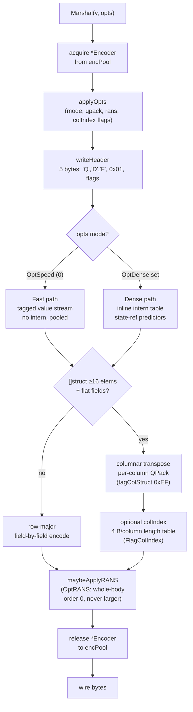

# qdf Architecture Diagrams

Visual reference for the qdf serialization format. Each document covers one
layer of the system with a Mermaid diagram (rendered natively by GitHub) and
a short explanatory prose section.

## The concept: "Parquet for messages"

JSON, msgpack, and protobuf encode every record independently. qdf treats a
batch of structured records as a single unit of compression: strings are
interned once across all records, numeric slices are compressed column-by-column,
and struct shapes are declared once and reused by ID. The closest prior art is
Apache Parquet, applied on-the-fly to in-memory message batches with no schema
file and no two-pass encode.

### Overview flowchart

Mermaid source

The encoder path (top-left to bottom-right) is a straight line with two
decision branches: mode (Fast vs Dense) and shape (columnar vs row-major).
The rANS pass is the last stage and fires only when it shrinks the output.

## Diagram index

| File | What it shows |
|------|---------------|
| [architecture.md](architecture.md) | Marshal/Unmarshal end-to-end: pool lifecycle, typeDesc cache, mode dispatch, rANS pass |
| [wire-format.md](wire-format.md) | 5-byte header layout, flags bit map, tag ranges, tagged-body structure |
| [options-and-modes.md](options-and-modes.md) | Options bit positions, bundle compositions (Speed/Balanced/Compression), Fast vs Dense decision tree |
| [qpack-codecs.md](qpack-codecs.md) | QPack codec picker for numeric/bool/float slices, never-larger floor, SIMD kernels |
| [dense-interning.md](dense-interning.md) | Intern table, state-ref emission, Markov-0/MTF/Markov-1/shape-intern predictors |
| [columnar-and-selective-decode.md](columnar-and-selective-decode.md) | []struct columnar transpose, Time split, Nullable column, colIndex, Select/Where predicate-pushdown with 3VL |
| [performance.md](performance.md) | The 10 algorithmic/CPU/memory wins grouped by category |
