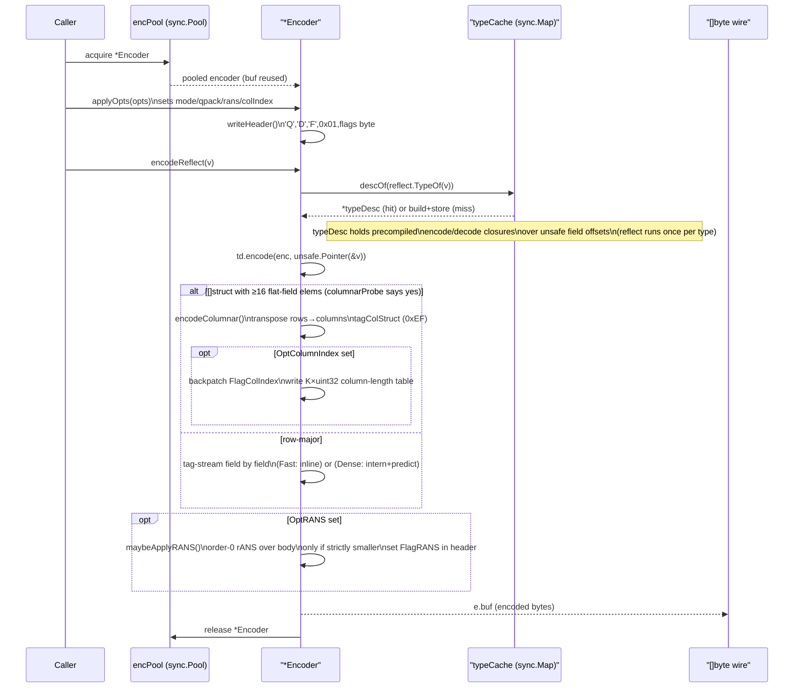
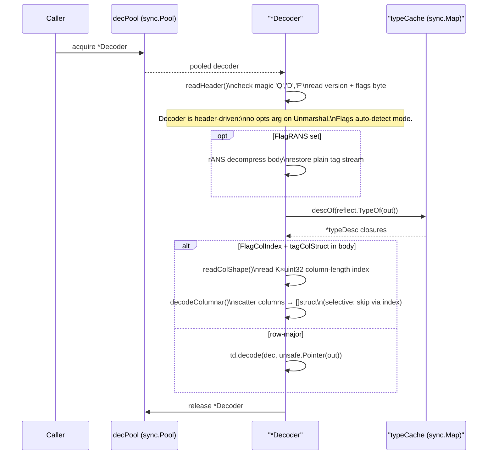
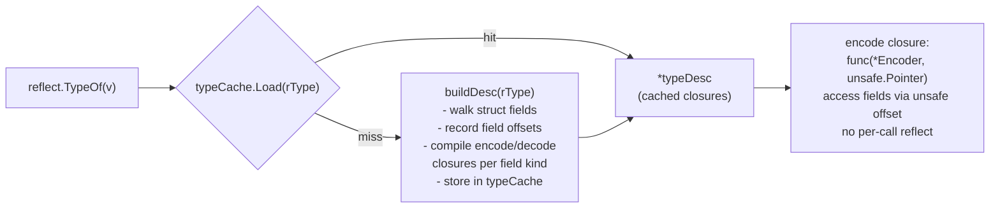
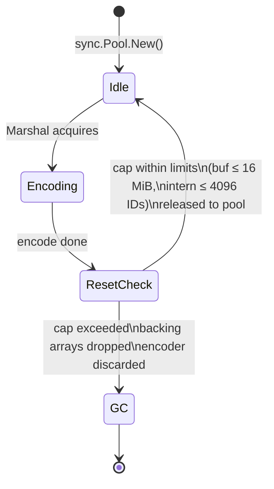

# Architecture: Marshal / Unmarshal End-to-End

## What this shows

The full encode/decode pipeline: how a caller-supplied value enters the
`Marshal` entry point, is routed through the pool and type-descriptor cache,
dispatched to Fast or Dense mode, optionally columnar-transposed, and finally
rANS-compressed. The decode mirror image is shown separately. Key design
choices that appear here: reflect-once (cached `typeDesc`), pooled encoders
(`encPool`), lazy Dense-state allocation, and the rANS pass as a final stage
that never grows the buffer.

## Encode path

## Decode path

## typeDesc cache detail

The cache is populated once per unique Go type across the process lifetime.
After the first call, encoding a `MyEvent` touches only the cached closure
array — no reflection, no type assertions on the hot path.

## Pool lifecycle

Dense-mode intern state (`encState`) is allocated lazily on the first Dense
call and reused across pool recycles. `Reset()` shrinks the backing arrays
when they exceed soft caps (`maxRetainedIDs = 4096`, `maxPooledBuf = 16 MiB`)
to prevent a single large payload from permanently inflating every pooled
encoder.
