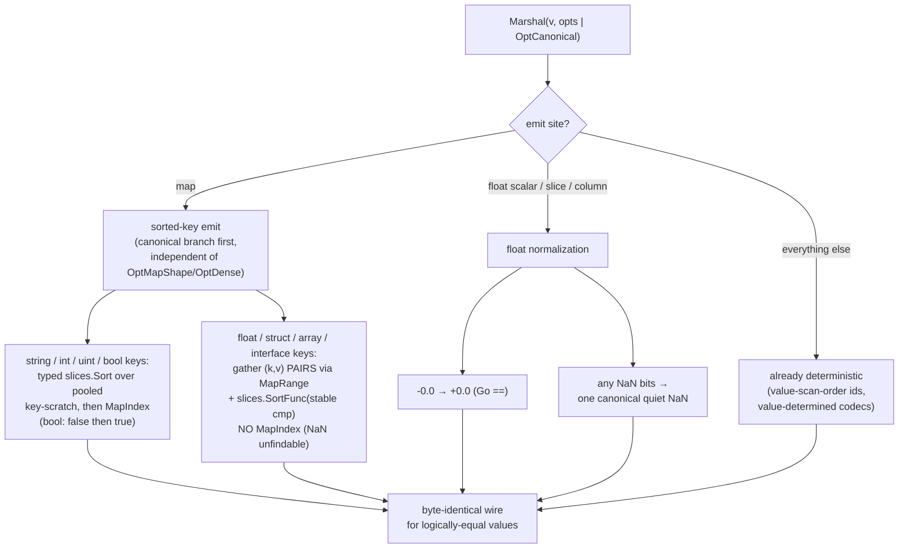
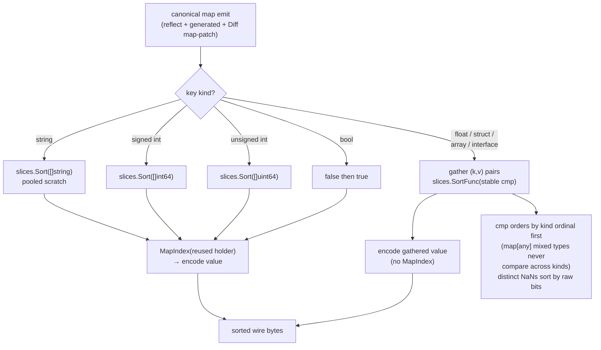

# Canonical Encoding: `OptCanonical`

## What this shows

The encode-side determinism layer: how `OptCanonical` makes the *same logical
value* serialize to *byte-identical* output, so the bytes are safe to hash,
sign, content-address, or deduplicate. An encode-path nondeterminism audit found
exactly two sources of structural variation — **Go map iteration order** and the
**sign-of-zero / NaN payload** — and `OptCanonical` removes both. Everything else
qdf does is already deterministic (intern/dict ids assigned in value-scan order,
the columnar codec picker is value-determined, FSST builds a strict total order,
delta fingerprints are commutative), so nothing else had to change. This is an
**encode-only** option: the bytes are ordinary qdf and decode exactly as any
other output.

## The two normalizations

Mermaid source

`OptCanonical` is **lossy for the sign of zero and the NaN payload** — by design,
for hash/sign/dedup where logically-equal values must agree. For a bit-exact
float round-trip (recover `-0.0` as `-0.0`, or a specific NaN payload), use the
default mode, which preserves every float bit. Everything else round-trips
normally, and the canonical form is idempotent:
`Marshal(Unmarshal(Marshal(v, C)), C) == Marshal(v, C)`.

## Sorted map-key emit — every key kind

Mermaid source

The string / signed / unsigned / bool keys take a typed, monomorphized
`slices.Sort` over a **pooled key-scratch** (zero steady-state allocation), then
`MapIndex` for the value. Float / struct / array / interface keys can't use
`MapIndex` — a NaN key is unfindable by index — so they gather `(k, v)` *pairs*
via `MapRange` and sort with a stable comparator that orders by kind ordinal
first (so a mixed-type `map[any]K` never compares a float against an int) and
breaks distinct-NaN ties by raw bits. The same sorted emit covers all three
paths: the reflect encoder, the generated typed-map fast paths, and the `Diff`
map-patch (update/add entries **and** deletion tombstones).

> Re-entrancy: the pooled key-scratch is guarded by a `canonKeysBusy` flag — a
> nested map-in-map gather uses a local slice so it can't clobber the outer
> map's scratch; the flat case stays pooled and zero-alloc.
