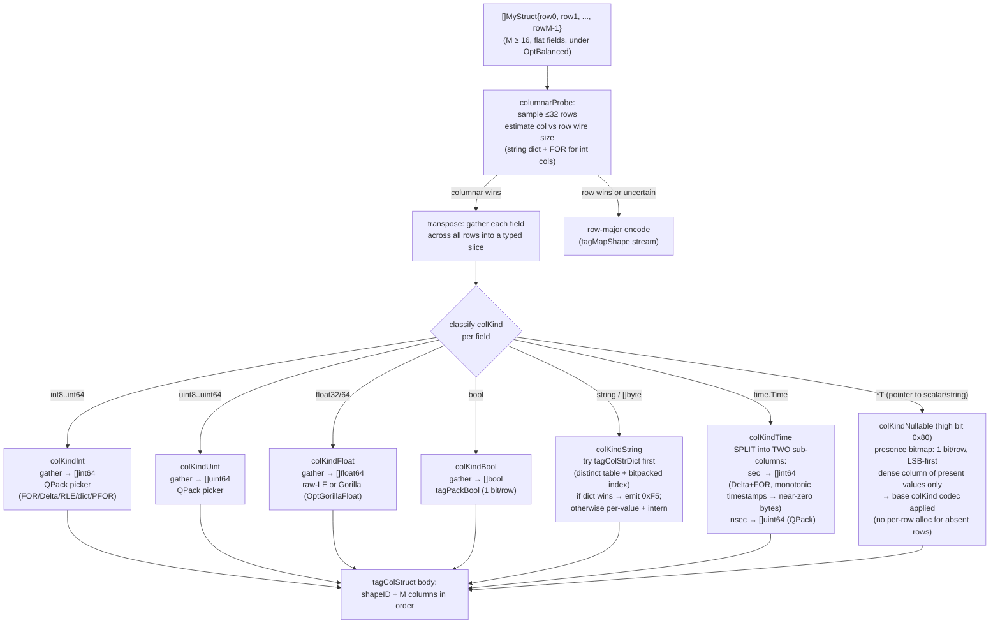
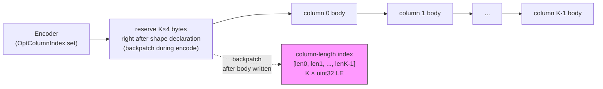
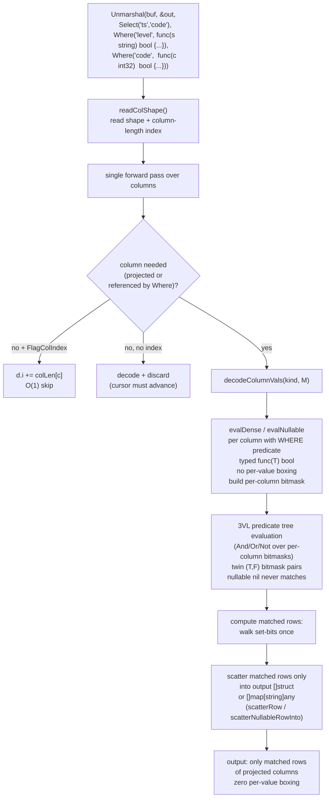
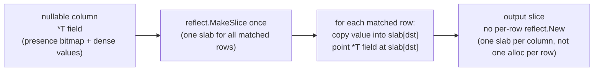
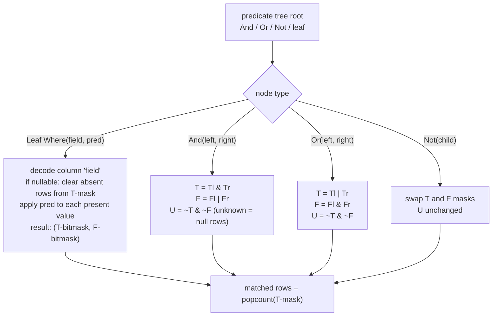

# Columnar Encoding and Selective Decode

## What this shows

How qdf transparently transposes a `[]struct` into a column-per-field layout
(`tagColStruct`), including the special handling for `time.Time` (split into
two sub-columns) and nullable fields (`*T` columns with presence bitmap).
Then: how `OptColumnIndex` adds a fixed-width length table enabling O(1) column
skipping, and how `Select`/`Where` predicate-pushdown with SQL 3-valued logic
filters rows inside the decoder.

## []struct → columnar transpose

## Column-length index (OptColumnIndex / FlagColIndex)

With the index, the decoder can skip any column body with a single pointer
advance (`d.i += colLen[c]`) instead of parsing the column to advance the
cursor. Cost becomes O(columns read), not O(all columns).

The flag is **backpatched** — set in the header byte only after the encoder
confirms a columnar body was actually written. `OptColumnIndex` on a
non-columnar payload is a true no-op.

## Selective decode: Select + Where

## Nullable column: slab allocation

The slab allocator (added in `perf/nullable-scatter-slab`) replaces
per-row `reflect.New` calls with a single slice allocation per nullable
column, cutting allocations and GC pressure on batches with optional fields.

## 3VL predicate tree

SQL 3-valued logic: a nullable `nil` row never matches a predicate
(it contributes to the Unknown set, which is excluded from results).
Only rows in the True bitmask are materialised in the output.

## Performance impact (confirmed numbers)

| Scenario | Full decode + filter | Selective pushdown |
|----------|---------------------|--------------------|
| 3 of 16 columns, 2000 rows | baseline | ~5.7× faster, ~5.3× fewer bytes |
| 9 columns, 2000 rows, 1% selectivity | baseline | ~2.3× faster, ~4.4× fewer bytes |
