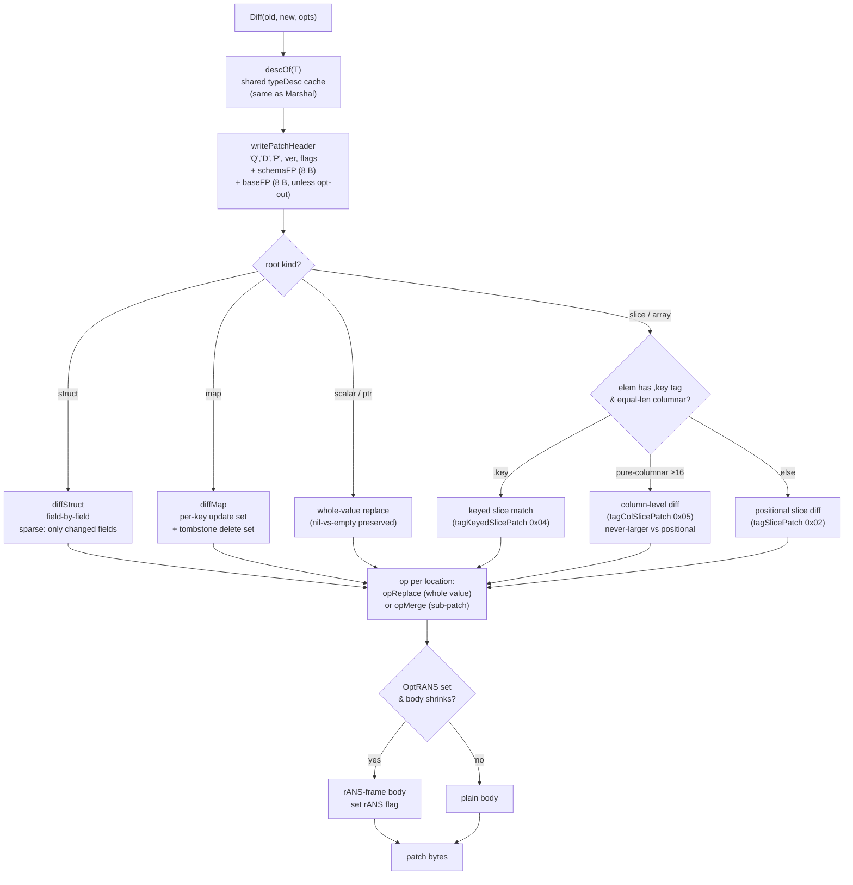
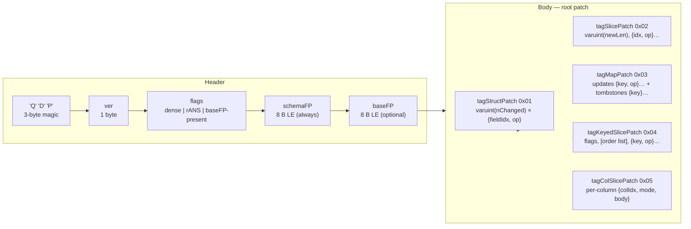
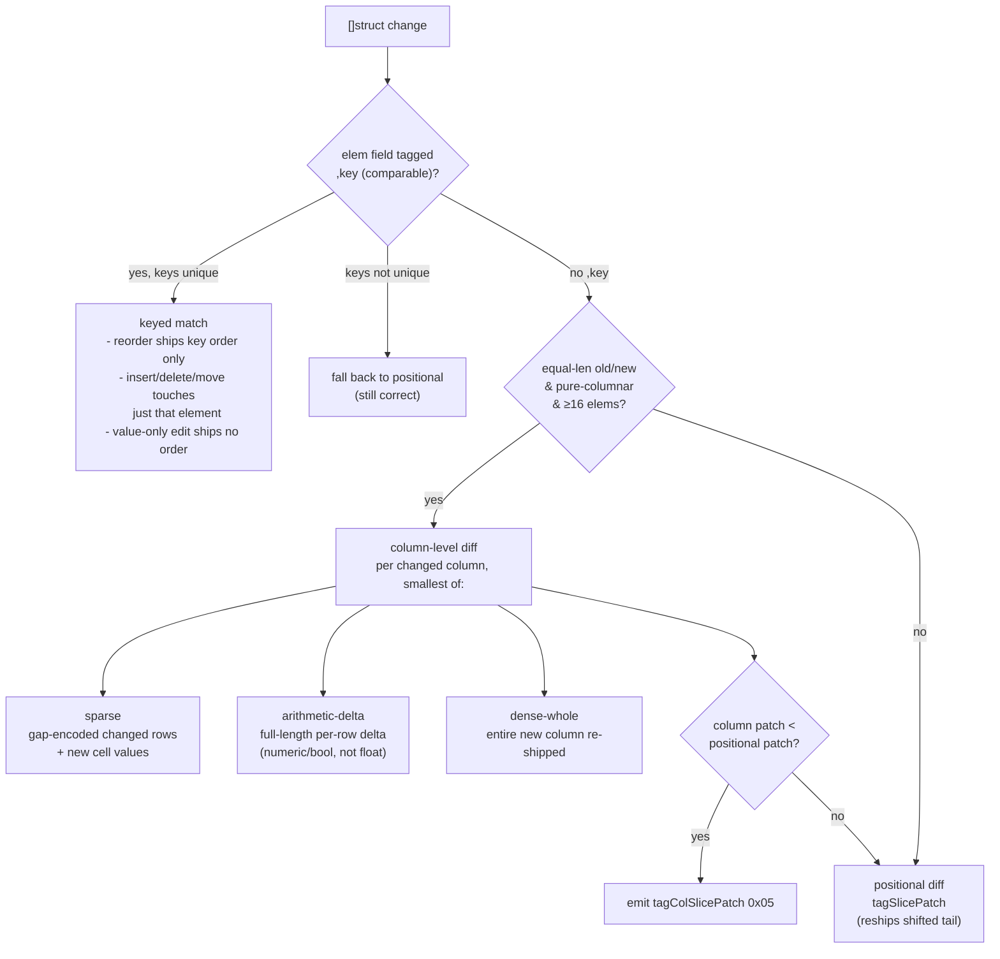
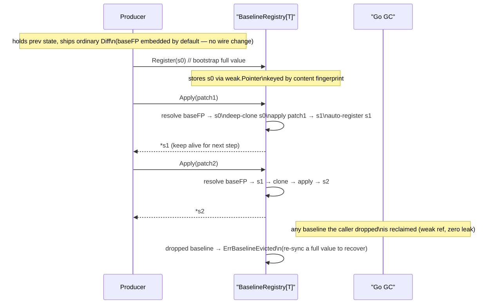
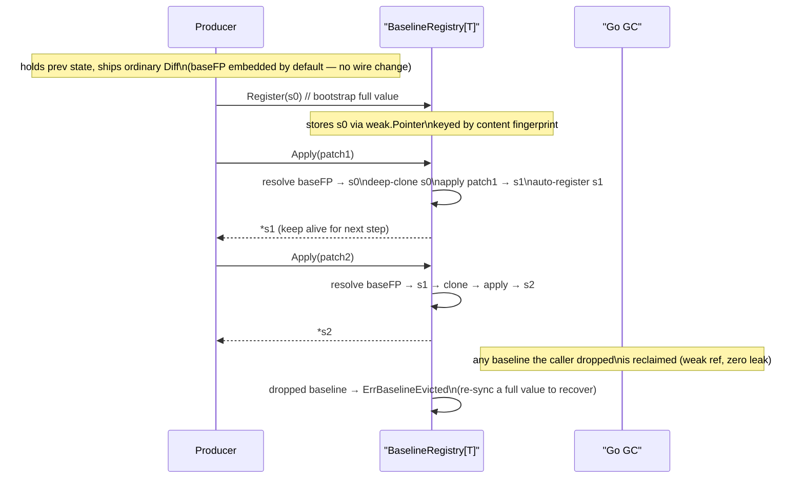

# Structural Delta: `Diff` / `Apply`

## What this shows

The structural-delta layer: how `Diff(old, new, opts)` walks two values of the
same type and emits a patch carrying only the locations that changed, how
`Apply` merges that patch back onto a base in place, the self-describing patch
wire format (its own `'Q','D','P'` magic and the two fingerprints that guard
it), and the three advanced matchers layered on top — keyed slices, columnar
column-level diff, and the content-addressed baseline registry. Delta reuses the
same `typeDesc` cache and value codecs as `Marshal`, so a patch is as tightly
packed as a fresh encode of the changed cells and never has to be told which
`Options` produced it.

## Diff / Apply pipeline

Mermaid source

`Diff` expresses every change at the finest granularity that still shrinks the
patch: an unchanged field, element, or key costs **zero bytes**; a scalar or
presence change ships the whole new value with the normal codec; a nested
struct / pointer / map / slice recurses and carries a sub-patch of only *its*
changed locations. The apply side is the mirror: **absent means unchanged** —
`Apply` leaves any location the patch does not list exactly as it found it.

## Patch wire format

Mermaid source

A patch carries its own `'Q','D','P'` magic so it can never be mistaken for a
full value (`'Q','D','F'`) or vice versa. Two fingerprints guard `Apply`: the
**schemaFP** (always present) is a hash of the type's shape and rejects a patch
built for a different type (`ErrPatchSchemaMismatch`); the **baseFP** (a content
hash of `old`, present unless `OptDeltaNoBaseFingerprint`) rejects a patch
applied to the wrong base (`ErrPatchBaseMismatch`) — never silent corruption.
Each op byte is either `opReplace` (whole new value) or `opMerge` (a recursive
sub-patch).

## Keyed slices vs columnar column-diff

Mermaid source

By default slices match **positionally**, so a middle insert/delete or a reorder
reships the shifted tail. Two opt-free matchers fix the common cases: a `,key`
tag matches elements by stable identity (reorder ships only the new key order;
a moved element touches just itself), and an equal-length pure-columnar batch
is diffed **by column** — each changed column packed with the same FOR / delta /
RLE / dictionary codecs as a fresh columnar encode. Both are **never-larger**:
the column patch is emitted only when it beats the positional patch for the same
change, and a non-unique-key slice transparently falls back to positional.

## Baseline registry — state-sync chains

Mermaid source

`BaselineRegistry[T]` removes the bookkeeping from a delta *stream*: the consumer
applies a chain of patches without threading `old` by hand. It reuses the
patch's existing `baseFP` as a lookup key (no new tag, flag, or field), holds
each baseline through a **`weak.Pointer`** so the GC reclaims anything the caller
dropped, and deep-clones the resolved baseline before applying so a branch off
the same state stays intact. The `baseFP` check is the backstop that turns any
clone discrepancy into an error, never silent corruption. It is safe for
concurrent `Register` / `Apply` / `Len`.
