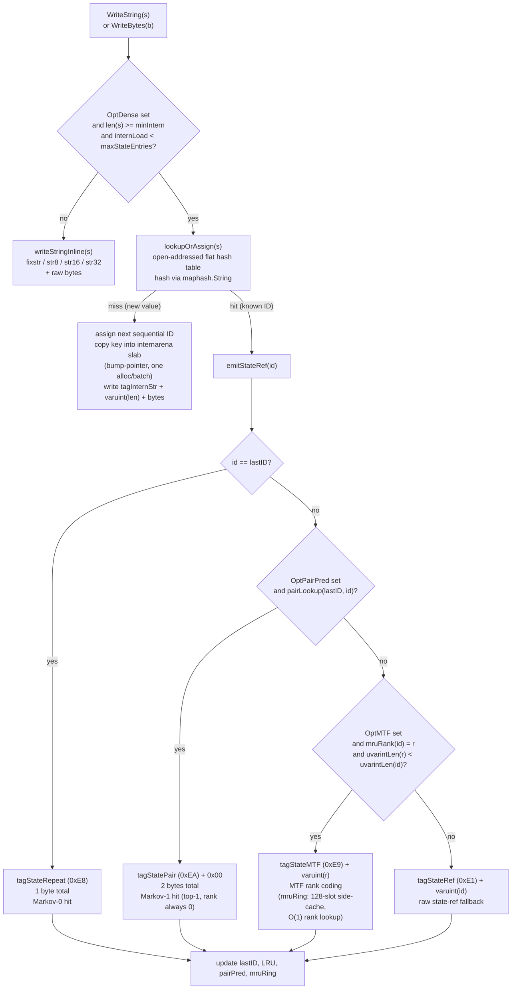
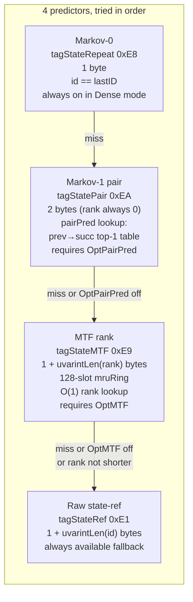
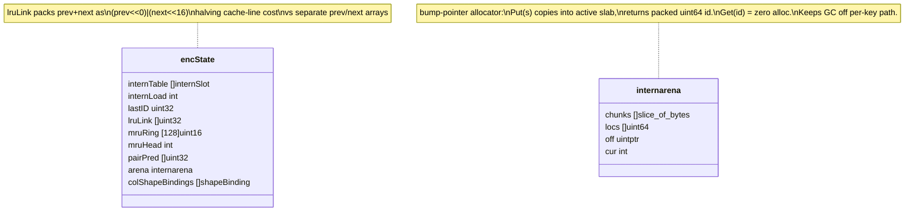
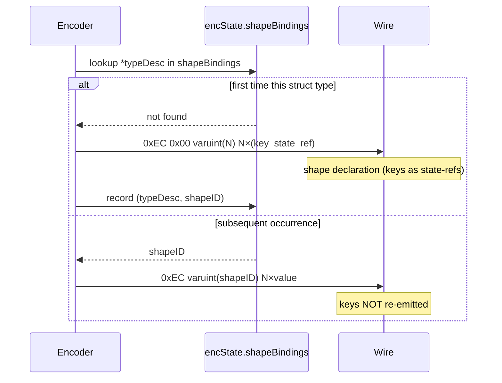

# Dense Mode: Intern Table and State-Ref Predictors

## What this shows

Dense mode's four-layer compression stack for repeated string and []byte
values. The intern table assigns a numeric ID to each unique value on first
sight; subsequent occurrences emit a compact state-ref tag. Four predictors
layer on top of raw state-refs — Markov-0 (same-as-previous), MTF rank,
Markov-1 pair, and shape interning — each saving bytes only when they cost
fewer bytes than the raw ref, so the wire is never larger than plain state-ref
encoding.

## Intern table write path

## Predictor stack

Encoder picks the **shortest** of the applicable forms. If MTF rank encodes
as a longer varuint than the raw ID, the raw form is used instead — the wire
never grows from predictor overhead.

## Intern state data structures

## Shape interning (OptShapeIntern)

Per-record wire saving on an array of identical struct types: approximately
`N × 2` bytes (elided key state-refs + map-header tag) per row after the first.
On a 100-row batch with 8-field structs, that is roughly 1 600 bytes saved.

## Streaming vs single-message intern scope

The intern table is scoped to the encoder instance.

| API | Intern table scope |
|-----|--------------------|
| `Marshal(v, opts)` | per call — fresh table each time |
| `StreamEncoder.Encode(v)` | per stream — shared across all `Encode` calls |

`StreamEncoder` is where the intern table amortises best: a 10 000-row log
stream shares one table, so region codes and service names written 10 000
times each ship once.
