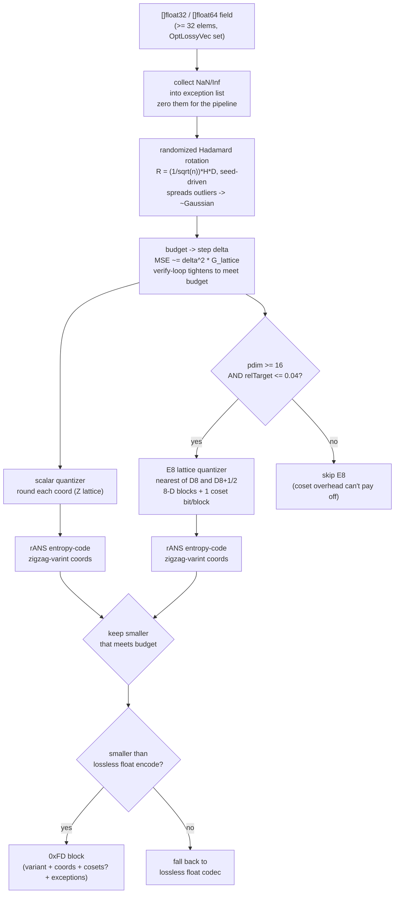
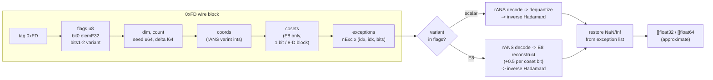

# Lossy vector codec (`OptLossyVec`, tag `0xFD`)

The lossy vector codec compresses `[]float32` / `[]float64` embedding fields by
trading a bounded, caller-chosen amount of fidelity for a much smaller wire.
It runs a rotation → lattice-quantize → entropy-code pipeline, picks the
smaller of two quantizers per column, and never exceeds the lossless size.

## Encode pipeline

Mermaid source

Two structural edges over GPU KV-cache quantizers (TurboQuant et al.), which are
forced into fixed-width scalar codebooks: qdf is a CPU serializer, so it can
(1) **entropy-code** the quantization indices — after the rotation they are
near-Gaussian, so an order-0 rANS pass recovers the bits a fixed-width code
wastes — and (2) use a **lattice** (E8) whose Voronoi region is rounder than the
scalar cube. The `delta` step is chosen from the budget by a closed-form
distortion model and then verified on the data so the achieved error meets the
guarantee.

## Variant selection and decode

Mermaid source

The chosen quantizer is recorded in `flags` bits 1-2, so the decoder needs no
side channel. Decode bounds every allocation by `dim`/`count` read from the
wire, validates the coset stream length exactly, and rejects an unknown variant.
