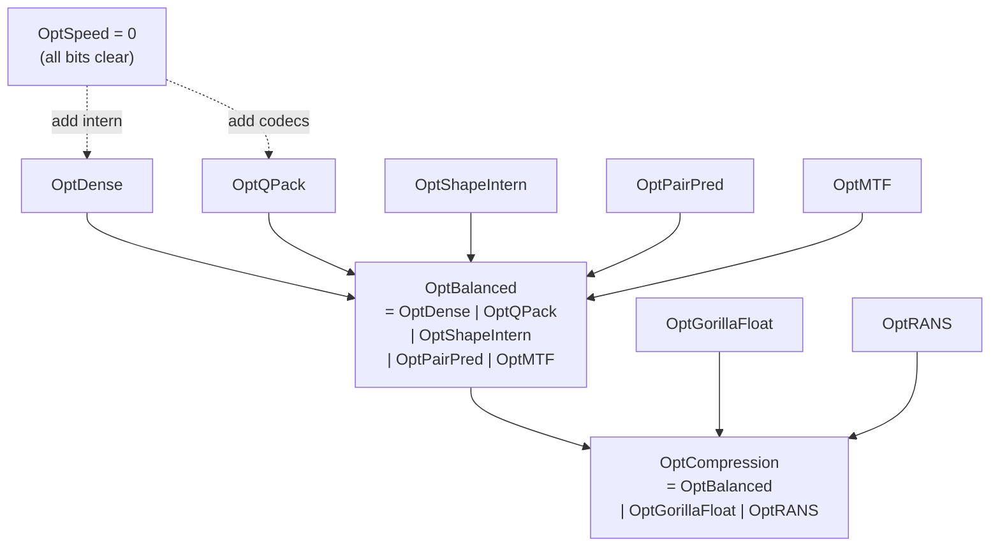
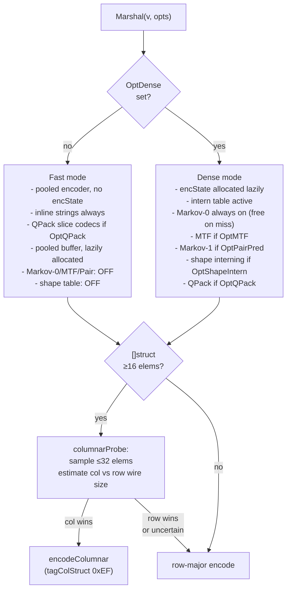
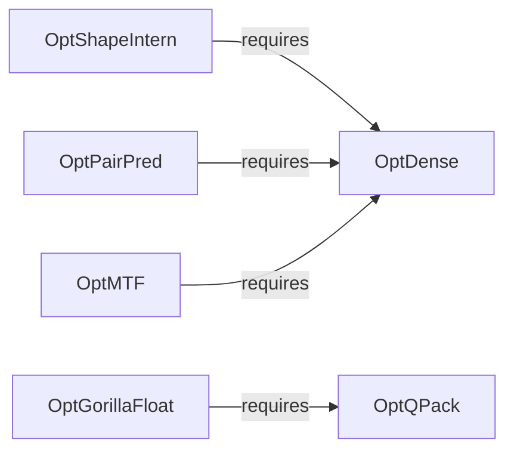

# Options and Modes

## What this shows

The `Options` uint32 bitmask: which bit gates which codec, how the three
preset bundles compose those bits, and the Fast vs Dense decision tree
inside the encoder. Understanding this map lets you tune the CPU/wire-size
tradeoff for a specific workload without touching the API.

## Options bit positions

```
bit:  31..7      6          5               4            3       2           1              0
   (reserved)  OptRANS  OptGorillaFloat  OptColumnIndex  OptMTF  OptPairPred  OptShapeIntern  OptQPack / OptDense
```

| Bit | Constant | Gates |
|-----|----------|-------|
| 0 | `OptDense` | Inline intern table; required by ShapeIntern/PairPred/MTF |
| 1 | `OptQPack` | Numeric/bool slice codecs (FOR/Delta/RLE/dict/PFOR/bitpack); required by GorillaFloat |
| 2 | `OptShapeIntern` | Struct shape table (`tagMapShape 0xEC`); no-op without OptDense |
| 3 | `OptPairPred` | Markov-1 successor predictor (`tagStatePair 0xEA`); no-op without OptDense |
| 4 | `OptMTF` | Move-to-Front rank coding (`tagStateMTF 0xE9`); no-op without OptDense |
| 5 | `OptGorillaFloat` | Gorilla XOR for `[]float64`/`[]float32`; no-op without OptQPack |
| 6 | `OptRANS` | Order-0 rANS entropy pass over whole body; independent |
| 7 | `OptColumnIndex` | Column-length index on `[]struct` columnar payloads; independent |
| 8..31 | (reserved) | Silent no-ops today; may opt into future codecs |

> Note: `OptDense` and `OptQPack` are independent — either can be set
> without the other. `OptShapeIntern`, `OptPairPred`, and `OptMTF` are
> no-ops without `OptDense`. `OptGorillaFloat` is a no-op without `OptQPack`.

## Bundle compositions



| Bundle | Bit mask | When to use |
|--------|----------|-------------|
| `OptSpeed` | `0x00000000` | Hot encode/decode path; CPU is the bottleneck; single-shot small payloads; wire ≈ msgpack size |
| `OptBalanced` | see above | Repetitive payloads — logs, telemetry, columnar rows; 25–55 % smaller than JSON at 2–6× encode speed vs JSON |
| `OptCompression` | see above | Backup / cold storage; smooth float series; trace archive; trades ~4–10× encode CPU for maximum wire reduction |

`OptColumnIndex` is orthogonal to all three bundles — add it to any bundle
when the consumer needs selective decode (`Unmarshal` into a subset struct or
`UnmarshalColumns`).

## Fast vs Dense decision tree



## Dependent-bit guard

Setting a dependent bit without its parent is silently a no-op (no error,
no panic). The contract is tested in `TestValidity_DependentBitsAreNoOpsWithoutDense`.


