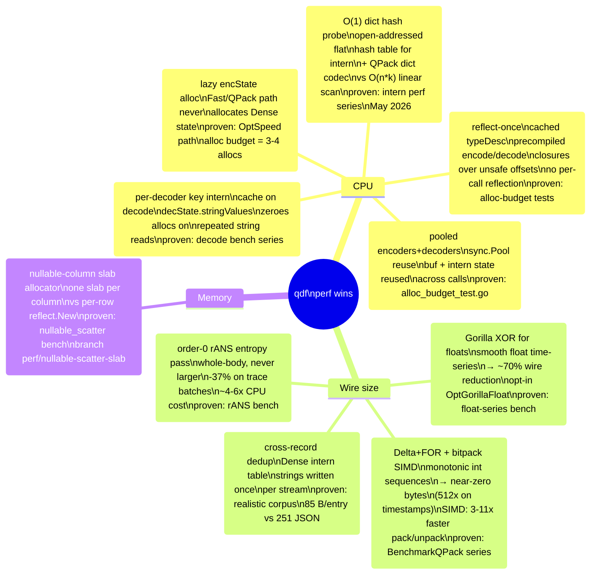
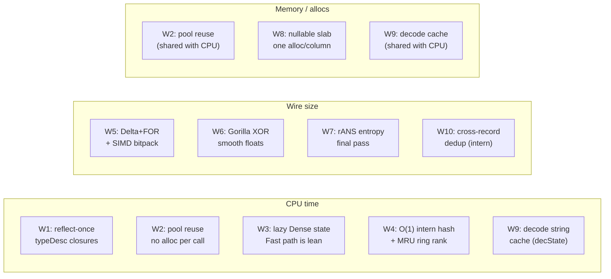

# Performance: Algorithmic Wins

## What this shows

The 10 key algorithmic and engineering wins in qdf, grouped by the resource
they optimise (CPU time, memory / allocation count, wire size). Each entry
notes whether the win is measure-first proven in benchmarks (committed
benchmark data, benchstat comparisons) or structural (the algorithm is
inherently cheaper — e.g. one allocation vs N allocations).

## Win map

## Detail table

| # | Win | Category | Mechanism | Proven by |
|---|-----|----------|-----------|-----------|
| 1 | Reflect-once typeDesc cache | CPU | `descOf` → `typeCache sync.Map`; encode/decode as precompiled closures over `unsafe.Pointer` + field offsets; no reflect on hot path | `alloc_budget_test.go`; `BenchmarkEncode_*` series |
| 2 | Pooled encoders and decoders | CPU + Memory | `encPool` / `decPool` (`sync.Pool`); buffer and intern state reused across calls; soft-cap shrink prevents peak-memory pinning | `alloc_budget_test.go`; `bench/profiles_test.go` |
| 3 | Lazy Dense-state allocation | CPU | `encState` allocated only on first Dense call; `OptSpeed` / `OptQPack` paths carry zero Dense overhead | `alloc_budget_test.go`: OptSpeed = 3–4 allocs/op |
| 4 | O(1) open-addressed intern hash | CPU | Flat `[]internSlot` array, `maphash.String` hash, linear probe; replaced earlier `map[string]uint32`; MRU ring (128 uint16 slots) for O(1) MTF rank | `bench/profiles_test.go` May 2026 series (`ada9fd7`, `2ea3b48`) |
| 5 | Delta+FOR + bitpack SIMD | Wire + CPU | FOR bitpacks integer ranges; Delta+FOR collapses monotonic sequences to near-zero bits; AVX2/NEON SIMD kernels for pack/unpack | `BenchmarkQPack_*`; `BenchmarkBitUnpackFast`; 512× on timestamps |
| 6 | Gorilla XOR for float series | Wire | XOR-delta of consecutive floats; probe on first 32 pairs; opt-in (`OptGorillaFloat`); ~70% wire reduction on smooth time-series | `bench/profiles_test.go` float-series fixture |
| 7 | rANS order-0 entropy pass | Wire | Whole-body static rANS; applied only when strictly smaller; −37% on trace batches; never fires on incompressible data | `docs/BENCH.md`; golden-file size tests |
| 8 | Nullable-column slab allocator | Memory | One `reflect.MakeSlice` per nullable column for all matched rows; `scatterNullableRowInto` points `*T` fields into slab; replaces per-row `reflect.New` | `bench/nullable_scatter_test.go`; branch `perf/nullable-scatter-slab` |
| 9 | Per-decoder key intern cache | Memory + CPU | `decState.stringValues` caches materialised Go strings by intern ID; N-1 reads of a repeated intern entry return cached string with zero alloc | `bench/profiles_test.go` decode series; commit `7090e25` |
| 10 | Cross-record dedup as size baseline | Wire | Dense intern table shared per stream; repeated strings (service, region, level) written once; `tagStateRepeat`/`tagStateMTF`/`tagStatePair` compress state-ref stream further | realistic-corpus test: 85 B/entry vs 251 JSON; −57% vs protobuf on OTLP |

## Grouped by resource

Note that wins W2 and W9 appear in multiple categories — pooling and decode
caching save both allocation count (GC pressure) and time (no setup cost per
call).
