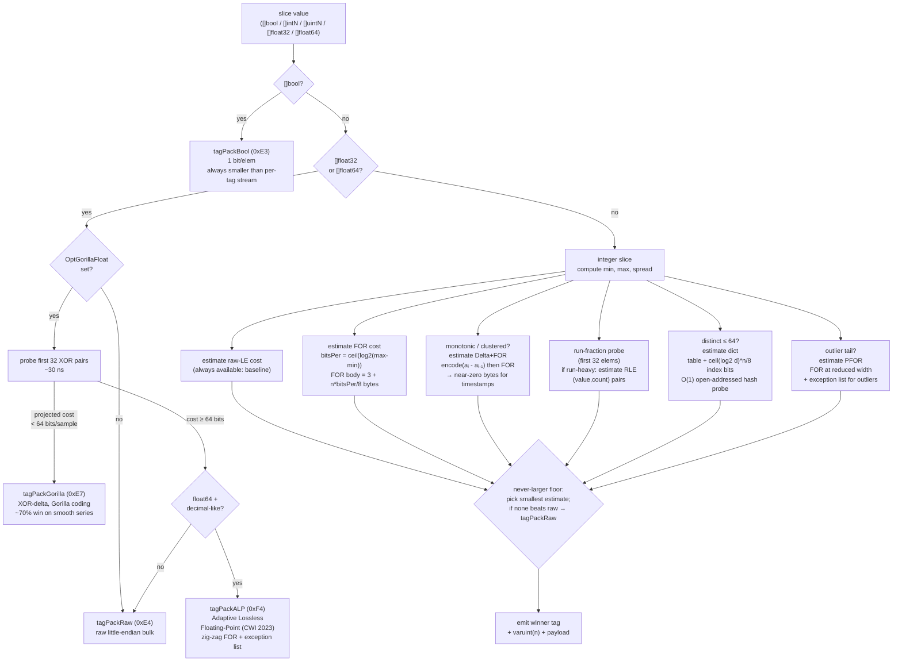
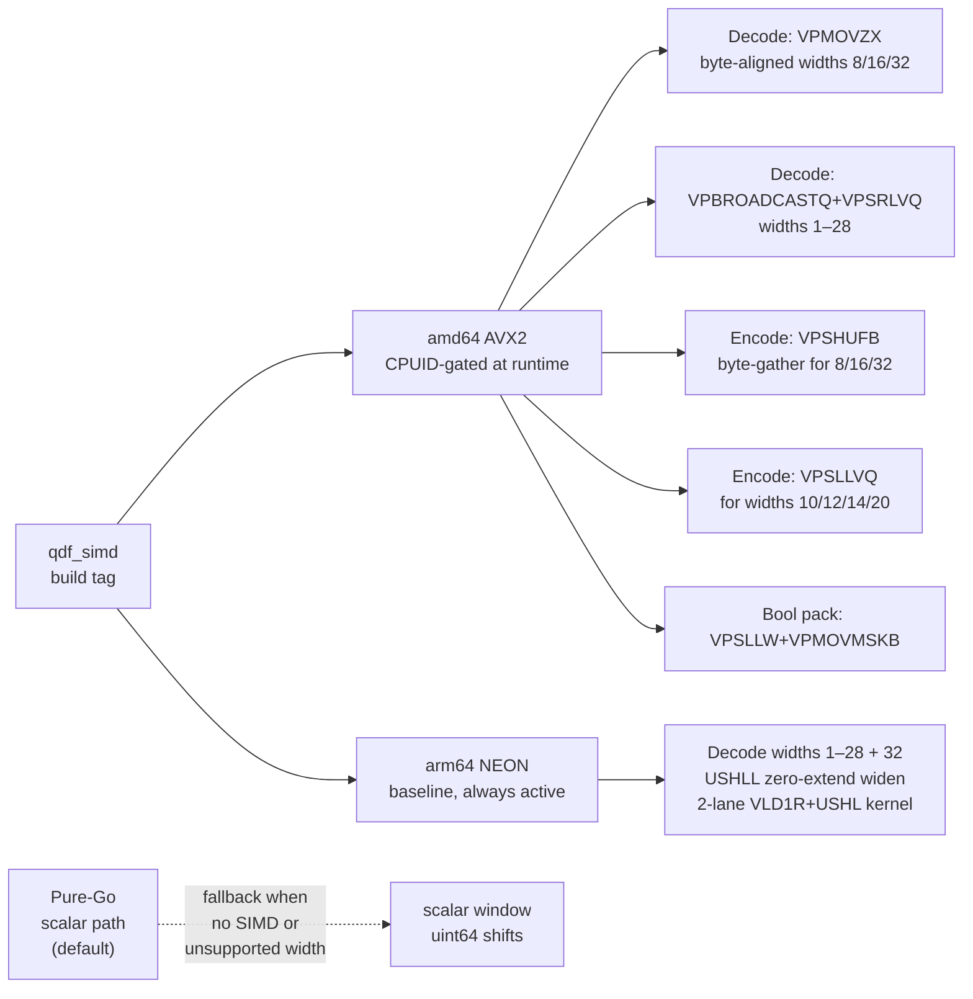

# QPack Codecs

## What this shows

The per-slice codec picker that runs when `OptQPack` is set. For every
numeric, bool, or float slice in the payload the encoder estimates the wire
cost of several codecs and emits the smallest one. A never-larger floor
guarantees the QPack path never grows the output vs raw encoding. The SIMD
acceleration layer is noted at the end.

## Codec picker decision tree

## Codec reference table

| Tag | Hex | Best case | Notes |
|-----|-----|-----------|-------|
| `tagPackBool` | `0xE3` | 8× vs per-tag stream | Always chosen for `[]bool` |
| `tagPackRaw` | `0xE4` | baseline | Raw LE; fallback when no codec wins |
| `tagPackFor` | `0xE5` | spread is small (e.g. IDs in a range) | SIMD-accelerated pack/unpack |
| `tagPackDeltaFor` | `0xE6` | monotonic sequences (timestamps) | 512× on consecutive Unix seconds |
| `tagPackGorilla` | `0xE7` | smooth float time-series | Opt-in: `OptGorillaFloat` |
| `tagPackRLE` | `0xEB` | run-heavy integer columns (status codes, enums) | Probe on first 32 elems |
| `tagPackDict` | `0xED` | ≤64 distinct values, wide spread | O(1) open-addressed hash |
| `tagPackPFor` | `0xEE` | mostly-small integers with rare large outliers | Narrow FOR body + exception list |
| `tagPackALP` | `0xF4` | quantized / decimal float64 | Chosen only when strictly smaller than raw and Gorilla |

## SIMD acceleration (build tag `qdf_simd`)

The SIMD path is a pure speed switch — wire format and output bytes are
**identical** to the scalar path on every architecture. Typical speedup:
3–11× over pure-Go on the accelerated bit widths. Widths outside the
supported set fall back to the scalar window kernel silently.
