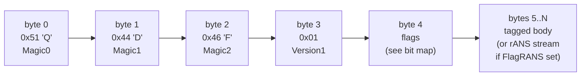
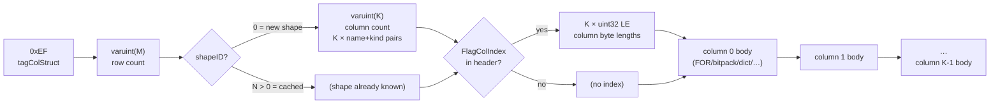
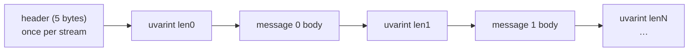

# Wire Format

## What this shows

The exact byte layout of a qdf buffer: the 5-byte header, the flags bit map,
and the complete tag space. Every qdf buffer is self-describing — the decoder
reads mode, codec hints, and compression state entirely from the header and
in-body tags; no out-of-band schema is required.

## Buffer layout

```
[ byte 0 ] [ byte 1 ] [ byte 2 ] [ byte 3  ] [ byte 4    ] [ byte 5 .. N ]
  0x51 'Q'   0x44 'D'   0x46 'F'   0x01 ver   flags byte    tagged body
```



<details><summary>Mermaid source</summary>



</details>

Byte positions 0–4 are the fixed header. Everything from byte 5 onward is
the tagged body (or, if `FlagRANS` is set: `varuint(origLen)` + 256-entry
frequency table + rANS stream).

## Flags byte (byte 4) bit map

```
bit:  7   6   5   4      3            2          1          0
      ---reserved---   FlagColIndex  FlagRANS  FlagQPack  FlagDense
                         0x08         0x04       0x02       0x01
```

| Flag | Hex | Meaning |
|------|-----|---------|
| `FlagDense` | `0x01` | Body uses Dense intern dialect; state-ref tags (`0xE0`–`0xEA`, `0xEC`) are present |
| `FlagQPack` | `0x02` | Body may carry QPack codec tags (`0xE3`–`0xEF`, `0xF4`–`0xFB`); early hint so readers can reject unsupported codecs before parsing |
| `FlagRANS` | `0x04` | Body is rANS-compressed: `varuint(origLen)` + 256-entry freq table + rANS stream. Decoder decompresses before reading tags. Set only when rANS form is strictly smaller. |
| `FlagColIndex` | `0x08` | A `tagColStruct` payload carries a fixed-width column-length index (K × `uint32` LE) right after the shape declaration. Backpatched by the encoder; never set on non-columnar payloads. |

## Tag space

**Scalar / structural tags** (present in both Fast and Dense modes):

| Range | Name | Description |
|-------|------|-------------|
| `0x00–0x7F` | fixint | Positive integer; value is the tag byte |
| `0x80–0x9F` | fixstr | String; length 0..31 packed into low 5 bits |
| `0xA0–0xBF` | fixarr | Array; length 0..31 packed into low 5 bits |
| `0xC0` | nil | Null value |
| `0xC1, 0xC2` | false, true | Boolean |
| `0xC3–0xC6` | uint8..uint64 | Unsigned integers |
| `0xC7–0xCA` | int8..int64 | Signed integers |
| `0xCB, 0xCC` | float32, float64 | IEEE-754, raw LE bits |
| `0xCD–0xCF` | str8, str16, str32 | Longer strings |
| `0xD0–0xD2` | bin8, bin16, bin32 | Byte slices |
| `0xD3, 0xD4` | arr16, arr32 | Longer arrays |
| `0xD5–0xD7` | map8, map16, map32 | Maps |
| `0xD8–0xDF` | negfixint | Negative integer -1 .. -8 |

**Dense-mode tags** (present when `FlagDense` set):

| Tag | Hex | Wire payload |
|-----|-----|--------------|
| `tagInternStr` | `0xE0` | First occurrence of interned string: `varuint(len)` + bytes |
| `tagStateRef` | `0xE1` | Reference to intern ID: `varuint(id)` |
| `tagInternBin` | `0xE2` | First occurrence of interned `[]byte`: `varuint(len)` + bytes |
| `tagStateRepeat` | `0xE8` | Markov-0: id == lastID; 1 byte total, no payload |
| `tagStateMTF` | `0xE9` | MTF rank: `varuint(rank)` |
| `tagStatePair` | `0xEA` | Markov-1 hit: `varuint(rank=0)` (top-1, rank always 0) |
| `tagMapShape` | `0xEC` | Struct shape reference: `varuint(shapeID)` |

**QPack codec tags** (present when `FlagQPack` set):

| Tag | Hex | Description |
|-----|-----|-------------|
| `tagPackBool` | `0xE3` | Bitpacked `[]bool`, 1 bit/elem |
| `tagPackRaw` | `0xE4` | Raw little-endian numeric slice |
| `tagPackFor` | `0xE5` | Frame-of-Reference bitpacked integer slice |
| `tagPackDeltaFor` | `0xE6` | Delta + zigzag + FOR integer slice |
| `tagPackGorilla` | `0xE7` | Gorilla XOR-coded `[]float64` / `[]float32` |
| `tagPackRLE` | `0xEB` | Run-length encoded integer slice |
| `tagPackDict` | `0xED` | Dictionary-coded integer slice (≤64 distinct) |
| `tagPackPFor` | `0xEE` | Patched FOR: narrow body + outlier exception list |
| `tagColStruct` | `0xEF` | Columnar container for `[]struct` |
| `tagPackALP` | `0xF4` | ALP decimal-coded `[]float64` |
| `tagColStrDict` | `0xF5` | Dictionary-coded string column (inside `tagColStruct`) |
| `tagColStrFSST` | `0xF6` | FSST-coded string column (symbol table + per-row code streams), inside `tagColStruct` |
| `tagHybridColStruct` | `0xF7` | Hybrid columnar container: a `[]struct` with mixed fields — eligible columns transposed, the rest kept as a per-row residual tail. Shape lists every field; residual entries carry kind byte `0xFF`. |
| `tagColStrRaw` | `0xF8` | Bulk-materialized string column (inside `tagColStruct`): every value laid down once, length-prefixed, so the decoder builds the whole column in ONE slab allocation. High-cardinality counterpart to `tagColStrDict`. |
| `tagColStrConst` | `0xF9` | Constant (single-distinct) string column (inside `tagColStruct`): one value + the row count, decoded as `n` shares of one owned string. Emitted on the codegen/`Fast` path where the per-value form does not intern repeats. |
| `tagColStrDictFC` | `0xFA` | Front-coded dictionary string column (inside `tagColStruct`): the distinct table is sorted and each entry stored as `sharedPrefixLen + suffix`. Index body byte-identical to `tagColStrDict`; emitted only when the front-coded table is strictly smaller (prefix-shared SID / path / DN / URL columns). Decoder rebuilds the whole table into one slab. |
| `tagColStrAlpha` | `0xFB` | Alphabet-packed string column (inside `tagColStruct`): a high-cardinality column whose bytes are all drawn from a small alphabet (`\|A\|` ≤ 64 — hex / base32 / base64 / decimal IDs). Layout: alphabet bytes, row count, fixed-or-per-row lengths, then LSB-first bitpacked `ceil(log2 \|A\|)`-bit char codes. The class the dictionary, front-coding and FSST all miss; emitted only when strictly smaller than the raw per-value floor. Decoder bit-unpacks the codes into one slab. |

**Other**:

| Tag | Hex | Description |
|-----|-----|-------------|
| ext8/16/32 | `0xF0–0xF2` | User extension envelope |
| `tagTimestamp` | `0xF3` | `zigzag(sec)` + `varuint(nsec)` |

## tagColStruct body layout

When `tagColStruct` (0xEF) is present, the body following it is:



<details><summary>Mermaid source</summary>



</details>

The column-length index appears only when `FlagColIndex` is set, enabling
O(1) skip of unwanted columns during selective decode.

## Stream framing (`StreamEncoder` / `StreamDecoder`)

One-shot `Marshal` produces a single self-contained buffer (the layout above).
A **stream** is different: the 5-byte header is written once as a preamble, then
each message is length-delimited with a `uvarint` byte-count so the decoder can
buffer a whole message — of any size — before decoding it.


<details><summary>Mermaid source</summary>



</details>

The shared Dense intern/shape/predictor tables span the whole stream (a repeated
value in message 1 is a state-ref back into message 0). A truncated final frame
returns `ErrShortBuffer`; a clean boundary returns `io.EOF`. Frame length is
capped at 2 GiB. The whole-buffer features — `FlagRANS`, `FlagColIndex`, and
predicate pushdown — are not used in streams; they apply to a single complete
payload. This framing is stream-specific: the one-shot `Marshal` wire has no
per-message length prefix.
