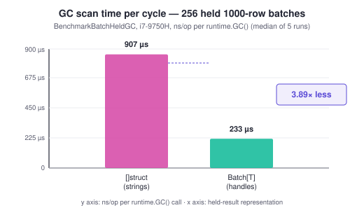

# Pointer-free batch decode — `qdf.UnmarshalBatch`

`UnmarshalBatch[T]` decodes into a `Batch[T]` whose `Rows []T` contains **no
pointers**: string/`[]byte`/`time.Time` fields become 8-byte offset/length
handles into one shared slab instead of individually heap-allocated Go
values. For a decode result you **hold** — a cache, an in-memory index, a
streaming pipeline's working set — this changes what the garbage collector
has to do with it on every mark phase, not just how the decode itself
allocates.

For the general decode-allocation levers see [`DECODE-PERF.md`](DECODE-PERF.md);
for the arena's "copy once, still pointer-ful" alternative see
[`ARENA.md`](ARENA.md#arena-vs-withnocopy).

---

## Why it exists

A decoded `[]struct{ Name string, ... }` that you keep alive across GC cycles
puts one pointer (the string header's data pointer) into the heap per row per
string field. The Go garbage collector is precise and must **scan every
pointer it can reach on every mark phase** — it does not matter that the
bytes behind the pointer never change; the pointer itself has to be walked
and its target marked reachable, every cycle, for as long as you hold the
slice.

```
held []struct{ Name string }, N rows:
  N string headers = N pointers the GC walks every mark phase
  N scattered heap objects (poor cache locality, one alloc each)
```

`Batch[T]` removes the pointers instead of trying to make them cheaper to
walk. `T`'s string/bytes/time fields become `qdf.Str` / `qdf.Bytes` /
`qdf.Time` — plain integer pairs, not pointers — so `[]T` is **GC-noscan**:
the collector recognizes the type carries no pointers and skips scanning the
whole backing array in O(1), regardless of row count. Every byte a handle
refers to lives in one contiguous `[]byte` slab owned by the `Batch`, itself
a single scannable allocation.

![Left: []struct with strings, pointers scattered across the heap, GC scans every one. Right: Batch[T] rows with {offset,length} handles into one contiguous slab, zero pointers, GC skips the region.](assets/batch-handles-layout.svg)

This is the same "pointer-free result" idea noted in earlier decode-alloc
research (offset-handles vs pointer-dense `[]Struct`) turned into a concrete,
tested API.

### The measured story

Numbers below are from `batch_bench_test.go` — reproduce with
`go test -run '^$' -bench 'BenchmarkBatch' -benchmem -count=5` —
Intel i7-9750H, medians of 5 runs, no thermal-throttle contamination
observed (≤4% spread across runs). All three numbers are cited verbatim —
no rounding up.

| Benchmark | ns/op (median) | B/op | allocs/op |
|---|---:|---:|---:|
| `BatchDecode/handles` (`UnmarshalBatch` + `Release`) | 10,967 | 48 | 2 |
| `BatchDecode/strings` (plain `Unmarshal` into `[]batSrc`) | 19,859 | 57,541 | 12 |
| `BatchSteadyState` (decode+`Release` loop, pools warm) | 11,013 | 50 | 2 |
| `BatchHeldGC/handles` (`runtime.GC()`, 256 held 1024-row batches) | 233,389 | 0 | 0 |
| `BatchHeldGC/strings` (same, `[]struct` with real strings) | 907,261 | 0 | 0 |

Three separate claims, three separate benchmarks:

1. **3.89× cheaper GC scan.** `233,389 / 907,261 ≈ 0.257` — holding 256
   decoded 1024-row batches as `Batch[T]` costs the collector 3.89× less
   wall-clock per `runtime.GC()` than holding the same data as
   `[]struct{...string...}`. (An earlier, unrelated probe — retained-bytes,
   not scan-time, different corpus — reported "5.2×"; that number measures a
   different thing and is not this benchmark's result.)
2. **~1.8× faster decode**, not just parity: `10,967` vs `19,859` ns/op. This
   is not a scan-time effect — it is `Str` resolution being **lazy**. The
   handles path never materializes a Go string for a field you don't call
   `b.Str` on; the plain-`Unmarshal` baseline always does.
3. **2 allocs/op steady state** (`BatchSteadyState`, pools warm). This is the
   floor once the slab and rows backing are being recycled by their
   `sync.Pool`s — see *How it works* below.



Two further decode-path wins land on the shapes the columnar numbers above
don't cover — each is its own benchmark (same i7-9750H):

| Decode path | Before | After | Repro |
|---|---|---|---|
| **Row-major** batch (1000 rows) — small-n or a string-heavy struct the columnar probe drops to row-major | 1000 allocs, ~156 µs (mirror) | **0 allocs, ~115 µs** | `-bench BenchmarkBatchRowMajorDecode` |
| **FSST** string column (1000 rows) — decompress straight into the slab | 111,925 B, 14 allocs, ~138 µs | **29,864 B, 13 allocs, ~105 µs** | `-bench BenchmarkBatchFSSTDecode` |
| **Alpha** string column (1000 × 16-char hex) — unpack straight into the slab | 16,445 B, 2 allocs, ~24 µs | **24 B, 1 alloc, ~15 µs** | `-bench BenchmarkBatchAlphaDecode` |

The row-major path removes the per-row string allocation the reflect mirror
paid (1000 → 0); the FSST and alpha paths each remove a decode scratch buffer
and one copy pass (−82 KB / −16 KB per op, −24 % / −37 %). All are in *How it
works* below.

---

## Quick start

```go
type Source struct {
    ID   int64  `qdf:"id"`
    Name string `qdf:"name"`
}
type Row struct {
    ID   int64   `qdf:"id"`
    Name qdf.Str `qdf:"name"`
}

data, err := qdf.Marshal([]Source{{ID: 1, Name: "alpha"}}, qdf.OptSpeed)
if err != nil {
    log.Fatal(err)
}

b, err := qdf.UnmarshalBatch[Row](data)
if err != nil {
    log.Fatal(err)
}
defer b.Release() // recycles the slab; Rows and every handle are invalid after this

for _, r := range b.Rows {
    fmt.Println(r.ID, b.Str(r.Name)) // resolve on demand
}
```

`Row` declares the wire shape exactly like any other qdf target struct
(`qdf`/`json` tags, embedding), except that `string`/`[]byte`/`time.Time`
fields are spelled `qdf.Str`/`qdf.Bytes`/`qdf.Time`. Everything else about
tags, field names, and wire compatibility is unchanged — the wire `Row`
decodes is the same wire a `string`-typed struct would decode.

See `ExampleUnmarshalBatch` in [`example_batch_test.go`](../example_batch_test.go)
for the compiled, tested version of this snippet.

---

## The type rules

`UnmarshalBatch[T]` validates `T` once per type (`batchPlanOf`, cached in a
`sync.Map`) and returns a descriptive error on the **first call** if `T`
isn't eligible — there is no silent fallback to a slower-but-working mode for
an ineligible type.

| Field type | Allowed? | Why |
|---|---|---|
| `bool`, `int*`, `uint*`, `float32/64` | Yes | Copied by value; already pointer-free. |
| `qdf.Str` | Yes | 8-byte `{off,len}` handle into the slab. |
| `qdf.Bytes` | Yes | Same shape as `Str`; view aliases the slab. |
| `qdf.Time` | Yes | `{Sec int64, Nsec uint32}` — plain integers, no `*time.Location`. |
| Anonymous embedded struct (flattened) | Yes | Flattened the same way the normal encoder flattens embeds; fields promoted into the plan. |
| `string` | **No** — `"field %s is string — use qdf.Str"` | A Go `string` is a pointer + a length; the whole point is removing that pointer. |
| `time.Time` | **No** — `"field %s is time.Time — use qdf.Time"` | Carries a `*time.Location` pointer, which would reintroduce GC scanning through the back door. |
| `[]byte`, any other slice | **No** — `"field %s is a slice — use qdf.Bytes for []byte, or drop the field"` | A slice header holds a pointer. |
| `map[...]...` | **No** — `"field %s (map) is not pointer-free"` | Maps are pointers under the hood. |
| pointer / `interface{}` (`any`) / `chan` / `func` | **No** — `"field %s (<kind>) is not pointer-free"` | All pointer-carrying by definition. |
| Nested **named** (non-anonymous) struct field | **No** — `"field %s: nested struct fields decode via the row-major fallback in v1 — flatten it or use scalar/handle fields"` | v1 scope decision: the columnar scatter path only walks a flat field list; a named nested struct is validated pointer-free (so the error is precise about which inner field is the problem) but rejected rather than silently falling back to a slower per-row path for part of the struct. |
| `[N]byte` / other fixed-size array field | **No** — `"field %s: array fields are v1-fallback only"` | Same v1 scope decision as nested structs. |

The nested-struct and array restrictions are a **v1 scope decision**, not a
fundamental limitation — the validator (`validateBatchStruct`/
`validateBatchElem` in `batch_desc.go`) already walks into them far enough to
confirm they're pointer-free and to name the exact offending leaf field in
the error, it just doesn't yet wire them into the columnar scatter. If your
struct needs one, flatten it (embed instead of name) or split it out.

---

## How it works

`UnmarshalBatch` has three decode strategies — two allocation-free fast paths
(one per wire shape it decodes directly) and a correctness-first fallback. All
populate the same `Batch[T]` result; which one runs depends on the wire shape,
not on anything the caller chooses.

### 1. Columnar fast path (the common case)

When the wire's top-level tag is a plain `tagColStruct` (columnar, no
nullable columns — see below) and it wasn't emitted with `OptDense`'s shape
referencing another block, `decodeBatchColumnar` decodes **directly into the
`T` rows and the slab**, with no intermediate representation:

1. **Zero-alloc shape matching.** The wire declares its columns as
   `(name, kind)` pairs. Instead of qdf's normal shape reader — which
   allocates a `[]string` of column names and registers the shape on decoder
   state, because a general columnar decode doesn't know the target ahead of
   time — `batchReadColShape` already knows every field `T` can have (from
   the cached `batchPlan`) and matches each wire column name against it as a
   raw `[]byte` comparison (no `string(...)` conversion, no allocation). The
   match result — which plan field, if any, and the wire's `colKind` — is
   written into `[]int16`/`[]colKind` scratch slices that live on the
   `batchSlab` and are reused across decodes.
2. **Per-column dispatch straight into row memory.** Once matched, each
   column is decoded and scattered into every row's field via `unsafe`
   pointer arithmetic (`base + i*stride + field.offset`) — scalars are a
   width-switched store, `qdf.Time` splits into the sec/nsec sub-columns the
   wire already carries.
3. **Per-codec string materialization into the slab** (`readStringColumnHandles`).
   This is where most of the allocation floor comes from, and it exploits
   what each string codec already guarantees:
   - **`tagColStrConst`** — the whole column is one repeated value: **one**
     `slab.append` call, and every row gets the same `Str` handle.
   - **Dict family** (`tagColStrDict`, `tagColStrDictFC`, `tagColStrDictQ`) —
     the wire already carries a table of distinct values plus a per-row
     index. Each **table entry** is appended to the slab exactly once; a
     row's handle is simply its entry's handle. This is **free
     deduplication** — a low-cardinality string column (status codes,
     categories) costs one slab copy per distinct value, not per row,
     something a plain `Unmarshal` into `[]string` cannot give you (every row
     still gets its own Go string, even if the runtime string data happens
     to be shared).
   - **FSST** (`tagColStrFSST`) — the bytes are compressed, so they can't be
     aliased and *must* be decompressed. `readStringColumnFSSTInto`
     decompresses each row **straight onto the slab's backing** (the FSST
     decoder appends in place), so the column is materialized with **no
     intermediate scratch buffer and no second copy** — the temp
     `make([]byte, decompressedTotal)` the general path used to allocate, plus
     one full copy pass, are gone. On a 1000-row FSST column that is one fewer
     alloc and **−82 KB/op** (≈ −73 % of the decode's bytes), −24 % wall-clock.
     Every bound the general FSST reader enforces (decompressed-size caps,
     per-row compressed-length checks, the slab's `uint32` offset guard) is
     preserved, so a hostile column still errors rather than over-allocating.
   - **Alpha** (`tagColStrAlpha`, the restricted-alphabet packer used for
     hex/ID columns) unpacks its characters straight onto the slab's backing
     the same way (`readStringColumnAlphaInto`) — again no temp scratch, no
     second copy. On a 1000-row 16-char hex column that is one fewer alloc,
     **−16 KB/op**, −37 %.
   - **Everything else** (`tagColStrRaw` or per-row inline strings) has no such
     structure to exploit: `readStringColumnHandles` decodes each value via the
     general string-column machinery and copies its bytes into the slab, one
     `slab.append` per row. Raw/inline already alias the wire under `noCopy`,
     so that single copy is the necessary one — nothing to eliminate.

   All of this runs with the pooled decoder's `noCopy` mode on
   (`tryDecodeBatchColumnar` sets `d.noCopy = true`): every intermediate
   string view aliases the wire buffer instead of allocating an owned copy,
   and the slab append is the **only** copy that ever happens. This is safe
   despite `noCopy`'s usual use-after-free hazard because the alias's
   lifetime ends the moment it's copied into the slab, within the same
   function call — no alias escapes `decodeBatchColumnar`.
4. **Nullable columns bail out before any body is consumed.** A pointer-free
   `T` has no way to represent "no value" for a scalar field (there's no
   `qdf.OptionalStr` in v1), so `decodeBatchColumnar` checks every column's
   `colKind.isNullable()` **before decoding any column body** and returns
   `errBatchNeedFallback` if any is nullable. Because this check runs before
   consuming bytes, the caller can cleanly re-decode from the start via the
   fallback path below — no partial-decode state to unwind.

### 2. Row-major-direct fast path

Not every batch is columnar. A slice below `columnarMinElems` rows, or one
encoded without `OptDense`, is a plain **row-major** struct-slice (an array
header whose elements are struct headers). More subtly, a struct with a
dominant high-cardinality string column that doesn't compress fails the
columnar gain gate (`columnarMinGainPct`) and the encoder drops the *whole
struct* to row-major even under `OptDense` — so string/bytes-heavy record
types (logs, events, audit rows) routinely land here.

`tryDecodeBatchRowMajor` decodes such a wire **straight into the `T` rows and
the slab**, the row-major analogue of the columnar fast path:

1. **Detection.** The top tag is one of the array-header tags
   (`isRowMajorArrayTag`) — distinct from `tagColStruct`/`tagHybridColStruct`,
   so a single tag check routes the wire without peeking further. The row
   count is bounded by the input (`CheckLength(n, 1)` — each row is ≥ 1 wire
   byte) before any allocation, and by `n * sizeof(T)` before `takeRows`.
2. **Per-row scatter.** For each row it reads the struct header and, per
   field, matches the wire key against the plan and writes the value directly
   into `base + i*stride + field.offset`: scalars are a width-switched store,
   `qdf.Str`/`qdf.Bytes` decode under `noCopy` and materialize into the slab
   as handles, `qdf.Time` reads its sec/nsec directly. Every value reader
   validates its own wire tag, so a name match never scatters a wrong-typed
   value — a malformed wire errors (it does **not** silently fall through to
   the mirror mid-stream, which would double-decode).

This replaces what used to be the mirror path's single largest client: a
row-major batch that once paid a full reflect `Unmarshal` into a `[]mirror`
(**one owned string alloc per row**) plus a copy pass now decodes with **0
allocs** and ~1.36× less wall-clock (`BatchRowMajorDecode`: 1000 allocs → 0).
No code generation, so every batch caller gets it.

### 3. Mirror fallback (hybrid, batched-vector, or nullable wire)

Anything neither fast path handles — a hybrid columnar/row-major payload, a
batched-vector column, or a columnar payload with a nullable column — falls
back to a **correctness-first** strategy that reuses the existing
reflect-driven decoder instead of teaching the batch path every wire variant:

1. `batchPlanOf` built a **mirror type**: a `reflect.StructOf` with the same
   wire field names/tags as `T`, but with `qdf.Str`→`string`,
   `qdf.Bytes`→`[]byte`, `qdf.Time`→`time.Time` swapped back to their normal
   decodable Go types. The ordinary `Unmarshal` decodes the **original wire
   bytes** into a pooled `[]mirror` — no new wire-parsing logic, so this path
   handles literally everything `Unmarshal` does today, including future wire
   variants.
2. A single copy pass (`batchCopyRows`) then scatters each mirror row into a
   `T` row: scalars are `memmove`d, `string`/`[]byte` bodies are appended
   into the slab and rewritten as `Str`/`Bytes` handles, `time.Time` is
   converted to `qdf.Time`. String/bytes body lengths are summed **up front**
   so `slab.grow` reserves capacity once, instead of the slab reallocating on
   every append.

The mirror path pays for one intermediate `[]mirror` decode most of what a
plain `Unmarshal` would, plus the copy pass — it exists so `UnmarshalBatch`
never has a wire shape it silently can't handle, not to be fast. Columnar and
row-major wires — the overwhelming majority of real batch traffic — take one
of the two direct fast paths above; the mirror path is what keeps hybrid,
nullable, batched-vector, and future wire extensions correct without extending
either fast path's scope.

### Pooled slab + rows: how `Release` gets you to 2 allocs/op

All three paths draw their memory from two `sync.Pool`-backed structures owned
by `batchSlab`:

- **`buf []byte`** — the string/bytes slab itself. Handles store *offsets*,
  not pointers, so growing the buffer (`append`, which may reallocate) does
  not invalidate any handle already issued — only the base pointer moves,
  and every handle is resolved as `base + offset` at read time.
- **`rowsBuf []byte`** — the backing store for `Rows []T`, obtained via
  `takeRows`. Because `T` is validated pointer-free, a plain `[]byte` region
  is a legal backing for `[]T`: the GC never needs to walk it as `T`s, so
  reusing the same `[]byte` across decodes (resliced and `clear`ed in place
  when it already has enough capacity) needs no barrier-correct typed clear,
  just a raw `clear()`.

`Release` bumps `batchSlab.epoch` and returns the slab to `batchSlabPool`,
making both `buf` and `rowsBuf` available for the **next** `UnmarshalBatch`
call to reuse. Once the pool is warm (one throwaway call to page the first
slab in), steady-state decode+`Release` allocates only what's needed to
**hand back** the value-typed `Batch[T]` and its `Rows []T` header across a
function-call boundary — measured **2 allocs/op** (`BatchSteadyState`). In
code where the result is consumed inline rather than escaping through a
benchmark loop's `b.N` boundary, those two are typically stack-resident.

---

## Lifetime & safety contract

> **Handles are valid only until `Release`.** After `Release`, `Rows` is
> nilled out and the slab is back in the pool — the memory a stale handle
> points at may already belong to an unrelated `UnmarshalBatch` call.

- **Production builds do not check this.** `checkEpoch` and the
  offset/length bounds check compile to nothing (`batch_check_prod.go`):
  resolving a handle after `Release` is documented undefined behavior, not a
  runtime error — the same contract `WithNoCopy` makes for aliased decode
  results.
- **Debug and race builds catch it.** Under `-race` or `-tags qdfdebug`
  (`batch_check_debug.go`), every `Batch.Str`/`BytesOf` call verifies the
  slab's generation (`epoch`) still matches the one captured at decode time,
  and bounds-checks the handle against the live buffer length. A stale or
  out-of-range handle **panics** — `"qdf: stale batch handle (was Release
  called?)"` — instead of returning silently corrupted data.
- **`Batch[T]` is single-owner, not for concurrent mutation.** A `Batch`'s
  slab is not safe for concurrent decode-into or `Release` from multiple
  goroutines; treat it like any other non-`sync`-guarded Go value. Reading
  `Rows`/resolving handles from multiple goroutines after decode completes is
  fine (nothing is mutated), same as reading a normal decoded `[]T`
  concurrently.
- **`TimeOf` needs no slab.** `qdf.Time` is two plain integers
  (`Sec int64, Nsec uint32`) — `(*Batch[T]).TimeOf` is a pure conversion to
  `time.Time`, not a slab lookup, so it has no stale-handle failure mode and
  works even after `Release` (there's simply nothing that can go stale).
- **`Batch` is returned by value.** `UnmarshalBatch` returns `Batch[T]`, not
  `*Batch[T]`: the generic type is instantiated per `T`, so it can't be
  pooled centrally, and returning it by value means it's built on the
  caller's stack (or inlined into a containing struct) rather than forcing a
  heap allocation for the header on every decode. `Release` keeps a pointer
  receiver so it can still mutate an addressable local
  (`b, _ := UnmarshalBatch[T](...); defer b.Release()`).
- **`opts ...QueryOption` is accepted but currently inert.** `WithNoCopy`/
  `WithArena` don't apply here — the slab already owns every byte a handle
  points into, which supersedes both. The parameter exists so a future
  batch-relevant option doesn't need a signature change.

---

## When to use it (and when not)

| Situation | Use `UnmarshalBatch`? |
|---|---|
| Decode once, use the result, let it go out of scope | **No** — plain `Unmarshal` is simpler and the GC-scan win never has a chance to matter; you pay the columnar-vs-mirror complexity for nothing. |
| A short-lived request handler that decodes and responds within one call | **Marginal** — the ~1.8× decode-time win still applies, but the GC-scan win (the headline number) needs the result to survive across GC cycles to pay off. |
| A cache, in-memory index, or any store that holds decoded rows for a long time | **Yes** — this is the case the 3.89× number measures directly. |
| A streaming pipeline that decodes, processes, and reuses via `Release` in a loop | **Yes** — `BatchSteadyState`'s 2 allocs/op is the number that matters here. |
| `T` needs an `any` field, a map, a slice, or a nested named struct | **No** (v1) — `UnmarshalBatch` returns an error on the first call; use plain `Unmarshal`. |
| You need a nullable/optional field | **No** (v1) — the columnar fast path bails to the mirror fallback for a nullable column, and there's no pointer-free way to represent "absent" in `T` yet. |

---

## Comparison with the other decode modes

| | Default (`Unmarshal`) | `WithNoCopy` | `WithArena` | `UnmarshalBatch` |
|---|---|---|---|---|
| String/bytes copy | one allocation per value | zero (aliases input) | one bump-append per value, into one block per epoch | one `slab.append` per distinct value (dict family: per distinct value, not per row) |
| Result shape | `[]T` with real `string`/`time.Time` fields | same shape, values alias the input buffer | same shape, values alias the arena block | `Batch[T]`: `[]T` with `qdf.Str`/`qdf.Bytes`/`qdf.Time` handles |
| GC scan of a **held** result | O(rows × string fields) pointers walked every cycle | same as default (still real strings) | same as default (still real strings — only *where* the copy lives changed) | **O(1)** — `[]T` is noscan |
| Lifetime hazard | none (owned, independent copies) | input buffer must outlive and not mutate | none if you never `Reset` (Pattern 1); manual UAF contract if you do (Pattern 2) | handles die at `Release`; UB in prod after, panics in debug/race |
| `T`'s field types | any qdf-decodable type | any qdf-decodable type | any qdf-decodable type | constrained: scalars + `qdf.Str`/`Bytes`/`Time` + flattened embeds only |
| API shape | `Unmarshal(data, &out)` | `Unmarshal(data, &out, WithNoCopy())` | `Unmarshal(data, &out, WithArena(a))` | `b, err := UnmarshalBatch[T](data)` + `defer b.Release()` |

`WithNoCopy` and `WithArena` both answer "how do I avoid copying the string
*bytes*?" — they still hand back a `[]T` full of real `string`/`time.Time`
values, so the GC still has to walk one pointer per string field for as long
as you hold the result. `UnmarshalBatch` answers a different question — "how
do I avoid the collector having to walk my held result at all?" — by
changing what `T` is made of. They are not mutually exclusive concepts, just
independent levers: `WithNoCopy`/`WithArena` are about the decode-time copy,
`UnmarshalBatch` is about the held-result shape.

---

## FAQ / edge notes

**Can I mix `qdf.Str` fields with a normal `string` field in the same
struct?** No — `batchPlanOf` validates the *entire* struct; one `string`
field anywhere makes the whole type ineligible with a field-specific error.
There's no partial mode.

**What happens if the wire has a column `T` doesn't declare?** Same as a
normal decode: schema evolution is supported. An unmatched wire column is
skipped (seeked past when `colIndex` is on, fully decoded-and-discarded
otherwise) and a plan field absent from the wire keeps its Go zero value —
the `rowsBuf` backing is zeroed on every reuse specifically so this holds
even when the slab is recycled from a previous, differently-shaped decode.

**Does `UnmarshalBatch` allocate per row for the empty string?** No — the
slab reserves handle `{0, 0}` for the empty string; every append of a
zero-length value returns that shared handle rather than touching `buf`.

**Is `Batch[T]` safe to store in a `sync.Pool` or reuse across requests
myself?** `Batch[T]` already wraps a pooled slab internally; there's no
benefit to pooling the `Batch` value itself on top of that — call
`UnmarshalBatch` fresh per decode and `Release` when done. Trying to keep a
`Batch` "warm" and decode into it repeatedly is not an API this version
offers (unlike `Arena.Reset` or `Decoder.Reset`).

**Truncated or hostile input?** Every truncation point of a valid columnar
payload is exercised by `TestUnmarshalBatchTruncated`: `UnmarshalBatch`
returns an error, never panics, regardless of where the wire is cut.
