# Canonical encoding — `OptCanonical`

`OptCanonical` is an encode-side option that makes the *same logical value*
serialize to *byte-identical* output. Two values that are equal in your program
produce the exact same bytes, regardless of how their maps were built or which
sign a zero or which payload a NaN happened to carry. That makes the serialized
bytes safe to hash, sign, content-address, or deduplicate.

```go
b, _ := qdf.Marshal(v, qdf.OptBalanced|qdf.OptCanonical)
sum := sha256.Sum256(b) // stable across runs, machines, and map rebuilds
```

> **Visual reference:** the [canonical-encoding diagram](../diagrams/canonical.md)
> shows the two normalizations (sorted map keys per key kind + `-0.0`/NaN float
> normalization) and where each fires in the encode path.

This is the primitive behind any *content-addressed* or *integrity* workload:
caching keyed by a hash of the value, deduplicating identical records, signing a
payload and verifying the signature elsewhere, Merkle trees over serialized
state, and reproducible build artifacts. It works straight from the value,
type-generically — no canonical-form IDL, no field-order discipline to enforce
by hand.

---

## Quick start

```go
package main

import (
	"crypto/sha256"
	"fmt"
	"math"

	"github.com/alex60217101990/qdf"
)

type Record struct {
	ID   string            `qdf:"id"`
	Tags map[string]int    `qdf:"tags"`
	Cost float64           `qdf:"cost"`
}

func main() {
	// Two values that are logically equal but built differently: the maps were
	// inserted in different orders and one cost is -0.0 instead of +0.0.
	a := Record{ID: "x", Tags: map[string]int{"a": 1, "b": 2}, Cost: 0.0}
	b := Record{ID: "x", Tags: map[string]int{"b": 2, "a": 1}, Cost: math.Copysign(0, -1)}

	ba, _ := qdf.Marshal(a, qdf.OptBalanced|qdf.OptCanonical)
	bb, _ := qdf.Marshal(b, qdf.OptBalanced|qdf.OptCanonical)

	fmt.Println(sha256.Sum256(ba) == sha256.Sum256(bb)) // true
}
```

Without `OptCanonical`, `ba` and `bb` may differ: Go randomizes map iteration
order per range, and `-0.0` carries a distinct sign bit. With it, both collapse
to one stable encoding.

---

## What it guarantees



For two values that are logically equal, the canonical bytes are identical:

- **Map keys are emitted in sorted order**, for *every* key kind — string,
  signed and unsigned integers, bool, and (via a stable comparator) floats and
  exotic comparable keys (structs, arrays, interfaces). This covers the reflect
  path, the generated typed-map fast paths, and the `Diff` map-patch.
- **Floats are normalized**: `-0.0` collapses to `+0.0`, and any NaN bit pattern
  maps to a single canonical quiet NaN. This applies at every float emit —
  scalar, slice, and columnar / nullable struct batches.

Everything else qdf does is already deterministic: string-interning and
dictionary ids are assigned in value-scan order, the columnar codec picker is
value-determined, FSST builds a strict total order, and the delta fingerprints
are commutative. The *only* structural nondeterminism was Go map iteration order
and the sign-of-zero / NaN payload, and `OptCanonical` removes both.

The sorted-key emit splits by key kind — string / int / uint / bool keys sort a
pooled typed scratch and fetch values by `MapIndex`, while float / struct /
array / interface keys gather `(k, v)` pairs and sort with a stable comparator
(no `MapIndex`, since a NaN key is unfindable):




## Scope

- **Stable across machines.** The encoding is byte-identical on amd64 and arm64,
  in all tiers (`OptSpeed`, `OptBalanced`, `OptCompression`) — the adaptive
  codecs are all value-determined, so they pick the same encoding given the same
  values.
- **Stable across a major version.** The canonical bytes are a property of the
  wire format; treat them as stable within a major version, the same as any
  other qdf output.
- **Composes with `Diff`.** `Diff(old, new, OptBalanced|OptCanonical)` produces a
  byte-stable patch: the map-patch update/add entries and the deletion
  tombstones are emitted in sorted key order. A patch over logically-equal
  inputs is itself content-addressable.
- **Encode-side only.** `OptCanonical` changes nothing about decoding. The bytes
  are ordinary qdf and `Unmarshal` / `Apply` read them exactly as they read any
  other output; a receiver never has to know which options the producer used.
- **Zero overhead when there is nothing to canonicalize.** A map-free value with
  no `-0.0` / NaN encodes byte-identically to the default mode, and the
  sorted-key emit adds no steady-state allocations (the key-sort scratch is
  pooled on the encoder).

## The lossy caveat

`OptCanonical` is *lossy for the sign of zero and the NaN payload*. It is meant
for hashing / signing / dedup, where you want logically-equal values to agree —
not for a bit-exact round-trip. If you need to recover `-0.0` as `-0.0`, or a
specific NaN payload, **use the default mode** (omit `OptCanonical`), which
preserves every float bit exactly.

Everything else round-trips normally: decoding a canonical encoding and
re-encoding it under `OptCanonical` is a fixed point —
`Marshal(Unmarshal(Marshal(v, C)), C) == Marshal(v, C)`.

## Why protobuf / msgpack can't do this for free

Neither protobuf nor msgpack defines a canonical form you can rely on across
implementations. Protobuf explicitly *warns against* hashing serialized output:
map fields serialize in an unspecified order, and the spec permits an
implementation to vary field ordering and encoding, so the "same" message can
produce different bytes on different libraries or even different runs. msgpack
likewise leaves map ordering to the encoder. To get a stable hash with either
you have to canonicalize by hand — sort map entries, pin field order, normalize
floats — before serializing, per type, every time. `OptCanonical` does it once,
inside the encoder, for any value.
