# Lossy vector codec — `OptLossyVec`

qdf includes an **opt-in, lossy** codec for `[]float32` / `[]float64` fields
that hold embedding vectors or other high-dimensional float data. It trades a
bounded, caller-chosen amount of fidelity for a much smaller wire: at equal
reconstruction quality it produces **~19–22 % fewer bytes per vector than
scalar quantization** (and than a TurboQuant-style rotated-scalar codec), while
the default qdf path stays bit-exact.

```go
enc := qdf.NewEncoderWith(qdf.OptBalanced | qdf.OptLossyVec)
enc.SetVectorBudget(qdf.MinCosine(0.999)) // keep cosine similarity >= 0.999
_ = enc.EncodeValue(rows)
data := enc.Bytes()

var out []EmbedRow
_ = qdf.Unmarshal(data, &out) // no flag needed; the 0xFD tag self-describes
```

> **Visual reference:** the [lossy-vector diagram](../diagrams/lossy-vector.md)
> shows the encode pipeline (rotation → quantize → entropy → never-worse) and
> the `0xFD` wire format / decode path.



---

## Why it exists

A 768-dim `float32` embedding is 3 072 bytes. A corpus of millions of them is
the dominant storage and bandwidth cost of a vector database or a RAG index.
The values are not telemetry that must round-trip bit-for-bit — what matters is
that nearest-neighbour search returns the same results, i.e. that cosine
similarity (or L2 distance) is preserved to a few decimal places. That is
exactly the regime where lossy quantization wins, and it is **off by default**
so no exact workload is ever silently approximated.

The codec borrows the rotation idea from Google's TurboQuant (KV-cache
quantization) but, being a **CPU serializer** rather than a GPU kernel, it can
do two things a fixed-width GPU codebook cannot, which is where its size edge
comes from:

1. **Entropy-code the quantization indices.** After the rotation the indices are
   near-Gaussian (a peaked distribution); an order-0 rANS pass — the same one
   the rest of qdf uses — recovers the bits a fixed-width code wastes.
2. **Use a lattice.** The E8 lattice's Voronoi cell is rounder than the scalar
   cube, so it needs fewer bits for the same distortion.

---

## When to use it (and which budget)

| Situation | Use it? | Budget |
|---|---|---|
| Embedding store / RAG index (ANN search) | **Yes** — the headline use case | `MinCosine(0.999)` (recall-preserving) |
| Bandwidth-bound embedding transfer | **Yes** | `MinCosine` or `MaxRelError(0.01)` |
| Model weight / activation tensors | Yes, with care | `MaxRelError` / `TargetSNR`, validate downstream accuracy |
| Scientific / financial floats needing exact values | **No** — leave `OptLossyVec` off | — |
| Short vectors (< 32 elems) or scalar float fields | Won't fire | — (stays lossless automatically) |

Rules of thumb:

- **`MinCosine`** is the right knob for embeddings used in dot-product / cosine
  ANN search — it directly bounds the metric the index relies on.
- **`MaxRelError`** bounds the per-vector relative L2 error; use it when you
  reason about reconstruction error directly. Tighter `eps` ⇒ more bytes.
- **`TargetSNR`** (dB) suits signal-style data.
- A looser budget is smaller and faster; pick the loosest your downstream task
  tolerates and verify recall on a held-out query set.

The codec **only fires** when `OptLossyVec` is set, the slice has ≥ 32 elements,
and the lossy result is not larger than the lossless encoding (the never-worse
guarantee, below). Scalar float fields and short slices stay bit-exact even with
the flag on.

---

## How it works

For each float-vector column the encoder runs this pipeline (see the
[diagram](../diagrams/lossy-vector.md)):

1. **Exception scan** — `NaN`/`±Inf` cannot be quantized; they are pulled into
   an exception list and replaced with `0` for the pipeline, then restored
   bit-exactly on decode (see *NaN/Inf handling*).
2. **Randomized Hadamard rotation** — `R = (1/√n)·H·D`, a seed-driven sign-flip
   diagonal `D` composed with the Walsh–Hadamard transform `H`. It spreads
   per-coordinate outliers evenly so the data becomes approximately Gaussian —
   the ideal shape for low-bit quantization — and it costs only `O(n·log n)`
   with **no stored matrix** (just a `uint64` seed on the wire).
3. **Budget → step `delta`** — a closed-form distortion model
   (`MSE ≈ delta²·G_lattice`) maps the fidelity budget to a quantization step,
   then a short verify-loop tightens `delta` against the actual data until the
   achieved error meets the budget (so the guarantee holds even when the data
   is not perfectly Gaussian).
4. **Quantize** — both the scalar and (when worthwhile) the E8 quantizer, below.
5. **rANS entropy coding** — the zigzag-varint integer coordinates are
   compressed with qdf's interleaved rANS stage.
6. **Pick the smaller** quantizer that meets the budget, then **never-worse**:
   if even that is not smaller than the lossless float encoding, emit lossless.

Decode reverses it: rANS decode → dequantize (per the recorded variant) →
inverse Hadamard → restore exceptions.

### Quantizers

**Scalar** (`Z` lattice) maps every rotated coordinate to the nearest integer
multiple of `delta`. It always produces a valid result and is the floor the
never-worse guarantee is measured against.

**E8 lattice** groups the rotated coordinates into 8-D blocks and maps each
block to its nearest point on **E8** — the densest lattice packing in 8
dimensions. The exact nearest-point search (Conway–Sloane) compares the nearest
point of the integer sublattice **D8** against the nearest point of its glue
coset **D8 + ½**, and keeps the closer; the coset choice is stored as **one bit
per 8-D block** in a separate stream. E8's normalized second moment
(`≈ 0.0717`) is below the scalar cube's (`1/12 ≈ 0.0833`), a ~0.65 dB coding
gain — fewer bits for the same distortion.

The codec runs **both** quantizers and keeps the smaller block that meets the
budget (recorded in `flags` bits 1–2, so decode needs no hint). E8 is attempted
only when it can plausibly win: the padded dimension is ≥ 16 (≥ two 8-D blocks)
**and** the target rel-error is ≤ 0.04 — at looser budgets the per-block coset
bit costs more than the packing saves, so the second pass is skipped.



---

## Numbers

Measured on a synthetic Gaussian corpus (2 000 vectors × 256 dims), all methods
compared at **matched quality** (`rel ≈ 0.05`) and on equal, buffer-reusing
footing. Reproduce with `go run ./cmd/qdf-vecbench -synthetic -n 2000 -dim 256`.

### Size at equal quality

| Method | bytes / vector | vs qdf |
|---|---|---|
| **qdf-lossy** | **143** | — |
| naive scalar (5-bit) | 176 | **+23 %** |
| TurboQuant-scalar (5-bit) | 184 | **+29 %** |

qdf is **19–22 % smaller at equal reconstruction quality**. PQ (product
quantization) does not reach this quality on this corpus at comparable rates.

### Speed and allocations (warm, buffer-reusing)

| Method | enc MB/s | dec MB/s | enc allocs |
|---|---|---|---|
| qdf-lossy | 128 | 301 | **1** |
| naive scalar | 722 | 575 | 0 |
| TurboQuant-scalar | 389 | 226 | — |

This is an **honest trade**: qdf does strictly more work per vector (rotation +
entropy coding + a verify-loop) than the scalar baselines, so its encode
throughput is lower. In exchange you get the smallest wire at a given quality
and near-zero steady-state allocations — the right trade for write-once,
read-many embedding stores where storage and bandwidth dominate.

### Allocation efficiency vs a naive per-call encode

The encoder reuses its scratch across calls (the pooled `Marshal` path does this
automatically). On a 256×768 batch this brings the pooled encode from
**13 855 → 1 308 allocs/op** and **21.2 MB → 2.0 MB/op** (≈ 10× each) versus a
naive non-reusing encode, with byte-identical output. The wins come from:

- streaming the budget check (one reused row, no materialized `[][]float64`);
- per-Encoder reuse of the rotation, coordinate, widen, and rANS buffers;
- skipping the second (E8) quantization when it cannot reduce size.

---

## Wire format

```
0xFD                         tag byte
flags (u8)                   bit 0: elemF32 (1=float32, 0=float64)
                             bits 1-2: variant (0=scalar, 1=E8)
varuint dim                  vector length (pre-padding)
varuint count                number of vectors
u64le seed                   Hadamard rotation seed
f64le delta                  quantization step size
varuint coordsLen            byte length of the coords block
[coordsLen]byte coords       rANS-compressed zigzag-varint integers
// E8 variant only:
varuint cosetsLen            byte length of the coset stream
[cosetsLen]byte cosets       one bit per 8-D block, ceil((count*pdim/8)/8) bytes
// always present:
varuint nExc                 number of exceptions (0 if none)
nExc × {
    varuint vecIdx           which vector (0-based)
    varuint coordIdx         which coordinate (0-based)
    u32le / u64le bits       raw float32 or float64 bits (per elemF32)
}
```

`pdim = nextPow2(dim)`. Decode bounds every allocation by `dim`/`count` read
from the wire, validates `cosetsLen` exactly, and rejects an unknown variant.

---

## Never-worse guarantee

The encoder builds both the lossy block and the lossless float encoding and
keeps whichever is smaller. `OptLossyVec` is therefore a *hint*, never a
commitment to inflate: an incompressible or exception-heavy column falls back to
the lossless codec automatically, and the caller sees no API difference.

---

## NaN and Inf handling

Non-finite values round-trip **bit-exactly** regardless of the lossy budget.
They are detected before encoding, stored in the exception list (always present,
zero-length when there are none), and written back at their original positions
after decode. The caller's input slice is never mutated.

```go
v := []float64{1.0, math.NaN(), math.Inf(1)}
// ...encode with OptLossyVec, decode...
// out[1] is NaN, out[2] is +Inf — exact bit patterns
```

---

## Runnable examples

See `ExampleEncoder_lossyVector` and `ExampleMaxRelError` in
[`example_lossyvec_test.go`](../example_lossyvec_test.go) for compilable, tested
end-to-end usage (encode → decode → verify cosine / rel-error / NaN handling).

```go
type Doc struct {
	ID  string
	Emb []float32
}

docs := loadEmbeddings() // []Doc, dim 384

enc := qdf.NewEncoderWith(qdf.OptBalanced | qdf.OptLossyVec)
enc.SetVectorBudget(qdf.MinCosine(0.999))
if err := enc.EncodeValue(docs); err != nil {
	log.Fatal(err)
}
data := enc.Bytes()

var out []Doc
if err := qdf.Unmarshal(data, &out); err != nil {
	log.Fatal(err)
}
// out[i].Emb approximates docs[i].Emb with cosine >= 0.999
```
