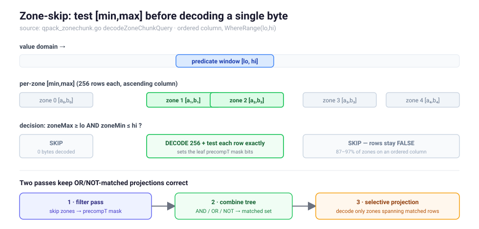
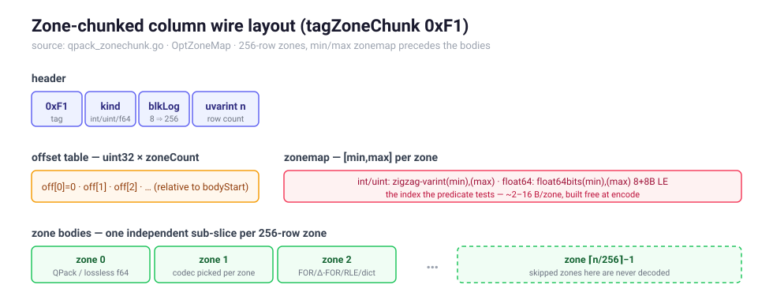

# Zone maps — skip non-matching rows *without decoding them* (`OptZoneMap`)

> **Predicate pushdown, one level deeper.** Plain pushdown
> ([PREDICATE-PUSHDOWN.md](PREDICATE-PUSHDOWN.md)) never touches the columns a
> row is filtered out on, but it still decodes each *predicate* column **whole**
> before testing a single row. `OptZoneMap` removes that last full-column decode:
> it chops an integer/float column into fixed **256-row zones**, tags each zone
> with its `[min, max]`, and a range/comparison predicate then **skips entire
> zones whose `[min, max]` cannot satisfy it — their bytes are never decoded.**
> On an ordered column (timestamps, monotonic ids, sorted keys) this skips
> **87–97 %** of the data.

This is the classic data-warehouse *zone map* / *min-max index* (Netezza,
Snowflake, Parquet row-group statistics) brought to a plain `Unmarshal`.

- [Why](#why)
- [The API](#the-api)
- [Tutorial](#tutorial)
- [When it helps (and when it doesn't)](#when-it-helps-and-when-it-doesnt)
- [Semantics](#semantics)
- [Performance](#performance)
- [Wire format](#wire-format)
- [How it works](#how-it-works)
- [Limitations](#limitations)

---

## Why

Plain pushdown decodes a predicate column's *whole* codec body before testing
rows, because the body is one Frame-of-Reference / bit-pack / delta payload with
no per-row addressing — you cannot seek to row 9 000 without decoding rows
0–8 999. For a wide filter (`ts BETWEEN a AND b`) over a 50 000-row batch that
is 50 000 integers decoded to keep maybe 200.

A zone map breaks the column into independent 256-row **zones** and stores a
tiny `[min, max]` summary per zone *before* the bodies. A bound-carrying
predicate compares its target range against each zone's summary first:

- If the zone's `[min, max]` **cannot intersect** the predicate's range, the
  zone matches nothing — **skip it, decode nothing.**
- Otherwise decode just that zone (256 values) and test its rows exactly.

The summary is ~2–16 bytes per zone and is built for free during encode. The
trade is deliberate: chunking a column costs a little wire (offset table +
summaries + per-zone codec framing), so it is **opt-in and never automatic** —
you pay a small fixed size for a large query speedup on the columns you actually
range-scan.



---

## The API

Zone maps need a predicate that **carries its comparison bounds** so the engine
can test them against a zone's `[min, max]`. The opaque `Where(field, func)`
closure cannot expose its bounds, so two bound-carrying constructors are added
(`query_bounds.go`):

```go
// WhereCmp keeps rows where (field OP val). OP is one of the composable CmpOps.
func WhereCmp[T Ordered](field string, op CmpOp, val T) QueryOption

// WhereRange keeps rows where lo <= field <= hi (inclusive, two-sided).
func WhereRange[T Ordered](field string, lo, hi T) QueryOption
```

`CmpOp` is built from three primitive bits — *accept less-than*, *accept equal*,
*accept greater-than* — so the named operators compose and both the per-row test
and the zone bounds derive directly from the bits:

```go
LT  // field <  val      ( cmpLT )
LE  // field <= val      ( cmpLT | cmpEQ )
EQ  // field == val      ( cmpEQ )
GE  // field >= val      ( cmpGT | cmpEQ )
GT  // field >  val      ( cmpGT )
NE  // field != val      ( cmpLT | cmpGT )
```

`Ordered` is the queryable element types that support `<,<=,>,>=`: every
int/uint width, `float32`, `float64`, and `string`. (Only int/uint/`float64`
columns are zone-chunked on the wire today — see [Limitations](#limitations).)

To **produce** a zone-chunked payload, add `OptZoneMap` (and `OptColumnIndex`,
which the zone-skip seek needs) at encode time:

```go
buf, _ := qdf.Marshal(rows, qdf.OptBalanced|qdf.OptZoneMap|qdf.OptColumnIndex)
```

`OptZoneMap` is **columnar-only and opt-in**: without it the wire is
byte-identical to a normal columnar payload. The opaque `Where(func)` path still
works against a zone-chunked column — it just decodes every zone (no skip),
identical results.

---

## Tutorial

```go
type Event struct {
    TS   int64  `qdf:"ts"`   // ordered → great zone-skip
    Code uint32 `qdf:"code"`
    Msg  string `qdf:"msg"`
}

events := loadEvents() // many rows, ts ascending
buf, _ := qdf.Marshal(events, qdf.OptBalanced|qdf.OptZoneMap|qdf.OptColumnIndex)

// Range query — only the zones overlapping [lo, hi] are decoded.
var win []Event
_ = qdf.Unmarshal(buf, &win,
    qdf.WhereRange("ts", loTS, hiTS),
    qdf.Select("ts", "code", "msg"))

// Single comparison — GE skips every zone whose max < cutoff.
var recent []Event
_ = qdf.Unmarshal(buf, &recent,
    qdf.WhereCmp("ts", qdf.GE, cutoffTS),
    qdf.Select("ts", "code"))
```

The predicate column does **not** have to be projected, and projected columns
that you do not filter on are themselves decoded zone-selectively — only the
zones covering surviving rows are materialized.

---

## When it helps (and when it doesn't)

| Column shape | Zone-skip |
| --- | --- |
| **Ordered** (timestamps, monotonic / sequential ids, sorted keys) | **87–97 %** zones skipped — each zone's `[min,max]` is a tight, disjoint slice of the domain |
| **Clustered / bursty** (values grouped in runs) | high — adjacent zones cover different sub-ranges |
| **Uniformly random** | ~0 % — every zone's `[min,max]` spans the whole domain, so nothing can be excluded. Harmless: opt-in, you simply would not enable it here |

Zone-skip is a *range* optimization. It shines exactly where a column is sorted
or time-ordered — the common case for the `ts`/`id` columns you actually
range-scan. On a random column it costs a little wire and skips nothing, which
is why it is never on by default.

---

## Semantics

- **Results are exact.** Zone-skip only ever drops zones that *provably* contain
  no matching row; every surviving zone is decoded and its rows tested by the
  same per-row predicate as plain pushdown. Strict comparators (`GT`/`LT`) record
  a *conservative inclusive* bound, so a boundary zone is decoded and tested
  exactly rather than skipped on a guess.
- **One bounded leaf per column.** Zone-skip fires when a column is referenced by
  **exactly one** bound-carrying leaf. Two leaves on the same column (e.g.
  `WhereCmp("ts", GE, lo)` *and* `WhereCmp("ts", LE, hi)`) are decoded
  independently and their bounds *union* to the whole domain — skipping nothing.
  Express a two-sided range as a single `WhereRange` to keep the skip.
- **Composes with AND / OR / NOT.** A zone-chunked leaf can sit anywhere in a
  boolean tree; the projected value of a row matched via an `OR`/`NOT` sibling is
  still materialized correctly (projection follows the final matched set, not the
  leaf's own zone bounds).
- **NaN-aware (float64).** A per-row float predicate rejects `NaN`. A zone's
  summary stores the *finite* `[min, max]`; an all-`NaN` zone stores the empty
  interval `(+Inf, -Inf)`, so it intersects no finite range and is skipped — and
  `NaN` round-trips bit-exact in any decoded zone.
- **`Where(func)` still works**, with no skip — back-compat, identical results.

---

## Performance

Intel i7-9750H, 32 768 rows, three zone-chunked columns (`OptBalanced |
OptZoneMap | OptColumnIndex`).

**Narrow range query** (`WhereRange` over ~0.6 % of rows, projecting all three
columns), zone-selective projection on vs off:

| | ns/op | B/op | allocs/op |
| --- | ---: | ---: | ---: |
| zone-selective decode | ~150 k | 816 k | 48 |
| full-decode each projected column | ~325 k | 1.33 M | 298 |

≈ **2.2× faster, −39 % bytes, −84 % allocs** — the projected columns decode only
the zones covering surviving rows instead of every zone.

Skip rates measured on ordered columns: **int/uint 87–97 %**, **float64 range
56–63 %** of zones never decoded.

---

## Wire format

Tag `tagZoneChunk` (**0xF1**), emitted per column only under `OptZoneMap`.



```
0xF1  kind  zmap  blkLog  uvarint(n)
      ├ kind   : 0x00 int64 · 0x01 uint64 · 0x02 float64
      ├ zmap   : 0x00 min/max index · 0x01 learned linear model (int/uint only)
      └ blkLog : log2(zone size) — 8 ⇒ 256-row zones

uint32 offsetTable[zoneCount]      // body offset of each zone, relative to bodyStart
zonemap                            // zmap == min/max:  per zone
      int/uint : zigzag-varint(min), zigzag-varint(max)   (variable length)
      float64  : float64bits(min), float64bits(max)       (8 + 8 bytes, LE)
                                   // zmap == linear:   one model for the whole column
      int/uint : float64(c), float64(d), uvarint(epsP)    (~18 bytes total)
zone bodies[zoneCount]             // each an independent sub-slice:
      int/uint : a QPack codec picked per zone (FOR / Δ-FOR / RLE / dict / PFOR)
      float64  : a lossless float slice (a SCALAR float column never goes lossy)
```

`zoneCount = ⌈n / 256⌉`. The per-zone codec picks are shared with the block
codec's planner (`blkPlanI64/U64`), so chunking does not re-run codec selection.
The zone-chunk container itself has **no never-larger gate** — chunking an
already-tight ordered column is expected to cost a little wire; that cost *is*
the price of zone-skippability, and it is gated behind the opt-in flag.

### Learned linear zonemap (`zmap == 0x01`)

On a **sorted** int/uint column the per-zone `[min,max]` index dominates the
wire — the body delta-codes to almost nothing while the index stays
`O(zoneCount)` (it is 8–40 % of such a column). For these columns the whole
index collapses to a single learned model: the row position of a value is
`pos ≈ c·value + d` within `±epsP` positions (an ε-PLA with one segment, fit by
least squares). A query range `[lo,hi]` then maps to the row range
`[c·lo+d−epsP, c·hi+d+epsP]`, hence to a contiguous **zone** range — and because
every matching row provably lands inside it, **no zone with a match is ever
skipped** (`epsP` carries a +1 margin for float rounding; the exact per-row test
still runs in the decoded zones).

It is chosen by a **never-worse picker**: the linear model is emitted only when
the column is monotonic, the fit holds within one zone (`epsP ≤ blk`, so skip
stays tight), and it is strictly smaller than the min/max index — otherwise
min/max is kept. `float64` columns always use min/max in v1. Measured: −6.7 % of
the *whole* wire on a realistic 4-column struct with a sorted id/ts (81597 →
76106 bytes), up to −40 % on an all-sorted column; multi-segment (irregular)
columns are rejected by the picker and keep min/max.

---

## How it works

Encode (`qpack_zonechunk.go`, reached from `encodeOneColumn` when `OptZoneMap` is
set and the column has ≥ 2 zones): split the gathered column into 256-row zones,
write the offset table placeholder, the per-zone `[min,max]` summaries, then each
zone body, back-patching its offset.

Decode splits cleanly into **filter** and **projection**:


1. **Filter pass** (`decodeZoneChunkQuery`) — load the zonemap and decide which
   zones can match. With the min/max index, each zone is tested
   `zoneMax >= lo && zoneMin <= hi`; with the linear model, the predicate range
   maps once to a contiguous zone range. Zones that cannot match are skipped
   (their rows stay `FALSE` in the leaf's precomputed `precompT` mask); the rest
   are decoded and tested by the exact per-row predicate. This produces the
   leaf's truth mask directly.
2. **Combine** — `precompT` feeds the boolean tree exactly like any other leaf
   mask; AND/OR/NOT and three-valued NULL logic are unchanged.
3. **Projection pass** (`decodeZoneChunkSelective`) — *after* the final matched
   row set is known, each projected zone-chunked column decodes **only the zones
   that span a matched row** and scatters their values. Splitting projection from
   the filter is what keeps an `OR`/`NOT`-matched row correct: its value comes
   from the final match set, never from the filtering leaf's own zone bounds.

The full-decode path (`Unmarshal` with no query) and the selective path **skip
the zonemap entirely** — they read all / matched zones regardless, so the
per-zone summaries are walked only to locate the bodies, never materialized.

---

## Limitations

- **Columnar `int` / `uint` / `float64` only.** `string` zone maps were built and
  **measured-killed**: a bounded-prefix summary skips ~0 % on the structured
  strings people actually range-scan (`user-000123`, `/srv/data/…`) because they
  share a common prefix, and a full-string summary bloats the map on long values.
  `float32` columns and nullable (`*T`) columns are not zone-chunked.
- **Needs `OptColumnIndex`** for the query-time zone-skip seek (to reposition past
  a column). Full decode of a zone-chunked column works without it.
- **One bounded leaf per column** to skip (see [Semantics](#semantics)); use
  `WhereRange` for two-sided ranges.
- **Base types only** for `WhereCmp` / `WhereRange`, same as `Where` — named
  types (`type ID int64`) are matched on their base type.
- **Single message.** Like the column index and pushdown, this is a single
  `Unmarshal` of a columnar `[]struct`, not a streaming-mode feature.

See also: [PREDICATE-PUSHDOWN.md](PREDICATE-PUSHDOWN.md),
[GUIDE.md](GUIDE.md), [CHOOSING.md](CHOOSING.md).
